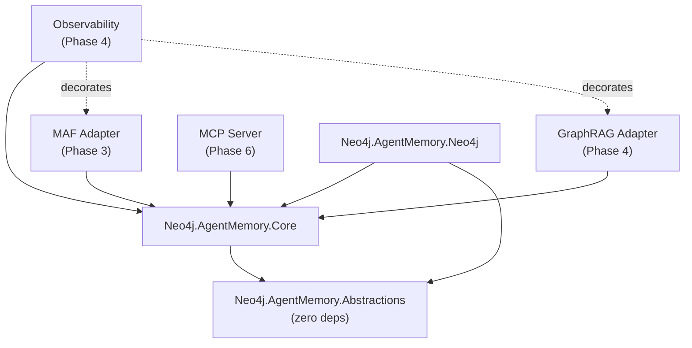
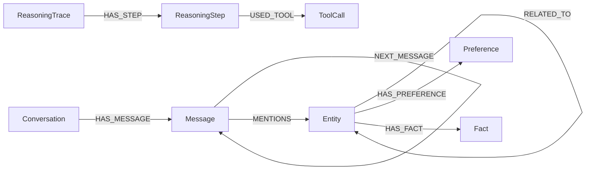

# Architecture Overview — Agent Memory for .NET

**Last Updated:** 2026-04-13 (Phase 4 — Complete)  
**Author:** Deckard (Lead Architect)  
**Canonical Specification:** [Agent-Memory-for-DotNet-Specification.md](../Agent-Memory-for-DotNet-Specification.md)
**Implementation Plan:** [Agent-memory-for-dotnet-implementation-plan.md](../Agent-memory-for-dotnet-implementation-plan.md)

---

## 1. Vision & Goals

### What It Is

Agent Memory for .NET is a **native .NET implementation of graph-native persistent memory for AI agents**, backed by Neo4j. It provides three memory layers — short-term (conversations), long-term (entities, facts, preferences, relationships), and reasoning (traces, steps, tool calls) — that persist across agent sessions and runs. The system is designed as a **framework-agnostic core** with an adapter model that enables integration with Microsoft Agent Framework, GraphRAG, MCP, and future frameworks. *(Spec §1.2–1.3)*

### What It Provides

- **Three-layer memory model**: short-term, long-term, and reasoning memory — each with dedicated domain types, repositories, and services *(Spec §3.1)*
- **Framework-agnostic core**: the memory engine has zero dependencies on MAF, GraphRAG SDKs, or any AI framework *(Spec §2.4)*
- **Adapter model**: MAF, GraphRAG, and MCP are thin adapter layers that depend inward on the core — never the reverse *(Plan §7.4)*
- **Neo4j graph-native persistence**: direct Neo4j driver usage, no ORM, with schema bootstrapping and migration support *(Plan §7.3)*
- **Context assembly**: configurable recall with budget enforcement and truncation strategies *(Spec §3.4, Plan §14)*
- **Extraction pipeline**: pluggable extraction from conversations to structured long-term memory *(Plan §13)*

### What It Does NOT Do

- **No Python runtime** — purely .NET, no Python bridge or subprocess *(Spec §1.4)*
- **No MCP server yet** — MCP is Phase 6, not in current scope *(Plan §Phase 6)*
- **No bundled LLM** — extraction and embedding providers are pluggable interfaces, stubbed in Phase 1 *(Decision D5)*
- **No fork of upstream Python agent-memory** — inspired by its architecture, not a port *(Spec §0.1)*
- **Not an official Neo4j product** — independent community project *(Spec §1.1)*

---

## 2. Layered Architecture

### 2.1 Package Dependency Diagram

```
┌─────────────────────────────────────────────────────────────────────┐
│                        ADAPTERS (Phase 3–6)                         │
│                                                                     │
│  ┌─────────────────────┐  ┌──────────────────────┐  ┌───────────┐  │
│  │ AgentMemory.MAF     │  │ AgentMemory.          │  │ AgentMem. │  │
│  │ (MAF adapter)       │  │ GraphRagAdapter       │  │ Mcp       │  │
│  │                     │  │                       │  │           │  │
│  │ + Microsoft.Agents  │  │ + Neo4j.AgentFW.      │  │ + MCP SDK │  │
│  │   .AI.*             │  │   GraphRAG            │  │           │  │
│  └────────┬────────────┘  └─────────┬─────────────┘  └─────┬─────┘  │
│           │                         │                       │        │
│           └─────────────┬───────────┘───────────────────────┘        │
│                         │  depends inward                            │
│                         ▼                                            │
├─────────────────────────────────────────────────────────────────────┤
│                 EXTENSIONS & CROSS-CUTTING (Phase 4–5)               │
│                                                                     │
│  ┌──────────────────────┐  ┌──────────────────────┐  ┌───────────┐ │
│  │ Observability        │  │ Extraction.          │  │Enrichment │ │
│  │ (OTel decorators)    │  │ AzureLanguage        │  │(Geocoding)│ │
│  │                      │  │ (Azure Text Analytics│  │           │ │
│  │ + OpenTelemetry.Api  │  │                      │  │ + Nominat │ │
│  │   1.12.0             │  │ + Azure.AI.TextAnal) │  │ + Wikimed │ │
│  └──────────┬───────────┘  └──────────┬───────────┘  └─────┬─────┘ │
│             │                         │                    │         │
│             └─────────────┬───────────┘────────────────────┘         │
│                           │  decorates / extends                     │
│                           ▼                                          │
├─────────────────────────────────────────────────────────────────────┤
│                    INFRASTRUCTURE (Phase 1)                          │
│                                                                     │
│  ┌──────────────────────────────────────────────────────────────┐   │
│  │  Neo4j.AgentMemory.Neo4j                                    │   │
│  │  (persistence — repositories, Cypher, schema, transactions) │   │
│  │                                                              │   │
│  │  + Neo4j.Driver 6.0.0                                       │   │
│  │  + Microsoft.Extensions.DI/Logging/Options 10.0.5           │   │
│  └──────────────────────┬───────────────────────────────────────┘   │
│                         │  depends on                               │
│                         ▼                                           │
├─────────────────────────────────────────────────────────────────────┤
│                    ORCHESTRATION (Phase 1)                           │
│                                                                     │
│  ┌──────────────────────────────────────────────────────────────┐   │
│  │  Neo4j.AgentMemory.Core                                     │   │
│  │  (services, stubs, validation, context assembly)            │   │
│  │                                                              │   │
│  │  + Microsoft.Extensions.DI/Logging/Options 10.0.5           │   │
│  └──────────────────────┬───────────────────────────────────────┘   │
│                         │  depends on                               │
│                         ▼                                           │
├─────────────────────────────────────────────────────────────────────┤
│                    FOUNDATION (Phase 1)                              │
│                                                                     │
│  ┌──────────────────────────────────────────────────────────────┐   │
│  │  Neo4j.AgentMemory.Abstractions                             │   │
│  │  (domain models, service interfaces, repository interfaces, │   │
│  │   configuration options — IGeocodingService,                │   │
│  │   IEnrichmentService added Phase 5)                         │   │
│  │                                                              │   │
│  │  ZERO external dependencies — .NET 9 BCL only               │   │
│  └──────────────────────────────────────────────────────────────┘   │
└─────────────────────────────────────────────────────────────────────┘
```

### 2.2 Dependency Direction Rule

**Dependencies flow strictly inward.** Adapters → Neo4j → Core → Abstractions. Never the reverse.



---

## 3. Package Responsibilities

### 3.1 Neo4j.AgentMemory.Abstractions

| Attribute | Value |
|---|---|
| **Purpose** | Domain contracts — all models, interfaces, and configuration types shared across the system |
| **Dependencies** | **None** — .NET 9 BCL only |
| **MUST NOT reference** | Neo4j.Driver, Microsoft.Agents.*, any GraphRAG SDK, any MCP SDK, any NuGet package |
| **Key types** | 31 domain records (Conversation, Message, Entity, Fact, Preference, Relationship, ReasoningTrace, ReasoningStep, ToolCall, etc.), 15 service interfaces, 10 repository interfaces, 9 configuration types, 6 enums |

**Namespace structure:**
```
Neo4j.AgentMemory.Abstractions.Domain        — records and enums
Neo4j.AgentMemory.Abstractions.Services      — service interfaces
Neo4j.AgentMemory.Abstractions.Repositories  — repository interfaces
Neo4j.AgentMemory.Abstractions.Options       — configuration records
```

### 3.2 Neo4j.AgentMemory.Core

| Attribute | Value |
|---|---|
| **Purpose** | Orchestration — service implementations, extraction pipeline, context assembly, stubs |
| **Dependencies** | Abstractions (project ref), Microsoft.Extensions.DependencyInjection.Abstractions 10.0.5, Microsoft.Extensions.Logging.Abstractions 10.0.5, Microsoft.Extensions.Options 10.0.5 |
| **MUST NOT reference** | Neo4j.Driver, Microsoft.Agents.*, any GraphRAG SDK |
| **Key types** | SystemClock, GuidIdGenerator, StubEmbeddingProvider, StubExtractionPipeline, StubEntityExtractor, StubFactExtractor, StubPreferenceExtractor, StubRelationshipExtractor, StubEntityResolver |

### 3.3 Neo4j.AgentMemory.Neo4j

| Attribute | Value |
|---|---|
| **Purpose** | Persistence — Neo4j repository implementations, Cypher queries, schema management, driver infrastructure |
| **Dependencies** | Abstractions (project ref), Core (project ref), Neo4j.Driver 6.0.0, Microsoft.Extensions.DependencyInjection.Abstractions 10.0.5, Microsoft.Extensions.Logging.Abstractions 10.0.5, Microsoft.Extensions.Options 10.0.5 |
| **MUST NOT reference** | Microsoft.Agents.*, Neo4j.AgentFramework.GraphRAG, any GraphRAG SDK |
| **Key types** | Neo4jDriverFactory, Neo4jSessionFactory, Neo4jTransactionRunner, SchemaBootstrapper, MigrationRunner, Neo4jOptions, ServiceCollectionExtensions |

### 3.4 Adapter Packages

#### 3.4.1 Neo4j.AgentMemory.AgentFramework (Phase 3 ✅ COMPLETE)

| Attribute | Value |
|---|---|
| **Purpose** | Thin adapter layer exposing memory capabilities to Microsoft Agent Framework |
| **Dependencies** | Abstractions (project ref), Core (project ref), Neo4j (project ref), Microsoft.Agents.AI.Abstractions 1.1.0, Microsoft.Extensions.DependencyInjection.Abstractions 10.0.5, Microsoft.Extensions.Logging.Abstractions 10.0.5, Microsoft.Extensions.Options 10.0.5 |
| **MUST NOT reference** | Business logic — act only as a type mapper and adapter |
| **Key types** | `Neo4jMemoryContextProvider` (extends `AIContextProvider`), `Neo4jChatMessageStore`, `Neo4jMicrosoftMemoryFacade`, `MafTypeMapper` (bidirectional `ChatMessage` ↔ `Message` mapping), `MemoryToolFactory` (6 tools), `AgentTraceRecorder` |
| **Core responsibility** | Bridge between Microsoft Agent Framework lifecycle (`ProvideAIContextAsync`, `StoreAIContextAsync`) and Neo4j memory persistence |

**Key Patterns:**

1. **Pre-run Context Injection** — `Neo4jMemoryContextProvider : AIContextProvider` fetches relevant memory from Neo4j before agent execution begins
2. **Post-run Persistence** — `Neo4jMicrosoftMemoryFacade` orchestrates message storage and trace recording after execution
3. **Type Mapping** — `MafTypeMapper` handles bidirectional conversion between MAF's `ChatMessage` and internal `Message` types
4. **Memory Tools** — `MemoryToolFactory` creates 6 tools for agent use:
   - `search_memory` — semantic search across all memory layers
   - `remember_preference` — store user preferences
   - `remember_fact` — store facts
   - `recall_preferences` — retrieve stored preferences
   - `search_knowledge` — search entities and facts
   - `find_similar_tasks` — retrieve similar prior executions
5. **Trace Capture** — `AgentTraceRecorder` records agent reasoning steps and tool calls to Neo4j for future analysis

**Namespace structure:**
```
Neo4j.AgentMemory.AgentFramework.Integration     — context provider, message store, facade
Neo4j.AgentMemory.AgentFramework.Tools            — memory tool definitions and factory
Neo4j.AgentMemory.AgentFramework.Mapping          — MAF type mapping
Neo4j.AgentMemory.AgentFramework.Tracing          — reasoning trace recording
```

#### 3.4.2 Neo4j.AgentMemory.GraphRagAdapter (Phase 4 ✅ COMPLETE)

| Attribute | Value |
|---|---|
| **Purpose** | Thin adapter exposing the existing Neo4j GraphRAG retrieval pipeline as an `IGraphRagContextSource` |
| **Dependencies** | Abstractions (project ref), Neo4j.AgentFramework.GraphRAG (project ref), Microsoft.Extensions.AI.Abstractions 10.4.1, Microsoft.Extensions.DI/Logging/Options 10.0.5 |
| **MUST NOT reference** | Business logic — wraps a reference provider only |
| **Key types** | `Neo4jGraphRagContextSource : IGraphRagContextSource`, `GraphRagAdapterOptions` |

**Key Patterns:**

1. **Provider delegation** — `Neo4jGraphRagContextSource` creates the appropriate `IRetriever` (vector, fulltext, hybrid, or graph-enriched) based on `GraphRagAdapterOptions.SearchMode` and delegates all retrieval to it.
2. **Resilience** — Exceptions from the underlying retriever are caught and logged; an empty `GraphRagContextResult` is returned so the agent run is never blocked by a retrieval failure.
3. **Search modes** — Supports `Vector`, `Fulltext`, `Hybrid` (vector + fulltext RRF fusion), and `Graph` (vector + multi-hop traversal).

**Namespace structure:**
```
Neo4j.AgentMemory.GraphRagAdapter             — public surface (source, options, DI)
Neo4j.AgentMemory.GraphRagAdapter.Internal    — adapter retrievers (vector, fulltext, hybrid)
```

#### 3.4.3 Neo4j.AgentMemory.Observability (Phase 4 ✅ COMPLETE)

| Attribute | Value |
|---|---|
| **Purpose** | Opt-in OTel decorator that wraps `IMemoryService` and `IGraphRagContextSource` with distributed tracing spans and metrics |
| **Dependencies** | Abstractions (project ref), Core (project ref), OpenTelemetry.Api 1.12.0, Microsoft.Extensions.DI/Logging.Abstractions 10.0.5 |
| **MUST NOT reference** | Neo4j.Driver, Microsoft.Agents.*, any GraphRAG SDK |
| **Key types** | `InstrumentedMemoryService`, `InstrumentedGraphRagContextSource`, `MemoryActivitySource`, `MemoryMetrics`, `ServiceCollectionExtensions` |

**Key Patterns:**

1. **Decorator pattern** — `AddAgentMemoryObservability()` finds the already-registered `IMemoryService` and `IGraphRagContextSource` descriptors, removes them, and re-registers them wrapped in instrumented decorators. No Scrutor dependency.
2. **OTel API only** — Uses only the vendor-neutral `OpenTelemetry.Api` package. The actual exporter (OTLP, console, etc.) is wired up by the host application.
3. **Registration order** — Must be called **after** `AddAgentMemoryCore()` and `AddGraphRagAdapter()`. If no `IGraphRagContextSource` is registered, the decorator step is silently skipped.
4. **Metrics** — `MemoryMetrics` exposes counters (`messages.stored`, `entities.extracted`, `graphrag.queries`) and histograms (`recall.duration`, `persist.duration`, `graphrag.duration`).
5. **Tracing** — All spans are emitted under `ActivitySource` name `"Neo4j.AgentMemory"` (version `1.0.0`).

**Namespace structure:**
```
Neo4j.AgentMemory.Observability    — all types (decorators, metrics, activity source, DI)
```

#### 3.4.4 Neo4j.AgentMemory.Extraction.AzureLanguage (Phase 5 ✅ COMPLETE)

| Attribute | Value |
|---|---|
| **Purpose** | Alternative extraction backend using Azure Cognitive Services (Text Analytics) |
| **Dependencies** | Abstractions (project ref), Core (project ref), Azure.AI.TextAnalytics 13.0.0, Microsoft.Extensions.DI/Logging.Abstractions 10.0.5 |
| **MUST NOT reference** | Business logic — extraction only, no memory persistence |
| **Key types** | `AzureEntityExtractor : IEntityExtractor`, `AzureKeyPhraseExtractor : IFactExtractor`, `AzurePiiExtractor : IEntityExtractor` |

**Key Patterns:**

1. **Azure Text Analytics wrapper** — Uses Azure Cognitive Services for NER, key phrase extraction, and PII detection
2. **IEntityExtractor implementations** — Named entities (NER) and PII detection as entity extractors
3. **IFactExtractor implementation** — Key phrases extracted as facts
4. **Language-agnostic** — Supports 100+ languages via Azure's language detection
5. **Async design** — All extractors use `async/await` for non-blocking service calls

**Namespace structure:**
```
Neo4j.AgentMemory.Extraction.AzureLanguage    — Azure-backed extractors and DI
```

#### 3.4.5 Neo4j.AgentMemory.Enrichment (Phase 5 ✅ COMPLETE)

| Attribute | Value |
|---|---|
| **Purpose** | Geocoding and entity enrichment services with caching and rate limiting |
| **Dependencies** | Abstractions (project ref), Core (project ref), Microsoft.Extensions.DI/Logging/Caching.Abstractions 10.0.5 |
| **MUST NOT reference** | Neo4j.Driver (repositories handle persistence) |
| **Key types** | `IGeocodingService`, `IEnrichmentService` (interfaces in Abstractions), `NominatimGeocodingService`, `WikimediaEntityEnrichmentService`, `CachedGeocodingService`, `RateLimitedGeocodingService` |

**Key Patterns:**

1. **Decorator chain** — Pluggable layers: Cache → RateLimiter → Backend service
   - `CachedGeocodingService` wraps the backend, checks cache first
   - `RateLimitedGeocodingService` enforces request throttling (by default Nominatim: 1 request/sec)
   - Backend: `NominatimGeocodingService` (OSM geocoding) or `WikimediaEntityEnrichmentService`
2. **Geocoding** — NominatimGeocodingService converts addresses to coordinates
3. **Entity enrichment** — WikimediaEntityEnrichmentService augments entities with Wikipedia descriptions and links
4. **Async design** — All services use `async/await` for non-blocking external API calls
5. **Configurable** — Rate limits, cache TTL, and backend selection via options

**Namespace structure:**
```
Neo4j.AgentMemory.Enrichment                           — services and DI
Neo4j.AgentMemory.Enrichment.Geocoding                 — Nominatim geocoding impl
Neo4j.AgentMemory.Enrichment.EntityEnrichment          — Wikimedia enrichment impl
Neo4j.AgentMemory.Enrichment.Decorators                — Cache/RateLimit decorators
```

#### 3.4.6 Future Adapter Packages

| Package | Phase | External Dependency | Implements |
|---|---|---|---|
| `Neo4j.AgentMemory.Mcp` | 6 | C# MCP SDK | MCP tool server exposing memory operations |

---

## 4. Neo4j Graph Model

*(Derived from Plan §9 and SchemaBootstrapper implementation)*

### 4.1 Node Types

| Neo4j Label | Domain Type | Key Properties |
|---|---|---|
| `:Conversation` | `Conversation` | `id`, `sessionId`, `userId`, `createdAtUtc`, `updatedAtUtc`, `metadata` |
| `:Message` | `Message` | `id`, `conversationId`, `sessionId`, `role`, `content`, `timestampUtc`, `embedding`, `metadata` |
| `:Entity` | `Entity` | `id`, `name`, `canonicalName`, `type`, `subtype`, `description`, `confidence`, `embedding`, `aliases`, `sourceMessageIds`, `metadata` |
| `:Fact` | `Fact` | `id`, `subject`, `predicate`, `object`, `confidence`, `validFrom`, `validUntil`, `embedding`, `sourceMessageIds`, `metadata` |
| `:Preference` | `Preference` | `id`, `category`, `preferenceText`, `context`, `confidence`, `embedding`, `sourceMessageIds`, `metadata` |
| `:MemoryRelationship` | `Relationship` | `id`, `sourceEntityId`, `targetEntityId`, `relationshipType`, `confidence`, `validFrom`, `validUntil`, `attributes` |
| `:ReasoningTrace` | `ReasoningTrace` | `id`, `sessionId`, `task`, `outcome`, `success`, `startedAtUtc`, `completedAtUtc`, `taskEmbedding`, `metadata` |
| `:ReasoningStep` | `ReasoningStep` | `id`, `traceId`, `stepNumber`, `thought`, `action`, `observation`, `embedding`, `metadata` |
| `:ToolCall` | `ToolCall` | `id`, `stepId`, `toolName`, `arguments`, `result`, `status`, `durationMs`, `error`, `metadata` |

> **Note:** The `Relationship` domain type maps to `:MemoryRelationship` in Neo4j to avoid conflict with Neo4j's native relationship concept.

### 4.2 Relationship Types



| Relationship Type | From | To | Purpose |
|---|---|---|---|
| `HAS_MESSAGE` | Conversation | Message | Conversation contains messages |
| `NEXT_MESSAGE` | Message | Message | Message ordering within conversation |
| `MENTIONS` | Message | Entity | Entity extraction provenance |
| `RELATED_TO` | Entity | Entity | Inter-entity relationships |
| `HAS_PREFERENCE` | Entity | Preference | User/entity preferences |
| `HAS_FACT` | Entity | Fact | Facts about entities |
| `HAS_STEP` | ReasoningTrace | ReasoningStep | Trace contains steps |
| `USED_TOOL` | ReasoningStep | ToolCall | Step used a tool |
| `INITIATED_BY` | ReasoningTrace | Message | Trace provenance |
| `TRIGGERED_BY` | ToolCall | Message | Tool call provenance |
| `EXTRACTED_FROM` | Entity/Fact/Preference | Message | Extraction provenance |
| `EXTRACTED_BY` | Entity/Fact/Preference | Extractor | Extraction method |
| `SAME_AS` | Entity | Entity | Entity deduplication |

### 4.3 Constraints (Implemented in SchemaBootstrapper)

```cypher
CREATE CONSTRAINT conversation_id IF NOT EXISTS FOR (c:Conversation) REQUIRE c.id IS UNIQUE
CREATE CONSTRAINT message_id IF NOT EXISTS FOR (m:Message) REQUIRE m.id IS UNIQUE
CREATE CONSTRAINT entity_id IF NOT EXISTS FOR (e:Entity) REQUIRE e.id IS UNIQUE
CREATE CONSTRAINT fact_id IF NOT EXISTS FOR (f:Fact) REQUIRE f.id IS UNIQUE
CREATE CONSTRAINT preference_id IF NOT EXISTS FOR (p:Preference) REQUIRE p.id IS UNIQUE
CREATE CONSTRAINT relationship_id IF NOT EXISTS FOR (r:MemoryRelationship) REQUIRE r.id IS UNIQUE
CREATE CONSTRAINT reasoning_trace_id IF NOT EXISTS FOR (t:ReasoningTrace) REQUIRE t.id IS UNIQUE
CREATE CONSTRAINT reasoning_step_id IF NOT EXISTS FOR (s:ReasoningStep) REQUIRE s.id IS UNIQUE
CREATE CONSTRAINT tool_call_id IF NOT EXISTS FOR (tc:ToolCall) REQUIRE tc.id IS UNIQUE
```

### 4.4 Fulltext Indexes (Implemented in SchemaBootstrapper)

```cypher
CREATE FULLTEXT INDEX message_content IF NOT EXISTS FOR (m:Message) ON EACH [m.content]
CREATE FULLTEXT INDEX entity_name IF NOT EXISTS FOR (e:Entity) ON EACH [e.name, e.description]
CREATE FULLTEXT INDEX fact_content IF NOT EXISTS FOR (f:Fact) ON EACH [f.subject, f.predicate, f.object]
```

### 4.5 Vector Indexes (Implemented in SchemaBootstrapper)

Vector indexes for semantic search, using cosine similarity with configurable dimensions (default 1536). *(Plan §9.3)*

```cypher
CREATE VECTOR INDEX message_embedding_idx IF NOT EXISTS FOR (n:Message) ON (n.embedding)
  OPTIONS {indexConfig: {`vector.dimensions`: 1536, `vector.similarity_function`: 'cosine'}}
CREATE VECTOR INDEX entity_embedding_idx IF NOT EXISTS FOR (n:Entity) ON (n.embedding)
  OPTIONS {indexConfig: {`vector.dimensions`: 1536, `vector.similarity_function`: 'cosine'}}
CREATE VECTOR INDEX preference_embedding_idx IF NOT EXISTS FOR (n:Preference) ON (n.embedding)
  OPTIONS {indexConfig: {`vector.dimensions`: 1536, `vector.similarity_function`: 'cosine'}}
CREATE VECTOR INDEX fact_embedding_idx IF NOT EXISTS FOR (n:Fact) ON (n.embedding)
  OPTIONS {indexConfig: {`vector.dimensions`: 1536, `vector.similarity_function`: 'cosine'}}
CREATE VECTOR INDEX reasoning_step_embedding_idx IF NOT EXISTS FOR (n:ReasoningStep) ON (n.embedding)
  OPTIONS {indexConfig: {`vector.dimensions`: 1536, `vector.similarity_function`: 'cosine'}}
```

> **Known Gap:** A `task_embedding_idx` for `ReasoningTrace.taskEmbedding` is needed for `SearchByTaskVectorAsync` but not yet created. Will be added during Epic 6 (Reasoning Memory Repositories).

### 4.6 Property Indexes (Implemented in SchemaBootstrapper)

```cypher
CREATE INDEX message_session_id IF NOT EXISTS FOR (m:Message) ON (m.sessionId)
CREATE INDEX message_timestamp IF NOT EXISTS FOR (m:Message) ON (m.timestamp)
CREATE INDEX entity_type IF NOT EXISTS FOR (e:Entity) ON (e.type)
CREATE INDEX entity_name_prop IF NOT EXISTS FOR (e:Entity) ON (e.name)
CREATE INDEX fact_category IF NOT EXISTS FOR (f:Fact) ON (f.category)
CREATE INDEX preference_category IF NOT EXISTS FOR (p:Preference) ON (p.category)
CREATE INDEX reasoning_trace_session_id IF NOT EXISTS FOR (t:ReasoningTrace) ON (t.sessionId)
CREATE INDEX reasoning_step_timestamp IF NOT EXISTS FOR (s:ReasoningStep) ON (s.timestamp)
CREATE INDEX tool_call_status IF NOT EXISTS FOR (tc:ToolCall) ON (tc.status)
```

---

## 5. Boundary Enforcement Rules

These rules are inviolable. Violation of any rule is a blocking review finding.

| Rule | Constraint | Rationale |
|---|---|---|
| **B1** | Abstractions MUST NOT reference any NuGet package | Foundation layer stays portable; zero external coupling |
| **B2** | Core MUST NOT reference Neo4j.Driver | Orchestration layer is persistence-agnostic |
| **B3** | Core MUST NOT reference Microsoft.Agents.* | Core is framework-agnostic; MAF lives in adapter |
| **B4** | Core MUST NOT reference Neo4j.AgentFramework.GraphRAG | GraphRAG is a separate adapter |
| **B5** | Neo4j MUST NOT reference Microsoft.Agents.* | Persistence layer has no framework knowledge |
| **B6** | Neo4j MUST NOT reference Neo4j.AgentFramework.GraphRAG | Existing GraphRAG package is referenced only by future adapter |
| **B7** | No adapter may contain business logic that belongs in Core | Adapters are thin translation layers only |
| **B8** | Adapters depend on Core/Abstractions — never the reverse | Dependency inversion; core doesn't know about adapters |

**Enforcement:** Code review gates on all PRs. Future CI step to scan .csproj files for prohibited `<PackageReference>` entries.

**Current Verification (as of Phase 1):**
- ✅ Abstractions .csproj: zero `<PackageReference>` entries
- ✅ Core .csproj: only M.E.DI/Logging/Options 10.0.5
- ✅ Neo4j .csproj: only Neo4j.Driver 6.0.0 + M.E.DI/Logging/Options 10.0.5
- ✅ `grep` for `Microsoft.Agents` across `src/` returns zero matches
- ✅ `grep` for `Microsoft.Extensions.AI` across `src/` returns zero matches

---

## 6. Relationship to neo4j-maf-provider

The existing `Neo4j/neo4j-maf-provider/dotnet` project is a Neo4j GraphRAG context provider for Microsoft Agent Framework. It is **reference material**, not a dependency for our core packages.

### 6.1 What It Provides

The existing package (`Neo4j.AgentFramework.GraphRAG`) contains:
- `Neo4jContextProvider` — a MAF `AIContextProvider` that retrieves knowledge graph context from Neo4j
- `IRetriever` / `VectorRetriever` / `FulltextRetriever` / `HybridRetriever` — a clean retriever abstraction with production-quality Cypher queries
- `RetrieverResult` / `RetrieverResultItem` — result types for retriever output
- `StopWords` — utility for fulltext query stop-word filtering
- `Neo4jContextProviderOptions` — configuration with index type, embedding generator, retrieval query

### 6.2 What We Reuse (Patterns Only)

We adapt the following **Cypher query patterns** from the retriever layer:

| Pattern | Source | Our Use |
|---|---|---|
| `db.index.vector.queryNodes($index, $k, $embedding)` | `VectorRetriever.cs` | Vector search in Entity, Message, Fact, Preference, ReasoningTrace repositories |
| `db.index.fulltext.queryNodes($index_name, $query)` | `FulltextRetriever.cs` | Fulltext search in Message, Entity, Fact repositories |
| `RoutingControl.Readers` read routing | All retrievers | All read queries routed to Neo4j cluster readers |
| Concurrent search + max-score merge | `HybridRetriever.cs` | Future hybrid search in context assembly |
| Parameterized Cypher queries | All retrievers | All repository queries use parameters, never string interpolation |
| Optional `retrieval_query` enrichment | `VectorRetriever.cs` | Future graph traversal enrichment in repositories |

### 6.3 What We Don't Reuse

| Component | Reason |
|---|---|
| `Neo4jContextProvider : AIContextProvider` | MAF-specific base class; we are framework-agnostic in Core |
| `RetrieverResult` / `RetrieverResultItem` | We have our own typed domain models (Entity, Fact, etc.) with scored tuple returns |
| `IEmbeddingGenerator<string, Embedding<float>>` | This is from `Microsoft.Extensions.AI`; we define our own `IEmbeddingProvider` in Abstractions |
| `Neo4jContextProviderOptions.EmbeddingGenerator` | Tied to M.E.AI type system |
| `InvokingContext` / MAF lifecycle hooks | MAF-specific; our adapter (Phase 3) will bridge these |

### 6.4 How the GraphRAG Adapter Will Bridge (Phase 4)

```
┌──────────────────────┐     ┌──────────────────────────────────┐
│ Core Memory Engine   │     │ Neo4j.AgentMemory.GraphRagAdapter │
│                      │     │                                   │
│ IGraphRagContextSource ◄────── GraphRagContextSourceAdapter    │
│   (in Abstractions)  │     │     │                             │
│                      │     │     │ delegates to                │
│                      │     │     ▼                             │
│                      │     │   IRetriever                      │
│                      │     │   (from Neo4j.AgentFramework.     │
│                      │     │    GraphRAG)                      │
└──────────────────────┘     └──────────────────────────────────┘
```

The adapter will:
1. Reference `Neo4j.AgentFramework.GraphRAG` as a NuGet dependency
2. Implement our `IGraphRagContextSource` interface (defined in Abstractions)
3. Delegate search calls to the existing `IRetriever` implementations
4. Map `RetrieverResult` to our `GraphRagContextResult` domain type
5. Be registered via DI — Core never knows the adapter exists at compile time

### 6.5 Why We ADAPT Rather Than Fork or Wrap

1. **Don't fork**: the retriever code is coupled to `RetrieverResult` types and `IEmbeddingGenerator<string, Embedding<float>>` from M.E.AI. Forking creates maintenance burden with no upstream sync.
2. **Don't wrap in Core**: wrapping would add a dependency from our Neo4j package to `Neo4j.AgentFramework.GraphRAG`, violating boundary rule B6.
3. **Do adapt the Cypher**: the `db.index.vector.queryNodes` and `db.index.fulltext.queryNodes` patterns are the valuable knowledge. We copy Cypher query structures into our typed repositories, adapted to our schema.
4. **Do bridge in Phase 4**: the `GraphRagAdapter` package is the correct integration point — it wraps the existing package behind our `IGraphRagContextSource` interface.

### 6.6 MAF Version Gap

The existing neo4j-maf-provider was built for **MAF 0.3** (pre-GA). MAF is now **1.1.0 post-GA**. Key implications:
- `AIContextProvider` base class and `ProvideAIContextAsync(InvokingContext)` signature may have changed
- Our Phase 3 MAF adapter will target the current MAF 1.1.0 API surface
- The existing neo4j-maf-provider may need updating before the GraphRAG adapter can reference it

---

## 7. Test Strategy

*(Spec §2.4, Plan §16)*

| Test Layer | Project | Scope | Key Dependencies |
|---|---|---|---|
| **Unit** | `Neo4j.AgentMemory.Tests.Unit` | Core services, stubs, domain logic, validation | xUnit 2.9.2, FluentAssertions 8.9.0, NSubstitute 5.3.0, coverlet 6.0.2 |
| **Integration** | `Neo4j.AgentMemory.Tests.Integration` | Repository implementations, schema bootstrap, transaction behavior | Testcontainers.Neo4j 4.11.0, Neo4j.Driver 6.0.0, real Neo4j container |
| **E2E** | `Tests.E2E` (Phase 3+) | Full pipeline with MAF adapter | MAF test host + Testcontainers |

### Testing Rules

1. Every repository implementation gets **integration tests** before moving to the next repository
2. Every service implementation gets **unit tests** before the service is considered done
3. Integration tests use a **shared Neo4j fixture** (one Testcontainer per test run)
4. Unit tests use **NSubstitute mocks** via `MockFactory` — no real infrastructure
5. Test data seeders provide factory methods for all domain types

### Current Test Inventory (Phase 1)

- **Unit tests (21):** SystemClock, GuidIdGenerator, StubEmbeddingProvider, StubExtractionPipeline
- **Integration tests (2):** Neo4j connectivity smoke test, basic node CRUD
- **Test infrastructure:** Neo4jTestFixture, IntegrationTestBase, TestDataSeeders, MockFactory, Neo4jTestCollection

---

## 8. Phase Roadmap

| Phase | Name | Objective | Status |
|---|---|---|---|
| **0** | Discovery & Design Lock | Freeze architecture, interfaces, graph schema | ✅ Complete |
| **1** | Core Memory Engine | Framework-agnostic memory core + Neo4j persistence | 🔧 **In Progress** |
| **2** | LLM Extraction Pipeline | .NET-native structured extraction using LLMs | ⏳ Not Started |
| **3** | MAF Adapter | Microsoft Agent Framework integration | ⏳ Not Started |
| **4** | GraphRAG + Observability | GraphRAG adapter, blended context, OpenTelemetry | ⏳ Not Started |
| **5** | Advanced Extraction | Azure Language, ONNX, geocoding, enrichment | ⏳ Not Started |
| **6** | MCP Server | External access via Model Context Protocol | ⏳ Not Started |

### Phase 1 Status Detail

| Component | Status |
|---|---|
| Abstractions package (all contracts) | ✅ Complete |
| Neo4j infrastructure (driver, schema, tx) | ✅ Complete |
| Test harness (Testcontainers, fixtures) | ✅ Complete |
| Stub implementations (embedding, extractors) | ✅ Complete |
| Neo4j repository implementations (10 repos) | 🔲 Not Started |
| Core service implementations (3 services) | 🔲 Not Started |
| Context assembler | 🔲 Not Started |
| Memory service facade | 🔲 Not Started |
| Schema constraints + indexes | ✅ Complete (9 constraints, 3 fulltext, 5 vector, 9 property) |
| DI wiring (full registration) | 🔲 Not Started |
| Unit tests for services | 🔲 Not Started |
| Integration tests for repositories | 🔲 Not Started |

### Phase 1 Exit Criteria

- All repositories implemented with Neo4j persistence
- All services unit tested
- All repositories integration tested with real Neo4j via Testcontainers
- Context assembler functional with configurable budgets
- No MAF or GraphRAG dependencies in Core or Abstractions
- Schema bootstrap creates all constraints and indexes
- In-process memory engine works without Agent Framework
