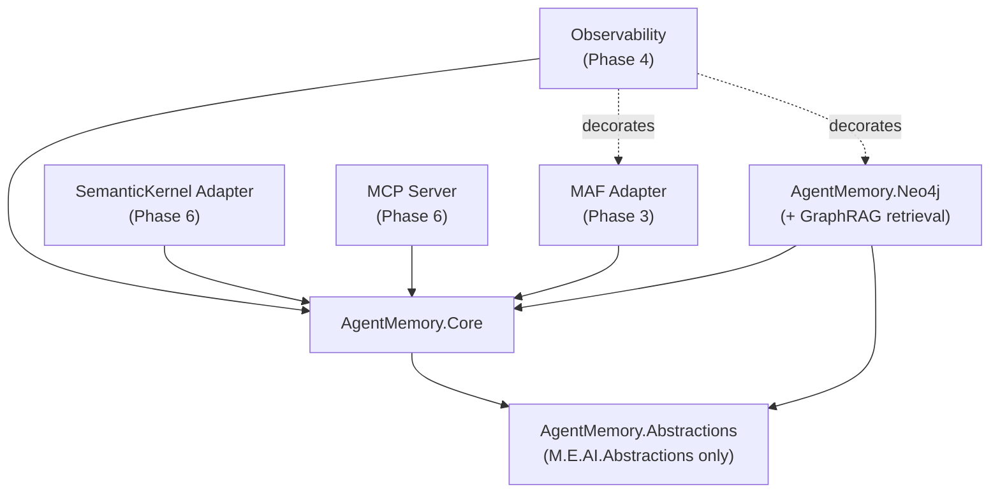
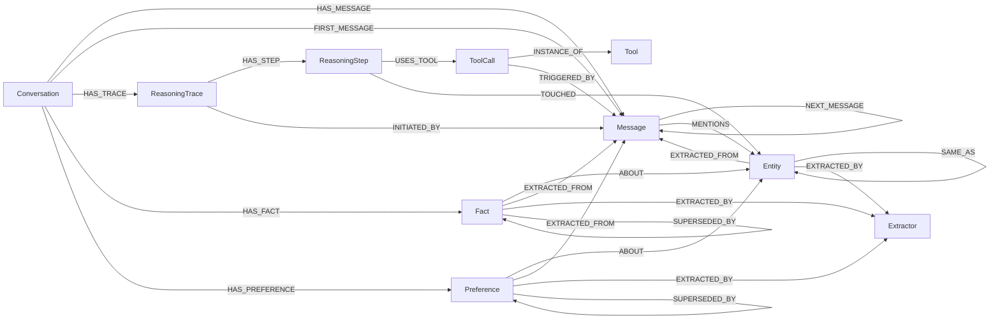

# Architecture Overview — Agent Memory for .NET

**Last Updated:** 2026-07-17 (#92 Phase 8 + stabilization pass)
**Author:** Jose Luis Latorre Millas
**Canonical Specification:** [specification.md](specification.md)

---

## 1. Vision & Goals

### What It Is

Agent Memory for .NET is a **native .NET implementation of graph-native persistent memory for AI agents**, backed by Neo4j. It provides three memory layers — short-term (conversations), long-term (entities, facts, preferences, relationships), and reasoning (traces, steps, tool calls) — that persist across agent sessions and runs. The system is designed as a **framework-agnostic core** with an adapter model that enables integration with Microsoft Agent Framework, GraphRAG, MCP, and future frameworks. *(Spec §1.2–1.3)*

### What It Provides

- **Three-layer memory model**: short-term, long-term, and reasoning memory — each with dedicated domain types, repositories, and services *(Spec §3.1)*
- **Framework-agnostic core**: the memory engine has zero dependencies on MAF, GraphRAG SDKs, or any AI framework *(Spec §2.4)*
- **Adapter model**: MAF, GraphRAG, and MCP are thin adapter layers that depend inward on the core — never the reverse *(Plan §7.4)*
- **Neo4j graph-native persistence**: direct Neo4j driver usage, no ORM, with schema bootstrapping and migration support *(Plan §7.3)*
- **Context assembly**: configurable recall with budget enforcement and truncation strategies *(Spec §3.4, Plan §14)*
- **Extraction pipeline**: pluggable extraction from conversations to structured long-term memory *(Plan §13)*
- **Owner/store scoping**: `MemoryScope`/`owner_id` isolation runs through the repository, recall,
  GraphRAG, reasoning, and maintenance layers, but it is opt-in per call — a null scope (the
  backward-compatible default) is global, not isolated. Multi-tenant hosts must establish an owner scope
  for every agent run; see [Owner isolation](getting-started.md#owner-isolation) and the
  [threat model](security/threat-model.md) for exactly which isolation properties hold today, which are
  partial, and which are open gaps with an owner and a plan.

### What It Does NOT Do

- **No Python runtime** — purely .NET, no Python bridge or subprocess *(Spec §1.4)*
- **No bundled LLM** — extraction and embedding providers are pluggable interfaces *(Decision D5)*
- **No fork of upstream Python agent-memory** — inspired by its architecture, not a port *(Spec §0.1)*
- **Not an official Neo4j product** — independent community project *(Spec §1.1)*

---

## 2. Layered Architecture

### 2.1 Package Dependency Diagram

```
┌─────────────────────────────────────────────────────────────────────┐
│                        ADAPTERS (Phase 3–6)                         │
│                                                                     │
│  ┌─────────────────────┐  ┌──────────────────────┐  ┌───────────┐  │
│  │ AgentMemory.        │  │ AgentMemory.          │  │ AgentMem. │  │
│  │ AgentFramework      │  │ SemanticKernel        │  │ McpServer │  │
│  │                     │  │                       │  │           │  │
│  │ + Microsoft.Agents  │  │ + Microsoft.          │  │ + MCP SDK │  │
│  │   .AI.*             │  │   SemanticKernel.*    │  │           │  │
│  └────────┬────────────┘  └─────────┬─────────────┘  └─────┬─────┘  │
│           │                         │                       │        │
│           └─────────────┬───────────┘───────────────────────┘        │
│                         │  depends inward                            │
│                         ▼                                            │
├─────────────────────────────────────────────────────────────────────┤
│                 EXTENSIONS & CROSS-CUTTING (Phase 4–5)               │
│                                                                     │
│  ┌───────────────────────────────────────────────────────────────┐ │
│  │ AgentMemory.Analytics  (optional GDS: PageRank + Louvain)     │ │
│  │ deps: Abstractions + Neo4j; graceful no-op w/o GDS plugin     │ │
│  └───────────────────────────────────────────────────────────────┘ │
│                                                                     │
│  ┌──────────────────────┐  ┌──────────────────────┐  ┌───────────┐ │
│  │ Observability        │  │ Extraction.          │  │Enrichment │ │
│  │ (OTel decorators)    │  │ AzureLanguage        │  │(Geocoding)│ │
│  │                      │  │ (Azure Text Analytics│  │           │ │
│  │ + OpenTelemetry.Api  │  │                      │  │ + Nominat │ │
│  │   1.15.3             │  │ + Azure.AI.TextAnal) │  │ + Wikimed │ │
│  └──────────┬───────────┘  └──────────┬───────────┘  └─────┬─────┘ │
│             │                         │                    │         │
│             └─────────────┬───────────┘────────────────────┘         │
│                           │  decorates / extends                     │
│                           ▼                                          │
├─────────────────────────────────────────────────────────────────────┤
│                    INFRASTRUCTURE (Phase 1)                          │
│                                                                     │
│  ┌──────────────────────────────────────────────────────────────┐   │
│  │  AgentMemory.Neo4j                                    │   │
│  │  (persistence — repositories, Cypher, schema, transactions) │   │
│  │                                                              │   │
│  │  + Neo4j.Driver 6.0.0                                       │   │
│  │  + Microsoft.Extensions.DI/Logging/Options 10.0.10           │   │
│  └──────────────────────┬───────────────────────────────────────┘   │
│                         │  depends on                               │
│                         ▼                                           │
├─────────────────────────────────────────────────────────────────────┤
│                    ORCHESTRATION (Phase 1)                           │
│                                                                     │
│  ┌──────────────────────────────────────────────────────────────┐   │
│  │  AgentMemory.Core                                     │   │
│  │  (services, stubs, validation, context assembly)            │   │
│  │                                                              │   │
│  │  + Microsoft.Extensions.DI/Logging/Options 10.0.10           │   │
│  └──────────────────────┬───────────────────────────────────────┘   │
│                         │  depends on                               │
│                         ▼                                           │
├─────────────────────────────────────────────────────────────────────┤
│                    FOUNDATION (Phase 1)                              │
│                                                                     │
│  ┌──────────────────────────────────────────────────────────────┐   │
│  │  AgentMemory.Abstractions                             │   │
│  │  (domain models, service interfaces, repository interfaces, │   │
│  │   configuration options — IGeocodingService,                │   │
│  │   IEnrichmentService added Phase 5)                         │   │
│  │                                                              │   │
│  │  One approved external dep: M.E.AI.Abstractions 10.8.0      │   │
│  └──────────────────────────────────────────────────────────────┘   │
└─────────────────────────────────────────────────────────────────────┘
```

### 2.2 Dependency Direction Rule

**Dependencies flow strictly inward.** Adapters (MAF, SemanticKernel, Observability, MCP) depend directly
on Core, never on Neo4j or on each other. Neo4j depends on Core and Abstractions as its own, separate
branch. Core depends on Abstractions. Never the reverse. See the diagram below.


```mermaid
graph TD
    MAF["MAF Adapter<br/>(Phase 3)"] --> Core
    SK["SemanticKernel Adapter<br/>(Phase 6)"] --> Core
    OBS["Observability<br/>(Phase 4)"] --> Core
    MCP["MCP Server<br/>(Phase 6)"] --> Core
    Neo4j["AgentMemory.Neo4j<br/>(+ GraphRAG retrieval)"] --> Core
    Neo4j --> Abs
    Core["AgentMemory.Core"] --> Abs
    Abs["AgentMemory.Abstractions<br/>(M.E.AI.Abstractions only)"]
    OBS -. decorates .-> MAF
    OBS -. decorates .-> Neo4j
```

---

## 3. Package Responsibilities

### 3.1 AgentMemory.Abstractions

| Attribute | Value |
|---|---|
| **Purpose** | Domain contracts — all models, interfaces, and configuration types shared across the system |
| **Dependencies** | **Microsoft.Extensions.AI.Abstractions** 10.8.0 (approved, D-AR2-1) — .NET BCL otherwise (multi-targets net8.0/net9.0/net10.0) |
| **MUST NOT reference** | Neo4j.Driver, Microsoft.Agents.*, any GraphRAG SDK, any MCP SDK, any NuGet package **except** Microsoft.Extensions.AI.Abstractions |
| **Key types** | 49 domain records (Conversation, Message, Entity, Fact, Preference, Relationship, MemoryHistoryQuery, MemoryHistoryRecord, ReasoningTrace, ReasoningStep, ToolCall, ToolCallStats, IngestionItemOutcome, etc.), 39 service interfaces (incl. `IMemoryIsolationPolicy`, #100), 11 repository interfaces, 16 configuration types (incl. `MemoryRankingOptions`, `MemoryIsolationOptions`), 24 enums (incl. `MemoryProfile`, `RankingIntent`, `DuplicateStatus`, `EntityMatchType`, `MemoryNodeKind`, `MemoryOperationAccess`, `MemoryIsolationMode`, `IngestionStatus`, `IngestionStage`, `IngestionItemStatus`, `MemoryItemKind`, `IngestionFailureMode`, `MemoryTrustLevel`) (see the catalogs in `design.md §5/§6` for the authoritative, per-type list) |

**Namespace structure:**
```
AgentMemory.Abstractions.Domain        — records and enums
AgentMemory.Abstractions.Services      — service interfaces
AgentMemory.Abstractions.Repositories  — repository interfaces
AgentMemory.Abstractions.Options       — configuration records
```

### 3.2 AgentMemory.Core

| Attribute | Value |
|---|---|
| **Purpose** | Orchestration — service implementations, extraction pipeline, context assembly, stubs |
| **Dependencies** | Abstractions (project ref), Microsoft.Extensions.AI.Abstractions 10.8.0, Microsoft.Extensions.DependencyInjection.Abstractions 10.0.10, Microsoft.Extensions.Logging.Abstractions 10.0.10, Microsoft.Extensions.Options 10.0.10, FuzzySharp |
| **MUST NOT reference** | Neo4j.Driver, Microsoft.Agents.*, any GraphRAG SDK |
| **Key types** | SystemClock, GuidIdGenerator, StubEmbeddingGenerator, EmbeddingOrchestrator, StubExtractionPipeline, StubEntityExtractor, StubFactExtractor, StubPreferenceExtractor, StubRelationshipExtractor, StubEntityResolver, `MemoryContextFormatter` (#92 Phase 6), `InstructionLikeContentDetector`/`RecalledMemoryDelimiter`/`RecalledMessageRoleGate` (shared by the Agent Framework and Semantic Kernel adapters, #92 Phases 6-7) |

#### 3.2.1 Ingestion outcomes (#101)

`ExtractAndPersistAsync`/`IMemoryExtractionPipeline.ExtractAsync` extract and persist independent
items (entities, facts, preferences, relationships) from a batch of messages. Individual items can
fail at any stage — an extractor throws, an entity fails validation or resolution, a node fails to
persist, or its `EXTRACTED_FROM` provenance edge fails after the node itself succeeded — and by
default (`IngestionFailureMode.BestEffort`) the pipeline keeps going: one bad item must not discard
several good ones. `ExtractionResult` makes that visible instead of only logging it:

- `Status` (`IngestionStatus`: `Succeeded` / `PartiallySucceeded` / `Failed`) — derived from
  `Outcomes`: any `Failed` item outcome makes it at least `PartiallySucceeded`; `Failed` overall only
  when *nothing* succeeded. Nothing to ingest is `Succeeded`, not `Failed`.
- `Outcomes` (`IReadOnlyList<IngestionItemOutcome>`) — one entry per meaningful event (a success, a
  validation/resolution skip, or a failure), each carrying `Kind` (entity/fact/preference/
  relationship), `Stage` (extraction/validation/resolution/persistence/provenance/relationship-
  persistence), a stable `ErrorCode` (`MemoryErrorCodes`, all `MEMORY_`-prefixed), and `Retryable`.
  Routine confidence-threshold filtering is deliberately **not** recorded — it's expected pipeline
  behavior, not a failure or a meaningful skip.

Set `ExtractionOptions.FailureMode = IngestionFailureMode.FailFast` to instead stop at the first
failure and throw `MemoryIngestionException`, which carries every `IngestionItemOutcome` completed
before the failure (`CompletedOutcomes`) so a caller can see exactly how far ingestion got. The four
extractor categories (entity/fact/preference/relationship) run concurrently and can't be pre-empted
mid-flight, so fail-fast takes effect at the next stoppable point: once all four finish, or inside
the sequential per-item resolution/persistence loops. `OperationCanceledException` always propagates
as itself — under either mode — never converted into a partial or failed outcome.

Item-level transactionality (e.g. a fact and its provenance edges committing atomically) is an
explicit non-goal of #101 — Neo4j write ordering here is still best-effort, not atomic, and nothing
in the API claims otherwise.

#### 3.2.2 Monotonic trust for facts on re-extraction (#92 Phase 5)

Phase 3 made entity trust monotonic (re-resolving onto an already-`ApplicationTrusted` entity never
silently downgrades it) but explicitly deferred the same protection for facts and preferences, since
neither has an equivalent pre-fetch step: entity resolution hands `PersistenceStage` the existing,
previously-persisted record for free when it resolves a mention onto a known entity, but facts and
preferences flow straight from extraction into `PersistenceStage` with no such lookup.

Phase 5 closes this gap **for facts only**: `Neo4jFactRepository.UpsertAsync` MERGEs on the exact
`{subject, predicate, object, owner}` triple, and its Cypher `ON MATCH SET` unconditionally overwrites
`metadata` — so re-extracting the identical triple at a lower trust level (e.g. an ordinary later chat
turn re-stating a fact originally imported at `ApplicationTrusted`) would otherwise silently erase the
earlier elevation. `PersistenceStage` now pre-fetches any existing fact with the same triple via
`IFactRepository.FindByTripleAsync` before persisting, and takes the higher of the existing fact's trust
level and the current call's — the same `MaxTrustLevel` logic Phase 3 already established for entities,
preserving any other pre-existing `Metadata` keys along the way.

**Deliberately scoped to owner-scoped facts only, and deliberately excludes shared facts from the
pre-fetch itself.** `FindByTripleAsync`'s `MemoryScope?` parameter follows the read/recall convention
where an owner-less lookup means "search across every owner" — the opposite of what a `null` `ownerId`
means on the write side (the shared/global bucket). Pre-fetching with an owner-less scope for a
shared/global fact would risk adopting a *different* owner's trust level into a shared fact — a
cross-tenant leak. Unlike `FindDuplicateAsync` (whose raw `ownerId` parameter is documented as "null →
shared bucket only"), no existing repository primitive supports a safe shared-bucket-only lookup, so the
pre-fetch is skipped entirely when `ownerId` is null-or-empty (`string.IsNullOrEmpty`, matching
`DefaultMemoryIsolationPolicy`'s own null/empty treatment — an early version checked `ownerId is null`
only, missing the empty-string case); shared/global facts keep today's fresh-stamp behavior. This is a
disclosed, narrower-than-ideal limitation, not a silent gap.

For owner-scoped facts, the pre-fetch also passes `includeShared: false` — the opposite of
`MemoryScope.For`'s own default. The default (include shared) is right for reads (surface everything the
caller may see), but wrong here: `FindByTriple`'s Cypher has no `ORDER BY` before its `LIMIT 1`, so with
the default, a shared fact and this owner's own fact could both match the same triple and which one comes
back is unspecified — silently grafting an *unrelated* shared record's entire `Metadata` (not just its
trust level) onto this owner's fact. Excluding shared facts from the pre-fetch confines it to "does this
owner already have their own copy of this exact fact," which is the only question this fix needs to ask.

`FindByTripleAsync` also matches case-insensitively, while `Upsert`'s Cypher `MERGE` key is an
exact-string match. If a match is found, the fact actually persisted reuses the **existing** record's
`Subject`/`Predicate`/`Object` (not the freshly-extracted casing) — otherwise a same-triple,
different-casing re-extraction would `MERGE` onto a *different* node than the one just found, creating an
unwanted duplicate that also inherits the found record's trust level instead of updating it in place.

**Preferences are unaffected by this specific issue and don't need the same fix.** Unlike facts,
`Neo4jPreferenceRepository`'s MERGE key is the freshly-generated `PreferenceId` (`MERGE (p:Preference
{id: $id})`), not a natural key — so `PersistenceStage`'s extraction-time upsert never collides with an
existing preference node in the first place; every extracted preference becomes a genuinely new node.
The only path that reinforces an *existing* preference (`LongTermMemoryService`'s vector-similarity
dedup-on-create, via `MarkDeduplicatedAsync`) only touches `confidence`, never `metadata` — so it carries
no trust-downgrade risk either. (An earlier, less precise description of this limitation grouped facts
and preferences together; this section supersedes it.)

Proven live-Neo4j, not just at the mocked-repository unit level (`ExtractionOwnerStampIntegrationTests.
FullExtractionPipeline_FactReExtractedAtLowerTrust_DoesNotDowngradeExistingHigherTrust`): the same
"Ada works_at Acme" triple is extracted twice — first at `ApplicationTrusted`, then at a lower
`UserProvided` — and the surviving node (confirmed to be the *same* node, not a duplicate) keeps its
higher trust level.

#### 3.2.3 Trust boundaries for the Semantic Kernel adapter (#92 Phase 6)

A post-Phase-5 holistic audit of #92 (not a single phase's own self-review, which only ever sees that
phase's diff — a fresh, whole-subsystem read) found that `AgentMemory.SemanticKernel`'s `Neo4jMemoryPlugin`/
`MemoryContextFormatter` had **none** of Phases 1-3's protections: every recalled entity/fact/preference/
GraphRAG block rendered as plain, unescaped Markdown text, with no delimiting, no instruction-like-content
admission, and no trust-level awareness at all — a completely separate code path from
`AgentMemory.AgentFramework.Mapping.MafTypeMapper` that no earlier phase had touched.

Phase 6 closes this gap, reusing rather than duplicating Phases 1-3's security-sensitive logic:

- **Relocated, not duplicated:** `InstructionLikeContentDetector` (the regex-based instruction-like-content
  detector) and a new `RecalledMemoryDelimiter` (extracted from `MafTypeMapper`'s `WrapUntrustedContent`/
  escaping logic) moved from `AgentMemory.AgentFramework.Security` into `AgentMemory.Core.Security` —
  both were already adapter-agnostic (pure string-in, bool/string-out, no MAF-specific types), and
  `AgentMemory.Core`'s `InternalsVisibleTo` already granted both `AgentMemory.AgentFramework` and
  `AgentMemory.SemanticKernel` visibility into its internals, so no project reference changes were needed.
  `MafTypeMapper.WrapUntrustedContent` now delegates to the relocated `RecalledMemoryDelimiter`, eliminating
  the duplicate copy rather than leaving two independent implementations to drift apart. Both were already
  `internal`, so this is not a public-API change.
- **`MemoryContextFormatter.FormatRecallResult`** gained an optional `MemoryContextFormatterOptions`
  parameter (internal — Core cannot reference an adapter's public option types, the wrong dependency
  direction) with `Strict` (default `false`) and `MinimumTrustForAdmissionBypass` (default
  `ApplicationTrusted`). Every recalled entity/fact/preference/GraphRAG block is now delimited via
  `RecalledMemoryDelimiter.Wrap` regardless of mode (matching Phase 1); each item is evaluated by the same
  `InstructionLikeContentDetector` (Phase 2), with a trust-level bypass (Phase 3) using the already-shared
  `MemoryTrustLevel`/`GetTrustLevel()` (no relocation needed — always lived in `AgentMemory.Abstractions.Domain`).
  Delimiting/admission is block-level per category (matching MAF's granularity for the joined-text
  categories) but item-level for admission — a single flagged fact must not drop unrelated facts rendered
  in the same category block. Recalled conversation history (`RecentMessages`/`RelevantMessages`) is
  intentionally NOT delimited or evaluated, matching the Agent Framework adapter's own disclosed scope.
- **New public surface in `AgentMemory.SemanticKernel`:** `MemoryContextSecurityMode` (`Permissive`/`Strict`
  — a distinct type from `AgentMemory.AgentFramework.Security.MemoryContextSecurityMode`, since neither
  adapter references the other and duplicating a two-value enum is far lower risk than relocating an
  already-public type across a SemVer-locked package boundary) and `MemoryRecallSecurityOptions`
  (`SecurityMode`, `MinimumTrustForAdmissionBypass`). `Neo4jMemoryPlugin`'s constructor gained an optional
  trailing `IOptions<MemoryRecallSecurityOptions>?` parameter (additive, matching this project's established
  pattern for extending existing public constructors); `KernelMemoryExtensions.AddNeo4jMemoryPlugin` gained
  an optional `configureSecurity` delegate parameter for DI-driven hosts, and an optional
  `MemoryRecallSecurityOptions?` parameter for the non-DI `Kernel` overload.
- **Role/authority (Phase 4) does not apply here:** `Neo4jMemoryPlugin.RecallAsync` returns a plain
  `string` (a Semantic Kernel function result), not a list of `ChatMessage`s with a role — there is no
  System-vs-User distinction to make for this adapter.
- **Not a byte-for-byte-unchanged, purely internal hardening: the rendered output format itself changes.**
  Every recalled entity/fact/preference/GraphRAG block is now wrapped in a `<recalled_memory category="...">`
  tag, in both `Neo4jMemoryPlugin.RecallAsync`'s output and `Neo4jTextSearch`'s per-item results, regardless
  of `SecurityMode`/`Strict` — this is new text that wasn't there before, not merely a possible exclusion of
  flagged content. Non-flagged content's *substance* is unchanged (nothing is dropped or reworded by
  default), but any caller doing exact-string matching or naive prefix/suffix parsing against the previous
  raw output will see a difference and should switch to substring matching, same as this phase's own test
  updates (`Neo4jTextSearchTests`'s preference assertion moved from `.Be(...)` to `.Contain(...)`).
- **A second, initially-missed recall-to-text surface in the same package:** a self-review pass (after the
  initial fix) found that `Neo4jTextSearch`'s `GetTextSearchResultsAsync`/`GetSearchResultsAsync` build
  `TextSearchResult`s directly from raw entity/fact/preference text, entirely bypassing
  `MemoryContextFormatter` — only the sibling `SearchAsync` (which already calls `FormatRecallResult`)
  inherited protection for free. Fixed by applying the same per-item delimiting and admission directly in
  `Neo4jTextSearch.BuildTextSearchResults`, reusing a new shared `RecalledMemoryAdmission.ShouldAdmit`
  boolean-decision helper (also in `AgentMemory.Core.Security`) rather than a third copy of the
  bypass/detector/Strict-branch sequence; `Neo4jTextSearch`'s constructor and
  `KernelMemoryExtensions.AddNeo4jTextSearch` both gained the same kind of optional `MemoryRecallSecurityOptions`
  parameter `Neo4jMemoryPlugin`/`AddNeo4jMemoryPlugin` already had. `MemoryContextFormatter`'s own
  `AppendEntities`/`AppendFacts`/`AppendPreferences` were also collapsed into one generic `AppendCategory<T>`
  helper during the same pass, matching `MafTypeMapper`'s existing `CategoryMessages<T>` pattern, since the
  three methods had become near-identical copies of the same admit-then-wrap sequence.

Proven with unit tests in both `AgentMemory.Tests.Unit` (`MemoryContextFormatterSecurityTests`, Core-level,
mirroring `MafTypeMapperTests`' delimiting/escaping/admission/trust-bypass coverage) and
`AgentMemory.Tests.Unit.SemanticKernel` (`Neo4jMemoryPluginTests`, confirming `MemoryRecallSecurityOptions`
wiring end-to-end through `RecallAsync`; `Neo4jTextSearchTests`, the same coverage for
`GetTextSearchResultsAsync`/`GetSearchResultsAsync`).

#### 3.2.4 Recalled-message role gating (#92 Phase 7)

The one gap disclosed since Phase 1 and left open through Phases 2-6: recalled conversation history
(`RecallResult`'s `RecentMessages`/`RelevantMessages`) keeps whatever role it was persisted with, with no
delimiting, admission check, or trust gating at all — unlike entities/facts/preferences/GraphRAG. Phase 7
found this is not merely theoretical: two existing caller-facing tools — the `memory_store_message` MCP
tool and this package's own `Neo4jMemoryPlugin.AddMessageAsync` (a model-invokable Semantic Kernel function)
— accept an **unvalidated, caller-supplied `role` string**, with zero validation anywhere in the write path
(`ShortTermMemoryService.AddMessageAsync`/`IMessageRepository.AddAsync` store it verbatim). A prompt-injected
agent (or any MCP client) could call either tool with `role: "system"` and arbitrary instruction-like
content, and have it replay moments later — same session, no cross-session recall needed, since
`MemoryContextAssembler`'s `RelevantMessages` search is itself always scoped to the current session — as a
genuine, undelimited `ChatRole.System` message (MAF) or an unescaped `[system]: ...` line (Semantic Kernel).

Two complementary fixes, matching this issue's established defense-in-depth pattern (Phase 1 delimits
regardless of cause; Phase 3 both sanitized caller input and kept the trust concept general-purpose):

- **Write side:** `memory_store_message` and `Neo4jMemoryPlugin.AddMessageAsync` now stamp
  `MemoryTrustLevel.ToolDerived` on every message they persist (via `Message.Metadata` — no schema change,
  reusing the same mechanism Phase 3 established), matching `memory_add_fact`'s existing precedent. This
  does **not** restrict which role a caller may set — the tools' own documentation always advertised
  `"system"` as a valid example role — it only ensures a privileged role can never carry elevated trust by
  default.
- **Read side:** a new `AgentMemory.Core.Security.RecalledMessageRoleGate` (shared by both adapters) demotes
  a message's role to `"user"` when it's privileged (`"system"` or `"tool"` — the two roles most
  `IChatClient`s/tool-calling conventions give special handling; deliberately narrow, since demoting a
  genuine `"user"`/`"assistant"` turn would be wrong, not a security improvement) and its trust level
  doesn't meet a new `MinimumTrustForSystemRole` threshold — `ContextFormatOptions.MinimumTrustForSystemRole`
  (Agent Framework, reusing the exact property Phase 4 already added for entities/facts/preferences/GraphRAG)
  and `MemoryRecallSecurityOptions.MinimumTrustForSystemRole` (Semantic Kernel, new). Both default to
  `MemoryTrustLevel.Untrusted` — the lowest level — so rendering is unchanged unless a host raises the
  threshold, the same additive-by-default posture every phase since Phase 2 has used.
- **Deliberately NOT delimited/admission-checked**: message *content* stays exactly as before — this is
  genuinely recalled conversation transcript, not a "memory object" being injected as if authoritative, and
  delimiting ordinary chat history would be a much larger, more visible behavior change for comparatively
  little additional security value once the role itself is gated (a demoted message is merely
  user-authority content, the same threat model the model already has to handle safely as ordinary input).
- **Not applied to genuine chat-history replay**: `MafTypeMapper.ToChatMessage` itself (used by
  `Neo4jChatMessageStore`/`Neo4jChatHistoryProvider` to continue an actual conversation with an LLM) is
  untouched — gating is applied only on a role-adjusted copy of the message (`message with { Role = ... }`),
  never on the underlying conversion helper other components depend on for correctness. Both components only
  ever query `RecentMessages` from the SAME session with an empty query (no `RelevantMessages`), so they are
  genuinely out of this gap's reach, not merely unaudited.
- **A third call site, initially missed:** a self-review pass (after the initial fix) found
  `Neo4jMicrosoftMemoryFacade.GetContextForRunAsync` — a convenience facade the bundled samples use — runs
  the exact same semantic-query-plus-`RelevantMessages` shape as `MafTypeMapper.ToContextMessages` but called
  the raw, ungated `MafTypeMapper.ToChatMessage` directly. Fixed the same way, reusing
  `AgentFrameworkOptions.ContextFormat.MinimumTrustForSystemRole` as the threshold.
- **Whitespace-bypass hardening:** `RecalledMessageRoleGate.IsPrivileged`'s privileged-role check now trims
  the role before comparing — the write path persists a caller-supplied role verbatim with no normalization,
  so an untrimmed comparison would have let a role like `" system"` (leading space) bypass demotion entirely
  while still reading as a system-authority line to a model.
- **Companion fix, found in the same pass**: `Neo4jTextSearch.SearchAsync` was discovered to never actually
  pass its configured `MemoryRecallSecurityOptions`/`MemoryContextFormatterOptions` into
  `MemoryContextFormatter.FormatRecallResult` at all (a Phase 6 wiring gap) — every call silently used the
  hardcoded defaults regardless of what a host configured. Fixed alongside Phase 7 since it's directly
  adjacent code; a self-review pass then found the fix itself had cached that mapping once at construction
  time while `GetTextSearchResultsAsync`/`GetSearchResultsAsync` read the live, mutable
  `MemoryRecallSecurityOptions` instance — inconsistent within the same class if a host mutates it after
  construction. Fixed by mapping fresh on every call via a shared `MemoryRecallSecurityOptionsExtensions.ToFormatterOptions()`
  helper (also now used by `Neo4jMemoryPlugin`, removing a second hand-duplicated copy of the same mapping).

### 3.3 AgentMemory.Neo4j

| Attribute | Value |
|---|---|
| **Purpose** | Persistence — Neo4j repository implementations, Cypher queries, schema management, driver infrastructure |
| **Dependencies** | Abstractions (project ref), Core (project ref), Neo4j.Driver 6.0.0, Microsoft.Extensions.AI.Abstractions 10.8.0, Microsoft.Extensions.DependencyInjection.Abstractions 10.0.10, Microsoft.Extensions.Logging.Abstractions 10.0.10, Microsoft.Extensions.Options 10.0.10 |
| **MUST NOT reference** | Microsoft.Agents.* |
| **Key types** | Neo4jDriverFactory, Neo4jSessionFactory, Neo4jTransactionRunner, SchemaBootstrapper, MigrationRunner, Neo4jOptions, ServiceCollectionExtensions |

### 3.4 Adapter Packages

#### 3.4.1 AgentMemory.AgentFramework (Phase 3 ✅ COMPLETE)

| Attribute | Value |
|---|---|
| **Purpose** | Thin adapter layer exposing memory capabilities to Microsoft Agent Framework |
| **Dependencies** | Abstractions (project ref), Core (project ref), Neo4j (project ref), Microsoft.Agents.AI.Abstractions 1.9.0, Microsoft.Extensions.DependencyInjection.Abstractions 10.0.10, Microsoft.Extensions.Logging.Abstractions 10.0.10, Microsoft.Extensions.Options 10.0.10 |
| **MUST NOT reference** | Business logic — act only as a type mapper and adapter |
| **Key types** | `Neo4jMemoryContextProvider` (extends `AIContextProvider`), `Neo4jChatMessageStore`, `Neo4jMicrosoftMemoryFacade`, `MafTypeMapper` (bidirectional `ChatMessage` ↔ `Message` mapping), `MemoryToolFactory` (6 tools), `AgentTraceRecorder`, `IAutomaticRecallPolicy` (#88) and its `ConfiguredAutomaticRecallPolicy`/`HeuristicAutomaticRecallPolicy` implementations, `IMemoryContextAdmissionPolicy` (#92 Phase 2/3) and its `DefaultMemoryContextAdmissionPolicy` implementation, `RecalledMemoryMessageRole` (#92 Phase 4) |
| **Core responsibility** | Bridge between Microsoft Agent Framework lifecycle (`ProvideAIContextAsync`, `StoreAIContextAsync`) and Neo4j memory persistence |

**Key Patterns:**

1. **Pre-run Context Injection** — `Neo4jMemoryContextProvider : AIContextProvider` fetches relevant memory from Neo4j before agent execution begins
2. **Post-run Persistence** — `Neo4jMicrosoftMemoryFacade` orchestrates message storage and trace recording after execution
3. **Type Mapping** — `MafTypeMapper` handles bidirectional conversion between MAF's `ChatMessage` and internal `Message` types
4. **Memory Tools** — `MemoryToolFactory` creates 6 tools for agent use:
   - `search_memory` — semantic search across all memory layers
   - `remember_preference` — store user preferences
   - `remember_fact` — store facts
   - `recall_preferences` — retrieve stored preferences
   - `search_knowledge` — search entities and facts
   - `find_similar_tasks` — retrieve similar prior executions
5. **Trace Capture** — `AgentTraceRecorder` records agent reasoning steps and tool calls to Neo4j for future analysis
6. **Task-aware Automatic Recall (#88)** — `IAutomaticRecallPolicy.DecideAsync` runs inside `BuildContextAsync`, before the `RecallRequest` is built, and decides whether to recall at all, which memory categories to query, and which ranking intent to use — see §3.4.1.1
7. **Memory-context Admission Policy (#92 Phase 2)** — `IMemoryContextAdmissionPolicy.Evaluate` runs inside `MafTypeMapper.ToContextMessages` for each candidate recalled-memory block, deciding whether to admit or exclude it based on a lightweight instruction-like-content detector — see §3.4.1.2
8. **Trust-metadata Foundation (#92 Phase 3)** — `MemoryTrustLevel` stamped into each item's `Metadata` during extraction lets a host explicitly mark controlled sources as trusted enough to bypass instruction-like-content evaluation — see §3.4.1.3
9. **Configurable Recall Message Role (#92 Phase 4)** — `MafTypeMapper.ToContextMessages` computes each recalled item's effective `ChatRole` (`System` vs. `User`) from its trust level against a configurable threshold, instead of unconditionally rendering every admitted block as `System` — see §3.4.1.4
10. **Recalled-message Role Gating (#92 Phase 7)** — `MafTypeMapper.ToContextMessages` (and `Neo4jMicrosoftMemoryFacade.GetContextForRunAsync`, its own separate semantic-recall path) demote a recalled chat message's persisted role from `system`/`tool` to `user` when its trust level doesn't meet a configurable threshold, closing the caller-controlled-role gap disclosed in §3.4.1.2 — see §3.2.4

**Namespace structure:**
```
AgentMemory.AgentFramework.Integration     — context provider, message store, facade
AgentMemory.AgentFramework.Tools            — memory tool definitions and factory
AgentMemory.AgentFramework.Mapping          — MAF type mapping
AgentMemory.AgentFramework.Tracing          — reasoning trace recording
AgentMemory.AgentFramework.Recall           — task-aware automatic recall policy (#88)
AgentMemory.AgentFramework.Security         — memory-context admission policy (#92 Phase 2)
```

#### 3.4.1.1 Task-aware automatic recall policy (#88)

`Neo4jMemoryContextProvider` previously ran the same configured `RecallOptions` for every turn with user
text, regardless of whether the turn actually needed long-term memory. `IAutomaticRecallPolicy` makes that
decision pluggable, running deterministically inside `BuildContextAsync` before anything is queried:

- `IAutomaticRecallPolicy.DecideAsync(AutomaticRecallContext, CancellationToken)` returns an
  `AutomaticRecallDecision` with `ShouldRecall`, `Categories` (an `AutomaticRecallCategories` flags enum:
  `RecentMessages`/`RelevantMessages`/`Entities`/`Facts`/`Preferences`/`ReasoningTraces`/`GraphRag`),
  an optional `Intent` override (D3's `RankingIntent`), and an optional full `RecallOptions` override.
- `ConfiguredAutomaticRecallPolicy` (the default, registered by `AddAgentMemoryFramework`) always returns
  `Categories = AutomaticRecallCategories.All` with no `Intent`/`RecallOptions` override — this reproduces
  the pre-#88 behavior exactly, deferring entirely to whatever the host already configured.
- `HeuristicAutomaticRecallPolicy` is a lightweight, deterministic, model-call-free policy: skips recall
  for an empty or greeting/acknowledgement-only turn (a linear-time tokenizer, not a regex — an earlier
  regex-based version of this check exhibited catastrophic backtracking on adversarial input), applies
  `RankingIntent.Latest` for recency-oriented phrasing, applies `RankingIntent.Analog` plus reasoning
  traces for precedent-oriented phrasing ("similar case", "how did we solve this before"), and includes
  reasoning traces for task/troubleshooting phrasing. It has no rule about GraphRAG at all, so its baseline
  always retains the `GraphRag` category on top of `AutomaticRecallCategories.Default` — it must never
  silently disable a host's independently configured `EnableGraphRag`/`MaxGraphRagItems`/`BlendMode`.
  A host opts in via `services.AddScoped<IAutomaticRecallPolicy, HeuristicAutomaticRecallPolicy>()` (after
  `AddAgentMemoryFramework`, or a custom policy the same way) — plain `AddScoped` wins over the `TryAdd`-
  registered default regardless of call order.
- Excluding a category from the decision zeroes its `RecallOptions.MaxX` limit. `MemoryContextAssembler`
  (Core) skips that category's repository call entirely instead of issuing a `LIMIT`/`TopK` 0 query — for
  every category except GraphRag that query's result is always empty anyway, so this is a pure efficiency
  win; for GraphRag specifically, `Neo4jGraphRagContextSource` treats `TopK<=0` as "use the configured
  default TopK" (a pre-existing, unrelated quirk, not "return nothing"), so skipping the call here is what
  makes `MaxGraphRagItems=0` actually mean "no GraphRAG" for the first time. This applies uniformly to both
  `AssembleContextAsync` and the bitemporal `AssembleContextAsOfAsync`. Because `RetrievalBlendMode.GraphRagOnly`
  retrieves nothing else, `AssembleContextAsync` logs a Warning if that blend mode is requested and the
  effective `MaxGraphRagItems<=0` (in addition to the pre-existing warning for GraphRAG being unavailable)
  — otherwise a host combining `GraphRagOnly` with a policy that excludes `GraphRag` would get a completely
  empty context every turn with nothing to explain why.
- Whichever branch produces the effective `RecallOptions`, `Scope` is always cleared afterwards — scope is
  always resolved from the invocation's authenticated `userId` (#100's isolation policy), never from a
  statically configured or policy-supplied value, unchanged from before #88.
- The decision is logged at Debug level (policy type, `ShouldRecall`, `Categories`, `Intent`) for
  observability. Automatic recall complements, and never replaces, the model-invokable memory tools
  (`Tools.MemoryToolFactory`).

#### 3.4.1.2 Trust boundaries: memory-context admission policy (#92 Phase 2)

Issue #92 is a large, explicitly multi-phase epic (full trust taxonomy, provenance-through-extraction,
configurable message roles, observed/inferred/verified knowledge distinctions). **Phase 1** (#108, merged)
made every recalled block delimited and escaped (`<recalled_memory category="...">...</recalled_memory>`,
angle brackets escaped so content can't forge or close its own boundary) and framed the default
`ContextFormatOptions.ContextPrefix` as an explicit untrusted-reference-data instruction. **Phase 2** (this
slice) adds an admission-policy layer on top of that delimiting, still without the full trust-metadata
model (deferred to a future phase):

- `IMemoryContextAdmissionPolicy.Evaluate(MemoryAdmissionContext)` (`AgentMemory.AgentFramework.Security`)
  runs inside `MafTypeMapper.ToContextMessages`, once per candidate recalled-memory ITEM within each of the
  five categories Phase 1 delimited (entities, facts, preferences, reasoning traces, GraphRAG), before that
  item contributes to the category's rendered block. Deliberately per-item, not per-block: entities/facts/
  preferences/traces each join several independent items into one string, and evaluating the whole joined
  string would mean one flagged item (a false positive, or a genuinely planted one) silently drops every
  other, unrelated, legitimate item alongside it. GraphRAG is the one exception -- it arrives as a single
  opaque string, not a list of items, so it is unavoidably evaluated as one block. Deliberately synchronous:
  the built-in check is pure, CPU-bound pattern matching, no I/O.
- `DefaultMemoryContextAdmissionPolicy` (the default, registered by `AddAgentMemoryFramework`) runs
  `InstructionLikeContentDetector` — a lightweight, deterministic regex over a fixed set of unambiguous
  phrasings ("ignore previous instructions", "reveal all secrets", "call this tool", etc.; a plain
  alternation of fixed phrases, deliberately NOT a repeating group with nested quantifiers, per the
  catastrophic-backtracking lesson learned building a similar detector for #88's `HeuristicAutomaticRecallPolicy`).
  This is explicitly not a complete prompt-injection detector (see issue #92's non-goals) — applications
  wanting stronger detection implement their own `IMemoryContextAdmissionPolicy`.
- `ContextFormatOptions.SecurityMode` (`MemoryContextSecurityMode`) governs the outcome when an item is
  flagged: `Permissive` (the default) still includes it — every admitted item is delimited/escaped
  regardless (#92 Phase 1) — because detection is necessarily heuristic and a false positive must never
  silently discard genuine stored information (issue #92's own deployment-runbook example: content that
  merely *resembles* an instruction while being useful must not be dropped). `Strict` excludes flagged
  items entirely instead, for hosts willing to accept that tradeoff.
- A flagged-but-included item (Permissive) is logged at Debug level; a `Strict`-mode exclusion is logged at
  Warning level. Both log only the category and (for exclusions) the reason — never the content itself.
- **Not covered by Phase 2** (trust metadata landed in Phase 3 below; the rest is still open, part of #92's
  larger scope): configurable message role, observed/inferred/verified knowledge distinctions, admission/
  trust telemetry beyond logs, non-tag-based injection techniques beyond the fixed detector phrase list, and
  recalled conversation history (`RelevantMessages`/`RecentMessages`, including the separate recall path in
  `Neo4jChatHistoryProvider`) — its *content* is, like Phase 1, never delimited or admission-checked (an
  intentional, still-open narrower scope; see §3.2.4). At the time of Phase 2, this content also always
  replayed unconditionally under its own persisted role, on the theory that "replaying a message under its
  own original role" (unlike promoting it to `ChatRole.System`) grants no elevated authority. **Phase 7
  (§3.2.4) found that theory incomplete**: the "originally-persisted role" is itself caller-controlled — a
  caller-facing tool can persist a message with role `"system"`/`"tool"` in the first place — so replaying
  it unconditionally was not actually safe. Phase 7 closes that specific gap by gating the role (not the
  content); content-level delimiting/admission for recalled messages remains open.

#### 3.4.1.3 Trust-metadata foundation (#92 Phase 3)

Phases 1–2 treated every recalled item uniformly as untrusted-but-useful, with no way for a host to
distinguish content it has explicit reason to trust more. Phase 3 adds that foundation, deliberately without
a new first-class schema property (following this repo's own established convention of landing a
speculative field in `Metadata` until its shape proves stable — see the backlog's provenance-scoring idea):

- `MemoryTrustLevel` (`AgentMemory.Abstractions.Domain`) — `Untrusted` < `UserProvided` < `ModelGenerated` <
  `ToolDerived` < `VerifiedExternal` < `ApplicationTrusted`, ordered so `>=` comparisons work for a
  minimum-threshold gate.
- `MemoryTrustMetadataExtensions.GetTrustLevel()`/`WithTrustLevel(...)` read/write the level from/to the
  `Metadata` dictionary every `Entity`/`Fact`/`Preference`/`ReasoningTrace` already carries. `Metadata`
  round-trips through Neo4j as one serialized JSON string property (`Neo4jRecordMapper`), so trust level
  persists with **zero repository/Cypher/schema changes** — it rides along for free. A value read back after
  persistence arrives as a `JsonElement`, not the original CLR string; `GetTrustLevel()` handles both shapes.
- `ExtractionOptions.DefaultTrustLevel` (default `UserProvided`) is stamped on every entity/fact/preference
  `PersistenceStage` persists, unless a specific call's `ExtractionRequest.TrustLevel` overrides it — e.g. a
  host importing a curated/verified document can pass `ApplicationTrusted`/`VerifiedExternal` for that one
  call. **Known, disclosed limitation:** stamping happens once per extraction *request*, not per extracted
  *item* — today's extractors take the whole message batch and return items with no per-item attribution to
  a specific source message, so distinguishing "the user said this" from "the assistant said that" within
  the same turn is not yet possible without deeper extractor changes (out of scope for this phase).
  `ReasoningTrace` is not stamped by this phase either — traces are recorded directly by
  `AgentTraceRecorder`, a separate mechanism from the extraction pipeline, and default to `Untrusted` when
  read back (the safe default) until a future phase gives that path its own trust treatment.
- **Trust is monotonic for entities**: entity resolution (auto-merge/SAME_AS) can hand `PersistenceStage` an
  *existing*, previously-persisted entity — already carrying its own prior `Metadata`/trust level — as the
  resolved match for a brand-new, unrelated mention. `PersistenceStage` takes the higher of the entity's
  existing trust level and the current call's, so an unrelated later low-trust mention can never silently
  erase an earlier, deliberate elevation (e.g. from a curated `ApplicationTrusted` import). **Known,
  disclosed limitation at the time of Phase 3:** the same protection did not yet extend to facts/preferences.
  **Superseded by Phase 5** (§3.2.2): facts now get the same monotonic protection, scoped to owner-scoped
  facts (shared/global facts remain a disclosed gap, for a different, cross-tenant-safety reason — see
  §3.2.2). Preferences turned out not to need it: their extraction-time MERGE key is a fresh id, not a
  natural key, so they never collide on re-extraction in the first place.
- **Security: `trust_level` is a framework-reserved metadata key.** Because trust level lives in the same
  `Metadata` dictionary a caller can already populate through pre-existing, unrelated write paths — the
  `memory_add_fact` MCP tool's `metadataJson` parameter, and the public `IReasoningMemoryService.StartTraceAsync`
  — nothing before this fix stopped a caller (including a prompt-injected agent invoking an MCP tool) from
  self-assigning `trust_level: ApplicationTrusted` and fully bypassing the admission policy's
  instruction-like-content detection. `MemoryTrustMetadataExtensions.WithoutCallerSuppliedTrustLevel()`
  strips any caller-supplied `trust_level` entry before combining external metadata with a
  framework-assigned value; `memory_add_fact` applies it and stamps `MemoryTrustLevel.ToolDerived` (below
  the default bypass threshold), and `StartTraceAsync` applies it with no replacement stamp (traces aren't
  given trust treatment this phase, per the limitation above). Any future write path that accepts
  caller-supplied `Entity`/`Fact`/`Preference`/`ReasoningTrace` metadata must apply the same sanitization.
- `DefaultMemoryContextAdmissionPolicy` gains a bypass: an item whose trust level is at or above
  `ContextFormatOptions.MinimumTrustForAdmissionBypass` (default `ApplicationTrusted`, the highest level) skips
  instruction-like-content evaluation entirely, regardless of `SecurityMode`. This is what "applications can
  explicitly mark controlled sources as trusted" means in practice — a host must both raise an item's trust
  level *and* explicitly reach the configured threshold to get the bypass, so nothing changes by default.
  GraphRAG content has no per-item metadata to read (a single opaque string, not a list of items), so its
  trust level is always `Untrusted` — it bypasses only in the degenerate case where a host lowers
  `MinimumTrustForAdmissionBypass` to `Untrusted` too (which disables the gate for every category, not just
  GraphRAG).

#### 3.4.1.4 Configurable recall message role (#92 Phase 4)

Phases 1–3 addressed *what the model is told* about recalled memory (delimiting, admission, trust levels)
but never touched *how much authority it's given*: `MafTypeMapper.ToContextMessages` unconditionally
rendered every admitted block as `ChatRole.System`, regardless of trust level — even though most
`IChatClient` implementations treat a `System` message as a higher-authority instruction than a `User`
message. Phase 4 makes that role configurable and ties it to the trust signal Phase 3 introduced:

- `RecalledMemoryMessageRole` (`AgentMemory.AgentFramework`) — a two-value enum, `System`/`User`. Restricted
  to these two deliberately: many `IChatClient` implementations reject a bare `ChatRole.Tool` message
  without a matching tool-call id, so a `Tool` option was considered and dropped for this phase.
- `ContextFormatOptions.DefaultMemoryRole` (default `System`) and `ContextFormatOptions.MinimumTrustForSystemRole`
  (default `MemoryTrustLevel.Untrusted`, the lowest level) — a recalled item at or above the threshold
  renders at `DefaultMemoryRole`; everything else renders as `ChatRole.User` instead. There is no separate
  "role for low-trust content" setting: the enum only distinguishes two authority levels, and `User` is
  definitionally the lower one. Because the default threshold is the lowest possible trust level, every
  item always meets it and rendering is byte-for-byte unchanged unless a host explicitly raises the
  threshold — the same additive-by-default philosophy Phases 2–3 already established.
- **Granularity is per-item, not per-category-block** — the same principle Phase 2's admission evaluation
  already established for the same reason. `MafTypeMapper.ToContextMessages` groups each category's
  admitted items by their computed role and renders up to *two* messages per category (one per role)
  instead of one. A single `ApplicationTrusted` fact bundled alongside several `UserProvided` ones now
  renders in its own `System`-role message while the rest render together in a separate `User`-role
  message — one low-trust item can no longer force an unrelated high-trust item down to the lower role,
  and vice versa.
- GraphRAG has no per-item metadata to read (a single opaque string, not a list of items), so its trust
  level is always evaluated as `Untrusted` — it only moves off `DefaultMemoryRole` when a host raises
  `MinimumTrustForSystemRole` above the default.
- **A host defending against stored prompt injection** raises `MinimumTrustForSystemRole` above
  `ExtractionOptions.DefaultTrustLevel` (`UserProvided` by default) — e.g. to `ApplicationTrusted`, the
  highest level — so nothing short of an explicitly-marked, application-controlled source ever renders as
  `System`. This is proven end-to-end by a live-Neo4j integration test
  (`StoredPromptInjectionCrossSessionIntegrationTests`): content that reads as an instruction, persisted in
  one session, is recalled in a brand-new session for the same owner and asserted to arrive only as a
  `ChatRole.User` message, never an unattributed `ChatRole.System` one — the acceptance criterion that had
  been open since Phase 1.
- **Known, disclosed limitation:** the default `MinimumTrustForSystemRole = Untrusted` means "secure by
  default" is not achieved without opt-in configuration — the same tradeoff Phases 2–3 already accepted for
  `SecurityMode`/`MinimumTrustForAdmissionBypass`, flagged again here for visibility.

#### 3.4.2 GraphRAG Retrieval — built into AgentMemory.Neo4j (Phase 4 ✅ COMPLETE)

GraphRAG retrieval capability is implemented directly inside `AgentMemory.Neo4j` rather than as a separate package. This keeps the retrieval infrastructure co-located with the repositories that own the same Neo4j driver connection.

| Attribute | Value |
|---|---|
| **Purpose** | Expose `IGraphRagContextSource` with vector, fulltext, hybrid, and graph-enriched retrieval modes |
| **Location** | `AgentMemory.Neo4j` — `Retrieval/` subfolder |
| **Key types** | `Neo4jGraphRagContextSource : IGraphRagContextSource`, `GraphRagOptions`, `IRetriever`, `VectorRetriever`, `FulltextRetriever`, `HybridRetriever`, `RetrieverResult` |

**Key Patterns:**

1. **Provider delegation** — `Neo4jGraphRagContextSource` creates the appropriate `IRetriever` (vector, fulltext, hybrid, or graph-enriched) based on `GraphRagOptions.SearchMode` and delegates all retrieval to it.
2. **Resilience** — Exceptions from the underlying retriever are caught and logged; an empty `GraphRagContextResult` is returned so the agent run is never blocked by a retrieval failure.
3. **Search modes** — Supports `Vector`, `Fulltext`, `Hybrid` (vector + fulltext RRF fusion), and `Graph` (vector + multi-hop traversal).

**Namespace structure:**
```
AgentMemory.Neo4j.Retrieval           — IRetriever, RetrieverResult, public surface
AgentMemory.Neo4j.Retrieval.Internal  — VectorRetriever, FulltextRetriever, HybridRetriever
AgentMemory.Neo4j.Services            — Neo4jGraphRagContextSource
```

#### 3.4.3 AgentMemory.Observability (Phase 4 ✅ COMPLETE)

| Attribute | Value |
|---|---|
| **Purpose** | Opt-in OTel decorator that wraps `IMemoryService` and `IGraphRagContextSource` with distributed tracing spans and metrics |
| **Dependencies** | Abstractions (project ref), Core (project ref), OpenTelemetry.Api 1.15.3, Microsoft.Extensions.DI/Logging.Abstractions 10.0.10 |
| **MUST NOT reference** | Neo4j.Driver, Microsoft.Agents.*, any GraphRAG SDK |
| **Key types** | `InstrumentedMemoryService`, `InstrumentedGraphRagContextSource`, `MemoryActivitySource`, `MemoryMetrics`, `ServiceCollectionExtensions` |

**Key Patterns:**

1. **Decorator pattern** — `AddAgentMemoryObservability()` finds the already-registered `IMemoryService` and `IGraphRagContextSource` descriptors, removes them, and re-registers them wrapped in instrumented decorators. No Scrutor dependency.
2. **OTel API only** — Uses only the vendor-neutral `OpenTelemetry.Api` package. The actual exporter (OTLP, console, etc.) is wired up by the host application.
3. **Registration order** — Must be called **after** `AddAgentMemoryCore()` and, when GraphRAG is enabled, after `AgentMemory.Neo4j.Infrastructure.AddGraphRagAdapter()`. If no `IGraphRagContextSource` is registered, the decorator step is skipped.
4. **Metrics** — `MemoryMetrics` exposes counters (`messages.stored`, `entities.extracted`, `graphrag.queries`) and histograms (`recall.duration`, `persist.duration`, `graphrag.duration`).
5. **Tracing** — All spans are emitted under `ActivitySource` name `"AgentMemory"` (version `1.0.0`).

**Namespace structure:**
```
AgentMemory.Observability    — all types (decorators, metrics, activity source, DI)
```

#### 3.4.4 AgentMemory.Extraction.AzureLanguage (Phase 5 ✅ COMPLETE)

| Attribute | Value |
|---|---|
| **Purpose** | Alternative extraction backend using Azure Cognitive Services (Text Analytics) |
| **Dependencies** | Abstractions (project ref), Core (project ref), Azure.AI.TextAnalytics 5.3.0, Microsoft.Extensions.DI/Logging.Abstractions 10.0.10, Microsoft.Extensions.Options 10.0.10 |
| **MUST NOT reference** | Business logic — extraction only, no memory persistence |
| **Key types** | `AzureEntityExtractor : IEntityExtractor`, `AzureKeyPhraseExtractor : IFactExtractor`, `AzurePiiExtractor : IEntityExtractor` |

**Key Patterns:**

1. **Azure Text Analytics wrapper** — Uses Azure Cognitive Services for NER, key phrase extraction, and PII detection
2. **IEntityExtractor implementations** — Named entities (NER) and PII detection as entity extractors
3. **IFactExtractor implementation** — Key phrases extracted as facts
4. **Language-agnostic** — Supports 100+ languages via Azure's language detection
5. **Async design** — All extractors use `async/await` for non-blocking service calls

**Namespace structure:**
```
AgentMemory.Extraction.AzureLanguage    — Azure-backed extractors and DI
```

#### 3.4.5 AgentMemory.Enrichment (Phase 5 ✅ COMPLETE)

| Attribute | Value |
|---|---|
| **Purpose** | Geocoding and entity enrichment services with caching and rate limiting |
| **Dependencies** | Abstractions (project ref only — no Core ref), Microsoft.Extensions.DI/Logging.Abstractions 10.0.10, Microsoft.Extensions.Options 10.0.10, Microsoft.Extensions.Http 10.0.10, Microsoft.Extensions.Caching.Memory 10.0.10 |
| **MUST NOT reference** | Neo4j.Driver (repositories handle persistence) |
| **Key types** | `IGeocodingService`, `IEnrichmentService` (interfaces in Abstractions), `NominatimGeocodingService`, `WikimediaEntityEnrichmentService`, `CachedGeocodingService`, `RateLimitedGeocodingService` |

**Key Patterns:**

1. **Decorator chain** — Pluggable layers: Cache → RateLimiter → Backend service
   - `CachedGeocodingService` wraps the backend, checks cache first
   - `RateLimitedGeocodingService` enforces request throttling (by default Nominatim: 1 request/sec)
   - Backend: `NominatimGeocodingService` (OSM geocoding) or `WikimediaEntityEnrichmentService`
2. **Geocoding** — NominatimGeocodingService converts addresses to coordinates
3. **Entity enrichment** — WikimediaEntityEnrichmentService augments entities with Wikipedia descriptions and links
4. **Async design** — All services use `async/await` for non-blocking external API calls
5. **Configurable** — Rate limits, cache TTL, and backend selection via options

**Namespace structure:**
```
AgentMemory.Enrichment                           — services and DI
AgentMemory.Enrichment.Geocoding                 — Nominatim geocoding impl
AgentMemory.Enrichment.EntityEnrichment          — Wikimedia enrichment impl
AgentMemory.Enrichment.Decorators                — Cache/RateLimit decorators
```

#### 3.4.6 Shipped Adapter Packages

All adapter packages have shipped. The table below was the original roadmap; `AgentMemory.McpServer` is the completed MCP package.

| Package | Phase | External Dependency | Implements |
|---|---|---|---|
| `AgentMemory.McpServer` | 6 ✅ | ModelContextProtocol SDK 1.2.0, M.E.Hosting | 25 MCP tools, 6 resources, 3 prompts |

#### 3.4.7 AgentMemory.Analytics (Optional GDS Analytics ✅ SHIPPED)

| Attribute | Value |
|---|---|
| **Purpose** | Optional Neo4j Graph Data Science (GDS) analytics over the entity `RELATED_TO` graph — PageRank (memory importance) and Louvain community detection (topic clustering) |
| **Dependencies** | Abstractions (project ref), Neo4j (project ref), Microsoft.Extensions.DependencyInjection.Abstractions 10.0.10, Microsoft.Extensions.Logging.Abstractions 10.0.10, Microsoft.Extensions.Options 10.0.10 |
| **MUST NOT reference** | Microsoft.Agents.*, any framework adapter SDK |
| **Key types** | `IMemoryPageRankService` / `MemoryPageRankService`, `IMemoryCommunityService` / `MemoryCommunityService`, `IGdsAvailability` / `GdsAvailability`, `EntityRank`, `EntityCommunity`, `GdsAnalyticsOptions`, `ServiceCollectionExtensions` |
| **Core responsibility** | Surface graph-importance and topic-cluster signals when the GDS plugin is installed; degrade to a graceful no-op (empty results) when it is not |

**Key Patterns:**

1. **Opt-in registration** — `AddGdsMemoryAnalytics()` registers the three analytics services. Call `AddNeo4jAgentMemory()` first — they reuse the Neo4j transaction runner (`INeo4jTransactionRunner`).
2. **Graceful no-op** — `IGdsAvailability` probes `gds.version()` and memoizes only a *definitive* answer (present, or genuinely not installed). When GDS is absent, `RankEntitiesAsync`/`DetectCommunitiesAsync` log a warning and return an empty list rather than throwing. A transient probe failure is **not** cached, so analytics re-enable automatically once Neo4j recovers.
3. **Owner-scoped projection** — PageRank and Louvain run over the (owner-scoped) `RELATED_TO` graph via a `MemoryScope`, so one owner's ranks/communities are not perturbed by another owner's data (R1).
4. **Depends inward on Neo4j** — the only extension package (besides the driver firewall itself) that references `AgentMemory.Neo4j`, because it issues Cypher against the same driver.

**Namespace structure:**
```
AgentMemory.Analytics    — GDS services, availability probe, models, options, DI
```

---

## 4. Neo4j Graph Model

*(Derived from Plan §9 and SchemaBootstrapper implementation)*

### 4.1 Node Types

> **Note:** All Neo4j properties use `snake_case` (matching Python reference). C# domain models use PascalCase per .NET convention. The repository layer handles the translation.

| Neo4j Label | Domain Type | Key Properties (Neo4j snake_case) |
|---|---|---|
| `:Conversation` | `Conversation` | `id`, `session_id`, `user_id`, `title`, `created_at`, `updated_at`, `metadata` |
| `:Message` | `Message` | `id`, `conversation_id`, `session_id`, `role`, `content`, `timestamp`, `embedding`, `tool_call_ids`, `metadata` |
| `:Entity` | `Entity` | `id`, `name`, `canonical_name`, `type`, `subtype`, `description`, `confidence`, `embedding`, `aliases`, `attributes`, `source_message_ids`, `location`, `metadata` |
| `:Fact` | `Fact` | `id`, `subject`, `predicate`, `object`, `confidence`, `valid_from`, `valid_until`, `embedding`, `source_message_ids`, `created_at`, `metadata` |
| `:Preference` | `Preference` | `id`, `category`, `preference`, `context`, `confidence`, `embedding`, `source_message_ids`, `created_at`, `metadata` |
| `:ReasoningTrace` | `ReasoningTrace` | `id`, `session_id`, `task`, `outcome`, `success`, `started_at`, `completed_at`, `task_embedding`, `metadata` |
| `:ReasoningStep` | `ReasoningStep` | `id`, `trace_id`, `step_number`, `thought`, `action`, `observation`, `embedding`, `metadata` |
| `:ToolCall` | `ToolCall` | `id`, `step_id`, `tool_name`, `arguments`, `result`, `status`, `duration_ms`, `error`, `metadata` |
| `:Tool` | *(aggregate)* | `name`, `created_at`, `total_calls` |
| `:Extractor` | `ExtractorModel` | `id`, `name`, `version`, `config`, `created_at` — extraction provenance (upstream-parity node) |
| `:ConsolidationRun` | *(audit)* | `id`, `kind`, `ran_at`, `dry_run`, `candidate_count`, `actions_taken` — memory-hygiene audit trail written when a consolidation run is applied (PR #113) |
| `:MemoryReadAudit` | *(audit)* | `id`, `kind`, `memory_id`, `owner_id`, `read_at`, `access_count` — read/privacy audit trail recording long-term memory recall hits, written by `DecayQueries.UpdateAccessTimestamp` (upstream v0.5-compatible) |
| `:Schema` | `SchemaModel` / `EntitySchemaConfig` | `id`, `name`, `version`, `description`, `config`, `is_active`, `created_at`, `created_by` — custom-schema persistence; label + indexes declared by `SchemaBootstrapper`; CRUD via `ISchemaManager` → `Neo4jSchemaManager` (G4, see `docs/schema.md`) |

> **Note:** `SchemaConstants.NodeLabels` defines all 13 labels above. Entity-to-entity relationships use `RELATED_TO` via Neo4j native relationships (not a separate `:MemoryRelationship` node). The `Relationship` domain type maps to `RELATED_TO` relationship properties.

### 4.2 Relationship Types


```mermaid
graph LR
    Conversation -->|HAS_MESSAGE| Message
    Conversation -->|FIRST_MESSAGE| Message
    Message -->|NEXT_MESSAGE| Message
    Message -->|MENTIONS| Entity
    Entity -->|RELATED_TO| Entity
    Entity -->|SAME_AS| Entity
    Preference -->|ABOUT| Entity
    Fact -->|ABOUT| Entity
    ReasoningTrace -->|HAS_STEP| ReasoningStep
    ReasoningStep -->|USES_TOOL| ToolCall
    ToolCall -->|INSTANCE_OF| Tool
    Conversation -->|HAS_TRACE| ReasoningTrace
    ReasoningTrace -->|INITIATED_BY| Message
    ToolCall -->|TRIGGERED_BY| Message
    Entity -->|EXTRACTED_FROM| Message
    Fact -->|EXTRACTED_FROM| Message
    Preference -->|EXTRACTED_FROM| Message
    Entity -->|EXTRACTED_BY| Extractor
    Fact -->|EXTRACTED_BY| Extractor
    Preference -->|EXTRACTED_BY| Extractor
    ReasoningStep -->|TOUCHED| Entity
    Fact -->|SUPERSEDED_BY| Fact
    Preference -->|SUPERSEDED_BY| Preference
    Conversation -->|HAS_FACT| Fact
    Conversation -->|HAS_PREFERENCE| Preference
```

| Relationship Type | From | To | Purpose |
|---|---|---|---|
| `HAS_MESSAGE` | Conversation | Message | Conversation contains messages |
| `FIRST_MESSAGE` | Conversation | Message | Head of linked list |
| `NEXT_MESSAGE` | Message | Message | Message ordering within conversation |
| `MENTIONS` | Message | Entity | Entity mention in message |
| `RELATED_TO` | Entity | Entity | Inter-entity relationships |
| `ABOUT` | Preference/Fact | Entity | Links knowledge to entity |
| `SAME_AS` | Entity | Entity | Entity deduplication |
| `SUPERSEDED_BY` | Fact/Preference | Fact/Preference | Supersession (D7): loser soft-invalidated, points to winner (contradiction resolution / duplicate collapse; both kept, non-destructive) |
| `HAS_STEP` | ReasoningTrace | ReasoningStep | Trace contains steps (with `order` property) |
| `USES_TOOL` | ReasoningStep | ToolCall | Step-to-tool-call link |
| `INSTANCE_OF` | ToolCall | Tool | Links call to tool definition |
| `TOUCHED` | ReasoningStep | Entity | Audit/provenance edge — step read or acted upon an entity (carries `recorded_at`) |
| `HAS_TRACE` | Conversation | ReasoningTrace | Conversation-to-trace |
| `INITIATED_BY` | ReasoningTrace | Message | Trace triggered by message |
| `TRIGGERED_BY` | ToolCall | Message | Tool call triggered by message |
| `EXTRACTED_FROM` | Entity/Fact/Preference | Message | Extraction provenance (source message) |
| `EXTRACTED_BY` | Entity/Fact/Preference | Extractor | Extraction provenance (producing extractor) |
| `IN_SESSION` | ReasoningTrace | Conversation | .NET extension (reverse of HAS_TRACE) |
| `HAS_FACT` | Conversation | Fact | .NET extension |
| `HAS_PREFERENCE` | Conversation | Preference | .NET extension |

### 4.3 Constraints (Implemented in SchemaBootstrapper)

```cypher
CREATE CONSTRAINT conversation_id IF NOT EXISTS FOR (c:Conversation) REQUIRE c.id IS UNIQUE
CREATE CONSTRAINT message_id IF NOT EXISTS FOR (m:Message) REQUIRE m.id IS UNIQUE
CREATE CONSTRAINT entity_id IF NOT EXISTS FOR (e:Entity) REQUIRE e.id IS UNIQUE
CREATE CONSTRAINT fact_id IF NOT EXISTS FOR (f:Fact) REQUIRE f.id IS UNIQUE
CREATE CONSTRAINT preference_id IF NOT EXISTS FOR (p:Preference) REQUIRE p.id IS UNIQUE
CREATE CONSTRAINT reasoning_trace_id IF NOT EXISTS FOR (t:ReasoningTrace) REQUIRE t.id IS UNIQUE
CREATE CONSTRAINT reasoning_step_id IF NOT EXISTS FOR (s:ReasoningStep) REQUIRE s.id IS UNIQUE
CREATE CONSTRAINT tool_call_id IF NOT EXISTS FOR (tc:ToolCall) REQUIRE tc.id IS UNIQUE
CREATE CONSTRAINT tool_name IF NOT EXISTS FOR (t:Tool) REQUIRE t.name IS UNIQUE
CREATE CONSTRAINT extractor_name IF NOT EXISTS FOR (ex:Extractor) REQUIRE ex.name IS UNIQUE
CREATE CONSTRAINT consolidation_run_id IF NOT EXISTS FOR (r:ConsolidationRun) REQUIRE r.id IS UNIQUE
CREATE CONSTRAINT memory_read_audit_id IF NOT EXISTS FOR (a:MemoryReadAudit) REQUIRE a.id IS UNIQUE
```

### 4.4 Fulltext Indexes (Implemented in SchemaBootstrapper)

```cypher
CREATE FULLTEXT INDEX message_content IF NOT EXISTS FOR (m:Message) ON EACH [m.content]
CREATE FULLTEXT INDEX entity_name IF NOT EXISTS FOR (e:Entity) ON EACH [e.name, e.description]
CREATE FULLTEXT INDEX fact_content IF NOT EXISTS FOR (f:Fact) ON EACH [f.subject, f.predicate, f.object]
```

### 4.5 Vector Indexes (Implemented in SchemaBootstrapper)

Vector indexes for semantic search, using cosine similarity with configurable dimensions (default 1536). *(Plan §9.3)*

```cypher
CREATE VECTOR INDEX message_embedding_idx IF NOT EXISTS FOR (n:Message) ON (n.embedding)
  OPTIONS {indexConfig: {`vector.dimensions`: 1536, `vector.similarity_function`: 'cosine'}}
CREATE VECTOR INDEX entity_embedding_idx IF NOT EXISTS FOR (n:Entity) ON (n.embedding)
  OPTIONS {indexConfig: {`vector.dimensions`: 1536, `vector.similarity_function`: 'cosine'}}
CREATE VECTOR INDEX preference_embedding_idx IF NOT EXISTS FOR (n:Preference) ON (n.embedding)
  OPTIONS {indexConfig: {`vector.dimensions`: 1536, `vector.similarity_function`: 'cosine'}}
CREATE VECTOR INDEX fact_embedding_idx IF NOT EXISTS FOR (n:Fact) ON (n.embedding)
  OPTIONS {indexConfig: {`vector.dimensions`: 1536, `vector.similarity_function`: 'cosine'}}
CREATE VECTOR INDEX reasoning_step_embedding_idx IF NOT EXISTS FOR (n:ReasoningStep) ON (n.embedding)
  OPTIONS {indexConfig: {`vector.dimensions`: 1536, `vector.similarity_function`: 'cosine'}}
```

> **Note:** A `task_embedding_idx` for `ReasoningTrace.task_embedding` is used by `SearchByTaskVectorAsync` and is created in `SchemaBootstrapper` as part of the standard vector index set.

### 4.6 Property Indexes (Implemented in SchemaBootstrapper)

**21 range indexes** (`SchemaQueries.PropertyIndexes`, in bootstrap order — note `rel_owner_idx` is a **relationship-property** index on the `RELATED_TO` edge):

```cypher
CREATE INDEX conversation_session_idx IF NOT EXISTS FOR (c:Conversation) ON (c.session_id)
CREATE INDEX message_timestamp_idx IF NOT EXISTS FOR (m:Message) ON (m.timestamp)
CREATE INDEX message_role_idx IF NOT EXISTS FOR (m:Message) ON (m.role)
CREATE INDEX entity_type_idx IF NOT EXISTS FOR (e:Entity) ON (e.type)
CREATE INDEX entity_name_idx IF NOT EXISTS FOR (e:Entity) ON (e.name)
CREATE INDEX entity_canonical_idx IF NOT EXISTS FOR (e:Entity) ON (e.canonical_name)
CREATE INDEX fact_category IF NOT EXISTS FOR (f:Fact) ON (f.category)
CREATE INDEX preference_category_idx IF NOT EXISTS FOR (p:Preference) ON (p.category)
CREATE INDEX trace_session_idx IF NOT EXISTS FOR (t:ReasoningTrace) ON (t.session_id)
CREATE INDEX trace_success_idx IF NOT EXISTS FOR (t:ReasoningTrace) ON (t.success)
CREATE INDEX reasoning_step_timestamp IF NOT EXISTS FOR (s:ReasoningStep) ON (s.timestamp)
CREATE INDEX tool_call_status_idx IF NOT EXISTS FOR (tc:ToolCall) ON (tc.status)
CREATE INDEX schema_name_idx IF NOT EXISTS FOR (s:Schema) ON (s.name)
CREATE INDEX schema_version_idx IF NOT EXISTS FOR (s:Schema) ON (s.version)
CREATE INDEX fact_owner_idx IF NOT EXISTS FOR (f:Fact) ON (f.owner_id)
CREATE INDEX entity_owner_idx IF NOT EXISTS FOR (e:Entity) ON (e.owner_id)
CREATE INDEX preference_owner_idx IF NOT EXISTS FOR (p:Preference) ON (p.owner_id)
CREATE INDEX trace_owner_idx IF NOT EXISTS FOR (t:ReasoningTrace) ON (t.owner_id)
CREATE INDEX rel_owner_idx IF NOT EXISTS FOR ()-[r:RELATED_TO]-() ON (r.owner_id)
CREATE INDEX conversation_archived_idx IF NOT EXISTS FOR (c:Conversation) ON (c.archived)
CREATE INDEX memory_read_audit_kind_idx IF NOT EXISTS FOR (a:MemoryReadAudit) ON (a.kind)
```

**1 point index** (also in `SchemaQueries.PropertyIndexes`, for geospatial entity queries):

```cypher
CREATE POINT INDEX entity_location_idx IF NOT EXISTS FOR (e:Entity) ON (e.location)
```

> **Note:** The five owner-scope indexes — four node indexes (`fact_owner_idx`, `entity_owner_idx`, `preference_owner_idx`, `trace_owner_idx`) plus the `rel_owner_idx` relationship-property index — accelerate the `owner_id` filter applied during scoped vector recall (R1, multi-user isolation).

---

## 5. Boundary Enforcement Rules

These rules are inviolable. Violation of any rule is a blocking review finding.

| Rule | Constraint | Rationale |
|---|---|---|
| **B1** | Abstractions MUST NOT reference any NuGet package **except** `Microsoft.Extensions.AI.Abstractions` (approved — D-AR2-1) | `M.E.AI.Abstractions` provides the `IEmbeddingGenerator<string, Embedding<float>>` contract consumed by `IEmbeddingOrchestrator`. It is treated as a near-BCL contract layer with zero runtime coupling. All other Abstractions types remain free of NuGet dependencies. |
| **B2** | Core MUST NOT reference Neo4j.Driver | Orchestration layer is persistence-agnostic |
| **B3** | Core MUST NOT reference Microsoft.Agents.* | Core is framework-agnostic; MAF lives in adapter |
| **B4** | Core MUST NOT reference any framework adapter SDK (Microsoft.Agents.*, SemanticKernel.*, MCP SDK) | Core has zero knowledge of adapters; GraphRAG retrieval lives in the Neo4j package, not in a separate adapter package |
| **B5** | Neo4j MUST NOT reference Microsoft.Agents.* | Persistence layer has no framework knowledge |
| **B6** | Neo4j MUST NOT reference any framework adapter SDK (Microsoft.Agents.*, SemanticKernel.*, MCP SDK) | Persistence and retrieval layer has no framework knowledge; it is consumed by adapter packages, never the reverse |
| **B7** | No adapter may contain business logic that belongs in Core | Adapters are thin translation layers only |
| **B8** | Adapters depend on Core/Abstractions — never the reverse | Dependency inversion; core doesn't know about adapters |
| **B9** | `AgentMemory.Nams` MUST NOT reference any framework adapter SDK, Neo4j.Driver, or any sibling `AgentMemory.*` project | NAMS backend engineering plan Phase 1: an additive, self-contained skeleton kept fully independent of Core/Neo4j internals, so a later phase (the real client adapter) can't casually reach into them instead of going through whatever narrow, backend-neutral contract eventually gets designed |
| **B10** | `AgentMemory.AgentFramework.Nams` MUST NOT reference `Microsoft.SemanticKernel.*`, the MCP SDK, or `Neo4j.Driver`; MAY reference `AgentMemory.Abstractions`/`AgentMemory.Core`/`AgentMemory.AgentFramework`/`AgentMemory.Nams` and `Microsoft.Agents.*` | NAMS backend engineering plan Phase 6 / ADR-9: the Stage-1 MAF/NAMS adapter, isolated in its own package so neither `AgentMemory.Nams` (framework-free) nor `AgentMemory.AgentFramework` (backend-neutral for the direct provider) takes on a dependency the other doesn't need. Unlike B9, `Microsoft.Agents.*` is explicitly *allowed* here — this package IS the MAF adapter |
| **B11** | `AgentMemory.McpServer.Nams` MUST NOT reference `Microsoft.Agents.*`, `Microsoft.SemanticKernel.*`, or `Neo4j.Driver`; MAY reference only `AgentMemory.Nams` | NAMS backend engineering plan Phase 8: the NAMS MCP tool surface, isolated in its own package for the same reason as B9/B10 — `AgentMemory.Nams` can't take on a `ModelContextProtocol` dependency, and this package has no reason to depend on MAF (`Microsoft.Agents.*`) at all. Unlike B10, `Microsoft.Agents.*` IS forbidden here — this package is MCP-only, not a MAF adapter |

**Enforcement:** Code review gates on all PRs, plus automated CI guards — **B1** via `AbstractionsContractGuardTests` and **B2–B6/B8–B11** via `PackageBoundaryGuardTests` (both compiled-reference and `.csproj` scans). These run as unit tests in the CI workflow on every PR. (**B7** — "no business logic in adapters" — remains a review-only rule.)

**Current Verification (as of Gap Closure Sprint + MEAI adoption D-AR2-1):**
- ✅ Abstractions .csproj: one `<PackageReference>` — `Microsoft.Extensions.AI.Abstractions` 10.8.0 (approved, B1)
- ✅ Core .csproj: FuzzySharp + M.E.AI.Abstractions + M.E.DI/Logging/Options (no Neo4j.Driver, no framework SDKs)
- ✅ Neo4j .csproj: Neo4j.Driver 6.0.0 + M.E.DI/Logging/Options (no Microsoft.Agents.*, no MCP SDK)
- ✅ `grep` for `Microsoft.Agents` across `src/AgentMemory.Neo4j/` returns zero matches
- ✅ GraphRAG retrieval (`Neo4jGraphRagContextSource`, `IRetriever`, `VectorRetriever`, `FulltextRetriever`, `HybridRetriever`) lives inside `AgentMemory.Neo4j` — no separate `GraphRagAdapter` package exists
- ✅ `AgentMemory.Nams` .csproj: `Microsoft.Extensions.DependencyInjection.Abstractions` + `Microsoft.Extensions.Options` + `Microsoft.Extensions.Logging.Abstractions` + `Microsoft.Extensions.Http`, zero `<ProjectReference>` elements (B9) — as of Phase 2 it also has a low-level REST client, retry policy, and error model (its own `HttpClient`-based implementation, no dependency on the external `Neo4j.AgentMemory` TCK client — see `docs/reviews/NAMS_Phase2_LowLevelClientAdapter_PlanningAndImplementationPlan.md`), and as of Phase 3 an identity/conversation-resolution subsystem (`INamsConversationStateStore`/`INamsConversationResolver` — a host/Phase-6 extension point for durable, cross-process-safe mapping storage — see `docs/reviews/NAMS_Phase3_IdentityAndConversationMapping_PlanningAndImplementationPlan.md`), and as of Phase 4 a recall/context-mapping subsystem (`INamsRecallService` — retrieves and neutrally maps hosted reflections/observations/messages/entities, deliberately unescaped/undelimited/ungated since this package cannot reference the Abstractions/Core/AgentFramework types that gating requires; see `docs/reviews/NAMS_Phase4_RecallAndContextMapping_PlanningAndImplementationPlan.md`), and as of Phase 5 a post-turn persistence subsystem (`INamsPersistenceService` — a single bulk message write per turn, classified as `Persisted`/`Failed`/`UnknownWriteOutcome`, finally reading the `NamsOptions.PersistenceFailureMode` field that had existed unused since Phase 1; see `docs/reviews/NAMS_Phase5_PostTurnPersistence_PlanningAndImplementationPlan.md`), and as of the Phase 10b follow-up an `InternalsVisibleTo` grant to `AgentMemory.Tests.Integration` (mirroring `AgentMemory.AgentFramework`'s identical existing grant) so the live-integration suite can reach the internal `INamsClient.DeleteConversationAsync` — invisible to B9 enforcement either way, since `InternalsVisibleTo` is an outbound grant, not a reference; listed in `eng/release-packages.txt` (mandatory for every `src/*` package)
- ✅ `AgentMemory.AgentFramework.Nams` (Phase 6, new 14th `src/*` package, B10): `NamsMemoryContextProvider` finally wires Phases 3-5's raw, ungated output through the same #92 protections (escaping/delimiting via `AgentMemory.Core.Security.RecalledMemoryDelimiter`/`RecalledMessageRoleGate`, admission via `AgentMemory.AgentFramework.Security.IMemoryContextAdmissionPolicy`, trust-level mapping via a 1:1 cast from `NamsRecallProvenance`) the direct backend already applies — see `docs/reviews/NAMS_Phase6_DedicatedMafProvider_PlanningAndImplementationPlan.md`
- ✅ `AgentMemory.McpServer.Nams` (Phase 8, new 15th `src/*` package, B11): `nams_recall` (read, always registered by `AddNamsAgentMemoryMcpTools`) and `nams_remember` (write, only registered by the separate, explicit `AddNamsAgentMemoryMcpWriteTools` opt-in) delegate through the public `INamsRecallService`/`INamsPersistenceService` — never a raw `userId`/`workspaceId` model argument, only an opaque, already-resolved NAMS conversation ID — see `docs/reviews/NAMS_Phase8_McpTools_PlanningAndImplementationPlan.md`

---

## 6. Relationship to neo4j-maf-provider

The existing `Neo4j/neo4j-maf-provider/dotnet` project is a Neo4j GraphRAG context provider for Microsoft Agent Framework. It is **reference material**, not a dependency for our core packages.

### 6.1 What It Provides

The existing package (`Neo4j.AgentFramework.GraphRAG`) contains:
- `Neo4jContextProvider` — a MAF `AIContextProvider` that retrieves knowledge graph context from Neo4j
- `IRetriever` / `VectorRetriever` / `FulltextRetriever` / `HybridRetriever` — a clean retriever abstraction with production-quality Cypher queries
- `RetrieverResult` / `RetrieverResultItem` — result types for retriever output
- `StopWords` — utility for fulltext query stop-word filtering
- `Neo4jContextProviderOptions` — configuration with index type, embedding generator, retrieval query

### 6.2 What We Reuse (Patterns Only)

We adapt the following **Cypher query patterns** from the retriever layer:

| Pattern | Source | Our Use |
|---|---|---|
| `db.index.vector.queryNodes($index, $k, $embedding)` | `VectorRetriever.cs` | Vector search in Entity, Message, Fact, Preference, ReasoningTrace repositories |
| `db.index.fulltext.queryNodes($index_name, $query)` | `FulltextRetriever.cs` | Fulltext search in Message, Entity, Fact repositories |
| `RoutingControl.Readers` read routing | All retrievers | All read queries routed to Neo4j cluster readers |
| Concurrent search + max-score merge | `HybridRetriever.cs` | Future hybrid search in context assembly |
| Parameterized Cypher queries | All retrievers | All repository queries use parameters, never string interpolation |
| Optional `retrieval_query` enrichment | `VectorRetriever.cs` | Future graph traversal enrichment in repositories |

### 6.3 What We Don't Reuse

| Component | Reason |
|---|---|
| `Neo4jContextProvider : AIContextProvider` | MAF-specific base class; we are framework-agnostic in Core |
| `RetrieverResult` / `RetrieverResultItem` | We have our own typed domain models (Entity, Fact, etc.) with scored tuple returns |
| `IEmbeddingGenerator<string, Embedding<float>>` | Used by the reference project; we use it via `IEmbeddingOrchestrator` in our own packages (MEAI-native, D-AR2-1) |
| `Neo4jContextProviderOptions.EmbeddingGenerator` | Tied to M.E.AI type system — handled natively in our packages |
| `InvokingContext` / MAF lifecycle hooks | MAF-specific; bridged by the AgentFramework adapter (Phase 3 complete) |

### 6.4 How GraphRAG Retrieval Is Bridged (Phase 4 ✅ Complete)

Rather than a separate adapter package, GraphRAG retrieval was internalized into `AgentMemory.Neo4j`:

```
┌──────────────────────┐     ┌──────────────────────────────────┐
│ Core Memory Engine   │     │ AgentMemory.Neo4j           │
│                      │     │   (same package as Neo4j repos)   │
│ IGraphRagContextSource ◄────── Neo4jGraphRagContextSource     │
│   (in Abstractions)  │     │     │                             │
│                      │     │     │ delegates to                │
│                      │     │     ▼                             │
│                      │     │   IRetriever (VectorRetriever,    │
│                      │     │    FulltextRetriever,             │
│                      │     │    HybridRetriever)               │
└──────────────────────┘     └──────────────────────────────────┘
```

This approach:
1. Owns the `IRetriever` interface and retriever implementations directly in the Neo4j package
2. Implements `IGraphRagContextSource` (defined in Abstractions)
3. Uses `IEmbeddingGenerator<string, Embedding<float>>` natively (no external neo4j-maf-provider dependency)
4. Adapts the Cypher query patterns (`db.index.vector.queryNodes`, `db.index.fulltext.queryNodes`) to our schema

### 6.5 Why Internalized Rather Than Separate Package

1. **No upstream dependency needed**: Neo4j.AgentFramework.GraphRAG is MAF-version-coupled (was built for MAF 0.3). Owning the retriever implementations removes that dependency.
2. **Single driver connection**: GraphRAG retrievers and Neo4j repositories share the same `IDriver` instance via DI — no separate connection overhead.
3. **Cohesive Cypher ownership**: Retrieval Cypher patterns naturally belong with the repository Cypher patterns in the same package.

### 6.6 MAF Version Context

The upstream `neo4j-maf-provider` was built for **MAF 0.3** (pre-GA). Our Phase 3 MAF adapter targets the current **MAF 1.9.0** API surface. The reference project remains useful as architectural inspiration but is not referenced as a package dependency.

---

## 7. Test Strategy

*(Spec §2.4, Plan §16)*

| Test Layer | Project | Scope | Key Dependencies |
|---|---|---|---|
| **Unit** | `AgentMemory.Tests.Unit` | Core services, stubs, domain logic, validation | xUnit 2.9.2, FluentAssertions 8.9.0, NSubstitute 5.3.0, coverlet 6.0.2 |
| **Integration** | `AgentMemory.Tests.Integration` | Repository implementations, schema bootstrap, transaction behavior | Testcontainers.Neo4j 4.11.0, Neo4j.Driver 6.0.0, real Neo4j container |
| **E2E** | `Tests.E2E` (Phase 3+) | Full pipeline with MAF adapter | MAF test host + Testcontainers |

### Testing Rules

1. Every repository implementation gets **integration tests** before moving to the next repository
2. Every service implementation gets **unit tests** before the service is considered done
3. Integration tests use a **shared Neo4j fixture** (one Testcontainer per test run)
4. Unit tests use **NSubstitute mocks** via `MockFactory` — no real infrastructure
5. Test data seeders provide factory methods for all domain types

### Current Test Inventory

- **Unit tests:** Covering all src packages — domain models, services, repositories, extraction pipeline, entity resolution, MCP tools/resources/prompts, MAF adapter, GraphRAG, observability, enrichment, geocoding, configuration, datetime migration, session strategies, metadata filters
- **Integration tests:** Neo4j connectivity, repository CRUD, schema bootstrap, transaction behavior via Testcontainers
- **Test infrastructure:** Neo4jTestFixture, IntegrationTestBase, TestDataSeeders, MockFactory, Neo4jTestCollection

---

## 8. Phase Roadmap

| Phase | Name | Objective | Status |
|---|---|---|---|
| **0** | Discovery & Design Lock | Freeze architecture, interfaces, graph schema | ✅ Complete |
| **1** | Core Memory Engine | Framework-agnostic memory core + Neo4j persistence | ✅ **Complete** |
| **2** | LLM Extraction Pipeline | .NET-native structured extraction using LLMs | ✅ **Complete** |
| **3** | MAF Adapter | Microsoft Agent Framework integration | ✅ **Complete** |
| **4** | GraphRAG + Observability | GraphRAG retrieval inside `AgentMemory.Neo4j`, blended context, OpenTelemetry | ✅ **Complete** |
| **5** | Advanced Extraction | Azure Language, geocoding, enrichment | ✅ **Complete** |
| **6** | MCP Server | External access via Model Context Protocol | ✅ **Complete** |
| **7** | Gap Closure (Waves A–C) | Python parity sprint — datetime, sessions, filters, MCP resources | ✅ **Complete** |

### All Phases Complete

All 6 implementation phases plus the gap closure and hardening work are complete. The project ships 11 adapter/library packages plus the `AgentMemory` meta-package, with extensive unit and integration test coverage and ~99% functional parity with the Python reference.

### Phase 1 Exit Criteria

- ✅ All repositories implemented with Neo4j persistence
- ✅ All services unit tested
- ✅ All repositories integration tested with real Neo4j via Testcontainers
- ✅ Context assembler functional with configurable budgets
- ✅ No MAF or GraphRAG dependencies in Core or Abstractions
- ✅ Schema bootstrap creates all constraints and indexes (12 constraints, 21 property, 6 vector, 1 point, 3 fulltext)
- ✅ In-process memory engine works without Agent Framework

---

## 9. Package Strategy Analysis

**Added:** 2026-04-17
**Author:** Jose Luis Latorre Millas

### 9.1 Package Dependency Isolation Audit

Each package exists to prevent a specific unwanted transitive dependency from reaching consumers who don't need it. The following table shows what each package adds to the dependency graph and why that isolation matters.

| # | Package | Key External Deps | Depends On (Project Refs) | Isolation Justification |
|---|---|---|---|---|
| 1 | **Abstractions** | M.E.AI.Abstractions (for `IEmbeddingGenerator`) | — | **Foundation stone.** Contract package. Every other package references this. Minimal dependencies — only what is required for core domain contracts. |
| 2 | **Core** | FuzzySharp, M.E.AI.Abstractions, M.E.DI/Logging/Options | Abstractions | **Orchestration without infrastructure.** Services, entity resolution, extraction pipeline coordination. No driver, no framework. Consumers who only need in-memory stubs never touch Neo4j.Driver. |
| 3 | **Neo4j** | Neo4j.Driver 6.0.0 | Abstractions, Core | **Driver firewall.** The *only* package that references Neo4j.Driver. Also contains GraphRAG retrieval (`Neo4jGraphRagContextSource`, retrievers). |
| 4 | **Enrichment** | M.E.Http, M.E.Caching.Memory | Abstractions | **HTTP isolation.** Wikimedia/Nominatim enrichment requires HttpClient infrastructure and caching. Consumers who don't need external entity enrichment don't inherit these. |
| 5 | **Extraction.AzureLanguage** | Azure.AI.TextAnalytics 5.3.0 | Abstractions | **Azure SDK firewall.** Azure.AI.TextAnalytics pulls Azure.Core, Azure.Identity, and their transitive graph. Users of LLM extraction should never see these. |
| 6 | **Extraction.Llm** | M.E.AI.Abstractions | Abstractions, Core | **LLM extraction alternative.** Uses IChatClient for structured extraction. Separated from AzureLanguage so users choose one backend without pulling the other. |
| 7 | **AgentFramework** | Microsoft.Agents.AI.Abstractions 1.9.0 | Abstractions, Core | **MAF firewall.** Non-MAF users (MCP hosts, standalone apps) should never see Microsoft.Agents.* in their dependency tree. |
| 8 | **SemanticKernel** | Microsoft.SemanticKernel 1.74.0 | Abstractions, Core | **SK firewall.** SK-specific integration layer — only SK users pay this cost (the full SK package, not just contracts). |
| 9 | **McpServer** | ModelContextProtocol 1.2.0, M.E.Hosting | Abstractions | **MCP SDK firewall.** Only relevant for MCP server deployments. Library consumers never inherit MCP protocol overhead. |
| 10 | **Observability** | OpenTelemetry.Api 1.15.3 | Abstractions, Core | **OTel opt-in.** Observability is additive, not mandatory. Consumers who don't export traces shouldn't reference OTel. |
| 11 | **Analytics** | *(no new NuGet dep — GDS is a server-side Neo4j plugin)* | Abstractions, Neo4j | **Optional GDS analytics.** PageRank + Louvain community detection over the entity `RELATED_TO` graph. Opt-in; degrades to a graceful no-op when the GDS plugin is absent. The only extension package that references Neo4j (issues Cypher on the same driver). |

### 9.2 Dependency Graph (Simplified)

```
                        ┌─────────────────────┐
                        │    Abstractions      │  ← M.E.AI.Abstractions only
                        └──────────┬──────────┘
                                   │
                    ┌──────────────┼──────────────┐
                    │              │              │
              ┌─────▼─────┐  ┌────▼────┐   ┌────▼──────────────┐
              │   Core     │  │Enrichmt │   │ Extraction.Azure  │
              │ (FuzzySharp│  │ (HTTP,  │   │ (Azure.AI.Text)   │
              │  M.E.AI)   │  │ Cache)  │   └───────────────────┘
              └─────┬──────┘  └─────────┘
                    │
        ┌───────────┼───────────┬───────────────┐
        │           │           │               │
  ┌─────▼─────┐ ┌──▼────────┐ ┌▼────────────┐ ┌▼──────────────┐
  │   Neo4j   │ │ Extract.  │ │AgentFramework│ │ Observability │
  │(Neo4j.Drv)│ │   Llm     │ │(MS.Agents)  │ │(OTel.Api)     │
  │ +GraphRAG │ └───────────┘ └─────────────┘ └───────────────┘
  └───────────┘

  ┌──────────────┐   ┌──────────────┐   ┌──────────────────┐
  │SemanticKernel│   │  McpServer   │   │    Analytics     │
  │(SK.Abstract.)│   │(MCP SDK +   │   │ (→ Neo4j; opt-in │
  └──────────────┘   │ Hosting)     │   │  GDS PageRank /  │
                     └──────────────┘   │  Louvain)        │
                                        └──────────────────┘
```

### 9.3 Can We Simplify? Merger Candidates Analysis

| Merge Candidate | External Deps Gained | Verdict | Rationale |
|---|---|---|---|
| **Core + Neo4j** → single package | Neo4j.Driver 6.0.0 | ❌ **Do not merge** | Core is usable without Neo4j (in-memory stubs, testing). Merging forces every consumer to pull the driver (~4 MB + native deps) even when they only need service interfaces. This is the most valuable split in the system. |
| **Core + Observability** → single package | OpenTelemetry.Api | ⚠️ **Possible but not recommended** | OTel.Api is light (~200 KB), but making it mandatory violates the opt-in principle. Libraries shouldn't force telemetry on consumers. Keep separate. |
| **Extraction.Llm + Core** → single package | *None new* (same M.E.AI dep) | ⚠️ **Plausible** | Extraction.Llm depends on Core and shares the M.E.AI.Abstractions dependency. *However*, keeping it separate lets users deploy Core without any LLM extraction cost, which is valid for read-only or manually-curated memory use cases. **Defer until user feedback says otherwise.** |
| **Enrichment + Core** → single package | M.E.Http, M.E.Caching | ❌ **Do not merge** | Enrichment adds HttpClient factory and caching infrastructure — real runtime overhead that most consumers won't need. |
| **AgentFramework + SemanticKernel** → single package | Both MS.Agents + SK | ❌ **Do not merge** | Different frameworks, different consumers. A MAF user may not want SK. Each pulls a distinct SDK. |
| **Extraction.AzureLanguage + Extraction.Llm** → single package | Azure.AI.TextAnalytics | ❌ **Do not merge** | Azure SDK is ~12 transitive packages. LLM extraction is lightweight. Merging forces Azure SDK on LLM-only users. The whole point of extraction backends is pick-one-or-both. |
| **McpServer + anything** | MCP SDK + Hosting | ❌ **Do not merge** | MCP is an executable deployment unit, not a library. It has fundamentally different packaging concerns (hosting, stdio/SSE transport). |

### 9.4 Recommendation: Keep Current Package Topology

**The current package topology is justified.** Each package isolates a genuine external dependency that would otherwise pollute consumers who don't need it. The four strongest splits are:

1. **Abstractions ↔ everything** — minimal-dep contracts (industry standard pattern: cf. M.E.Logging.Abstractions)
2. **Core ↔ Neo4j** — driver isolation (the most impactful split)
3. **Extraction.AzureLanguage ↔ Extraction.Llm** — pick-your-backend without inheriting the other's SDK
4. **McpServer ↔ library packages** — executable vs. library concern separation

The only debatable merge is **Extraction.Llm → Core**, and even that should be deferred. The naming convention is clear and the solution file organizes them well.

### 9.5 Consumer Use-Case Matrix

| Use Case | Packages Required | Package Count |
|---|---|---|
| **Library consumer (read/write memory)** | Abstractions + Core + Neo4j | 3 |
| **+ LLM extraction** | + Extraction.Llm | 4 |
| **+ Azure extraction** | + Extraction.AzureLanguage | 4–5 |
| **+ Entity enrichment** | + Enrichment | 4–6 |
| **MAF agent integration** | Abstractions + Core + Neo4j + AgentFramework | 4 |
| **Semantic Kernel integration** | Abstractions + Core + Neo4j + SemanticKernel | 4 |
| **GraphRAG retrieval** | Abstractions + Core + Neo4j (GraphRAG built-in) | 3 |
| **MCP server deployment** | Abstractions + Core + Neo4j + McpServer | 4 |
| **+ Observability** | + Observability (additive to any above) | +1 |
| **+ GDS analytics (PageRank / communities)** | + Analytics (additive; requires Neo4j + GDS plugin) | +1 |

---

## 10. DateTime Storage — Native `datetime()` (Completed)

**Added:** 2026-04-17 (analysis) | **Completed:** Gap Closure Sprint Wave B (G1)
**Author:** Jose Luis Latorre Millas

### 10.1 Completed State

All timestamps are stored as **native Neo4j `datetime()`** values via the `Neo4jDateTimeHelper` utility class. All 7 Neo4j repositories use this approach. A backward-compatible reader gracefully handles both ISO-8601 strings and native datetime values during any transition period.

**Domain model types:** All timestamp properties use `DateTimeOffset` (correct .NET practice). The conversion at the serialization boundary uses `ZonedDateTime` from Neo4j.Driver 6.0.0.

### 10.2 Benefits Realized

| Benefit | Status |
|---|---|
| **Correct temporal ordering** | ✅ Neo4j native `datetime()` supports `>`, `<`, `duration.between()` natively |
| **Temporal query support** | ✅ Enables Cypher temporal functions: `duration.between()`, `date.truncate()`, etc. |
| **Schema consistency** | ✅ All repositories use the same approach — no more mixed ISO string / native datetime |
| **Neo4j Browser UX** | ✅ Native datetime renders properly in Neo4j tools |
