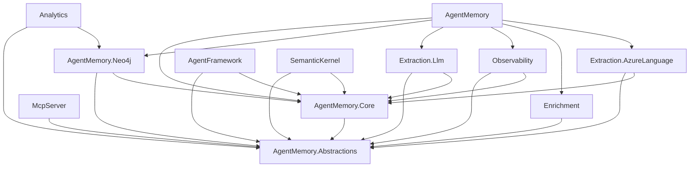
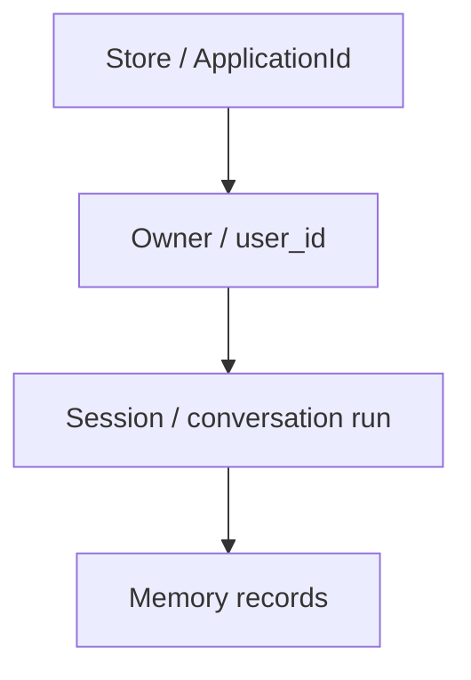

# Design Document

Status: current as of 2026-07-09.

## 1. Problem Statement

AI agents need durable memory that survives a single prompt window and remains queryable by user, application, time, and semantic relevance. A useful .NET implementation must fit normal .NET application architecture while preserving graph-native memory concepts from the Python reference ecosystem.

Agent Memory for .NET solves this by combining:

- a portable memory core,
- Neo4j-backed persistence,
- explicit extraction and embedding abstractions,
- isolation built into schema and queries,
- optional cross-cutting capabilities,
- agent-framework adapters for common .NET surfaces.

## 2. Goals

- Provide persistent graph-native memory for .NET agents.
- Support short-term, long-term, and reasoning memory.
- Use Neo4j for graph persistence and graph-aware retrieval.
- Provide clean DI registration and package boundaries.
- Support Microsoft Agent Framework, Semantic Kernel, and MCP usage.
- Keep optional capabilities opt-in.
- Preserve owner and store isolation across all memory paths.
- Keep behavior auditable through provenance, temporal fields, non-destructive invalidation, and memory-history reads.
- Provide operational tooling for schema, migration, consolidation, decay, memory history, conflict detection, and parity checks.

## 3. Non-Goals

- Do not become an official Neo4j product.
- Do not require LLM extraction for basic storage and recall.
- Do not require Neo4j GDS, enrichment services, or OpenTelemetry for basic use.
- Do not implement every Python-only integration as a release blocker.
- Do not hide multi-tenant identity inside model-generated tool arguments.
- Do not make destructive deletion the default form of forgetting.

## 4. Package Topology

| Package | Role |
|---|---|
| `AgentMemory.Abstractions` | Domain models, service and repository ports, options, schema constants. |
| `AgentMemory.Core` | Memory services, recall assembly, extraction pipeline, entity resolution, embedding orchestration, stubs. |
| `AgentMemory.Neo4j` | Neo4j driver/session infrastructure, repositories, queries, schema bootstrap, migrations, GraphRAG retrieval. |
| `AgentMemory.Extraction.Llm` | LLM-backed entity/fact/preference/relationship extractors via Microsoft.Extensions.AI. |
| `AgentMemory.Extraction.AzureLanguage` | Azure Language extraction support. |
| `AgentMemory.AgentFramework` | Microsoft Agent Framework providers, tools, facade, trace recorder. |
| `AgentMemory.SemanticKernel` | Semantic Kernel plugin and text-search integration. |
| `AgentMemory.McpServer` | MCP tools/resources/prompts over the memory service/facade. |
| `AgentMemory.Observability` | OpenTelemetry decorators, metrics, and tracing. |
| `AgentMemory.Enrichment` | Geocoding and external entity enrichment. |
| `AgentMemory.Analytics` | Optional Neo4j GDS analytics. |
| `AgentMemory` | Convenience meta-package for the common Core + Neo4j + extraction stack. |

## 5. Dependency Direction

The dependency direction is intentionally one-way:

`Abstractions` must stay dependency-light. `Core` must not depend on Neo4j-specific query logic. Neo4j implements ports and may provide optimized services such as decay and GraphRAG retrieval.

## 6. Main Runtime Components

### 6.1 Facade and Role Interfaces

`IMemoryService` composes three narrower roles:

- `IMemoryRecall` for recall and context assembly.
- `IMemoryIngestion` for writes and extraction.
- `IMemoryMaintenance` for upkeep operations.

The default DI registration binds all roles to the same scoped implementation.

### 6.2 Core Services

`AgentMemory.Core` registers:

- `IShortTermMemoryService`,
- `ILongTermMemoryService`,
- `IReasoningMemoryService`,
- `IMemoryContextAssembler`,
- `IMemoryService`,
- `IMemoryQueryFacade`,
- `IEntityResolver`,
- extraction stages and pipeline,
- `IEmbeddingOrchestrator`,
- `IStreamingExtractor`,
- default clocks, ID generation, session ID generation,
- owner and ranking AsyncLocal contexts,
- truncation strategies,
- stub extractors.

### 6.3 Neo4j Infrastructure

`AgentMemory.Neo4j` registers:

- driver/session/transaction infrastructure,
- schema bootstrapper and migration runner,
- store context and store provisioner,
- repository implementations,
- schema manager,
- graph query service,
- memory history service,
- consolidation service,
- conflict detection service,
- Neo4j-backed memory decay service,
- optional GraphRAG context source.

## 7. Memory Model

### Short-Term Memory

Short-term memory stores conversations and messages. Conversations group messages by `conversation_id` and `session_id`. Messages store role, content, timestamp, embeddings, metadata, tool-call IDs, and ordering links.

### Long-Term Memory

Long-term memory stores extracted entities, facts, preferences, and relationships. Long-term nodes carry owner scope, confidence, provenance, temporal fields, embeddings, and metadata where applicable.

Fact idempotency is based on `{subject, predicate, object, owner_key}` in both single and batch upserts. This prevents the same triple for one owner from duplicating while preserving separate records for different owners and shared/global memory.

### Reasoning Memory

Reasoning memory stores traces, steps, tool calls, tool aggregate nodes, and relationships to touched entities or initiating messages. It supports similar-task retrieval and gives agents a way to learn from prior execution patterns.

## 8. Isolation Model

Isolation is layered:

### Store Isolation

`IMemoryStoreContext.ApplicationId` selects the memory store. The default strategy is `SharedDatabase`. The opt-in `DatabasePerApplication` strategy maps each application to its own Neo4j database and can auto-provision that database.

### Owner Isolation

`MemoryScope` applies owner filtering. A null owner means shared/global memory. A concrete owner ID means private memory. `IncludeShared` controls whether shared memory is visible during scoped reads.

### Session Scoping

Sessions group recent context and reasoning traces. Session scoping does not replace owner or store isolation; it sits below them.

## 9. Extraction Design

The extraction pipeline has two stages:

1. Extraction: registered extractors produce entities, facts, preferences, and relationships.
2. Persistence: results are resolved, owner-stamped, embedded when needed, and written through repositories.

Default extractors are stubs. LLM and Azure Language extractors replace or supplement those stubs only when the consumer explicitly registers them.

Streaming extraction is a text-to-chunks helper. It does not persist by itself; owner stamping happens when output is persisted via the normal persistence stage.

## 10. Retrieval Design

The system supports several retrieval paths:

| Path | Purpose |
|---|---|
| Recent messages | Conversation continuity. |
| Vector search | Semantic similarity. |
| Fulltext search | Exact-ish natural-language lexical matching. |
| Hybrid search | Blend vector and fulltext via ranking fusion. |
| Graph traversal | Expand through entity relationships and graph neighborhoods. |
| Temporal/as-of recall | Reconstruct memory as believed at a prior time. |
| Reasoning similarity | Find previous task traces and steps. |
| GraphRAG context | Optional blended context source from the Neo4j package. |

Owner filters must be applied after vector candidate retrieval where Neo4j cannot pre-filter vector index results. Queries over-fetch, filter, and then limit so owner-local matches are not starved by foreign high-scoring rows.

## 11. Schema and Persistence

The schema uses labels and relationship types declared in `SchemaConstants`. Cypher statements are centralized under `AgentMemory.Neo4j/Queries`. Bootstrap creates:

- unique constraints,
- fulltext indexes,
- vector indexes,
- property/range indexes,
- point indexes,
- relationship-property indexes,
- migration tracking constraint.

Schema details live in `docs/schema.md`.

## 12. Framework Adapter Design

### Microsoft Agent Framework

The MAF adapter handles pre-run context injection, post-run persistence, memory tools, trace recording, and identity propagation from session state.

### Semantic Kernel

The SK adapter exposes memory as a plugin and integrates with SK text-search patterns.

### MCP

The MCP server exposes memory tools, resources, and prompts to external MCP clients. It depends on abstractions so hosts can wire the actual memory stack.

## 13. Optional Capabilities

| Capability | Design |
|---|---|
| Observability | Decorators and OpenTelemetry integration. |
| Enrichment | Nominatim geocoding and Wikimedia/Diffbot enrichment, with rate limiting/caching/retries. |
| Azure Language extraction | Optional extractor backend. |
| Analytics | Optional Neo4j GDS PageRank/Louvain, graceful no-op without plugin. |
| GraphRAG | Optional `IGraphRagContextSource` registered from `AgentMemory.Neo4j`. |

## 14. Operational Model

The project provides CLI and service surfaces for:

- bootstrap,
- migrate,
- schema-check,
- schema parity,
- consolidation,
- decay,
- conflicts,
- invalidation,
- supersession,
- memory history,
- graph query.

Schema bootstrap is safe to run repeatedly. Migrations are tracked. Vector dimension mismatch should fail fast unless validation is explicitly disabled.

## 15. Testing and Verification

Testing is split across unit, Semantic Kernel, integration, and targeted behavior suites. Unit tests validate core behavior without Neo4j. Integration tests validate live Neo4j behavior through Testcontainers. Documentation should report dated counts rather than timeless totals.

For this 2026-07-09 work, 2658 Release unit tests passed and a 5-test live Neo4j shakedown passed for the golden-path/history changes. The earlier docs cleanup also recorded 34 Semantic Kernel tests. ROADMAP records 236 full integration tests passing as of 2026-06-21.
