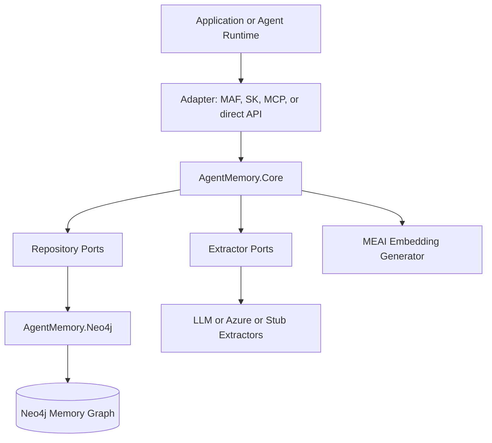

# Project Philosophy, Idea, and Concept

Status: current as of 2026-07-09.

## Core Idea

Agent Memory for .NET treats memory as a graph-backed system, not as a bigger prompt buffer. The project exists because useful agents need more than recent chat history: they need durable facts, preferences, entity relationships, provenance, and a record of prior reasoning that can be recalled with scope, time, and relevance.

The concept is simple:

- Keep recent dialogue as short-term memory.
- Extract durable knowledge into long-term memory.
- Record task execution and tool use as reasoning memory.
- Store all of it in Neo4j so relationships, provenance, temporal state, and graph traversal are first-class.
- Expose the system through .NET-native dependency injection, options, abstractions, and agent-framework adapters.

## Why Graph-Native Memory

Agent memory is naturally relational:

- A message mentions an entity.
- A fact is about a subject and extracted from one or more messages.
- A preference belongs to an owner and may supersede an older preference.
- A reasoning trace belongs to a session and may use tools that touched entities.
- Retrieval may depend on semantic similarity, text match, graph neighborhood, recency, and owner scope at the same time.

A property graph gives those relationships operational shape. It allows the library to answer questions like "what does this user prefer," "what evidence produced this fact," "what related entities are near this one," and "what did the agent do last time it solved a similar task" without collapsing everything into unstructured text.

## Why Native .NET

The project is inspired by the Python `neo4j-labs/agent-memory` project, but it is not a wrapper around it. The .NET version is designed for .NET teams and .NET runtime expectations:

- `net9.0` target.
- Microsoft dependency injection.
- options-based configuration.
- async repository and service contracts.
- `Microsoft.Extensions.AI` embedding and chat abstractions.
- Microsoft Agent Framework and Semantic Kernel integration.
- Model Context Protocol surface for external clients.
- NuGet package topology that lets consumers install only what they need.

The project should feel idiomatic to a .NET application rather than like a translated Python library.

## Project Identity

Agent Memory for .NET is an independent community project. It is not an official Neo4j product, not a fork of the Python project, and not a rebranding of upstream work.

It aims for conceptual and schema compatibility where that helps users, but it makes .NET-specific decisions when the .NET ecosystem has better primitives or different integration points.

## Design Values

### Memory is Additive and Auditable

The project prefers non-destructive change. Supersession, invalidation, provenance links, and as-of recall are favored over silent overwrite or deletion. A system that remembers should also be able to explain what it remembered, when it believed it, and what replaced it.

### Isolation Is Part of the Model

Multi-user and multi-application isolation is not treated as an adapter concern. It is modeled in the schema and query layer:

- Store isolation via `ApplicationId` and `MemoryStoreOptions`.
- Owner isolation via `owner_id`, `owner_key`, and `MemoryScope`.
- Session scoping for conversation and run-local recall.

The default remains easy to use: one shared database with optional owner scoping. Stronger physical isolation is opt-in.

### Core Stays Portable

The core package owns orchestration and behavior. Infrastructure packages own persistence and external systems. Cross-cutting capabilities are opt-in. This keeps the memory model testable, replaceable, and usable without forcing every consumer to install every adapter.

### Retrieval Is Blended

The project does not treat vector search as the whole story. Vector search, fulltext search, hybrid retrieval, graph traversal, temporal filtering, owner filtering, and ranking profiles all have a place. A durable agent memory system needs several retrieval modes because agent questions vary.

### Defaults Should Be Safe and Explicit

The default extraction path uses no-op stubs unless the consumer opts into LLM or Azure Language extraction. The default store strategy works with Neo4j Community Edition. Optional features such as GDS analytics, enrichment, observability, and GraphRAG retrieval are registered explicitly.

### Operations Are Product Features

Schema bootstrap, migrations, schema checks, CLI commands, observability, tests, and release process are not secondary. They are part of making memory dependable in real applications.

## What the Project Avoids

The project deliberately avoids several traps:

- It does not make global memory the unscoped default for multi-user applications.
- It does not require an LLM client just to store and recall memory.
- It does not require all optional packages for the basic use case.
- It does not hide schema drift behind best-effort startup logic.
- It does not claim feature parity with every Python framework integration.
- It does not treat historical planning documents as current truth.

## Conceptual Model

At the highest level, the system is:

The idea is not that Neo4j stores a transcript. The idea is that Neo4j stores an evolving memory graph whose nodes and relationships preserve what happened, what was extracted, who it belongs to, how confident it is, and how it should be recalled.
