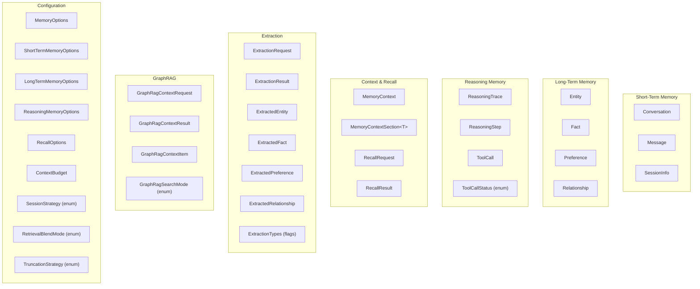
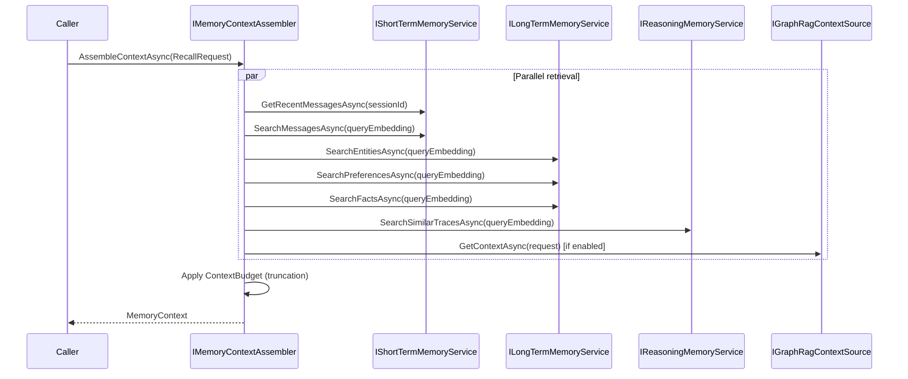
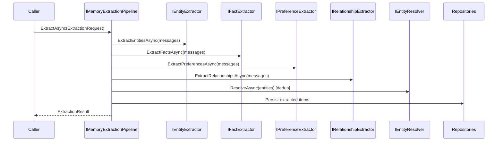

# Software Design Document — Agent Memory for .NET

**Last Updated:** 2025-07-22 (Post Wave 4A/4B/4C — Schema Parity Review)  
**Author:** Deckard (Lead Architect), domain model by Roy (Core Memory Domain Engineer)  
**Canonical Specification:** [Agent-Memory-for-DotNet-Specification.md](../Agent-Memory-for-DotNet-Specification.md)  
**Architecture Overview:** [architecture.md](architecture.md)

---

## 1. Domain Model Overview

The domain model comprises **31 domain types** organized across three memory layers, plus supporting types for context assembly, extraction, GraphRAG integration, and configuration. All domain types are defined in `Neo4j.AgentMemory.Abstractions`.

### Key Design Decisions

| Decision | Rationale |
|---|---|
| **C# `sealed record` types** | Structural equality, immutability, concise init-only syntax. Records prevent accidental mutation and work naturally as DTOs between layers. *(Decision D6.1)* |
| **`required` modifier for spec-mandated fields** | Compile-time enforcement of mandatory properties. Optional fields use nullable reference types. |
| **`DateTimeOffset` for all timestamps** | Unambiguous timezone handling. All timestamps use `Utc` suffix (e.g., `CreatedAtUtc`). |
| **`float[]?` for embeddings** | Nullable array — embeddings are optional until an embedding provider generates them. Dimension not enforced in domain (provider-specific). |
| **`CancellationToken` on all async methods** | Cooperative cancellation throughout the pipeline. Always with `default` value for convenience. |
| **`IReadOnlyList<T>` / `IReadOnlyDictionary<K,V>`** | Immutable collection contracts. Default to empty collections (never null) to avoid null-reference errors. |
| **Provenance via `SourceMessageIds`** | All extracted long-term memory carries references to the messages it was derived from. Enables traceability and debugging. *(Spec §3.4)* |
| **`Metadata` dictionaries throughout** | Extensibility without schema changes. All domain types carry `IReadOnlyDictionary<string, object> Metadata`. |
| **Scored results as `(T, double Score)` tuples** | Repository vector search returns tuples to avoid extra wrapper types. Clean, minimal, and directly destructurable. *(Decision D6.2)* |

### Type Inventory



---

## 2. Memory Layers

### 2.1 Short-Term Memory

**What it stores:** Recent conversations, messages, and session context. Represents the agent's "working memory" for the current interaction. *(Spec §3.1 — Short-term memory)*

**Key Domain Types:**

| Type | Purpose | Key Properties |
|---|---|---|
| `Conversation` | Groups messages into a conversation session | `ConversationId`, `SessionId`, `UserId?`, `CreatedAtUtc`, `UpdatedAtUtc`, `Metadata` |
| `Message` | A single message in a conversation | `MessageId`, `ConversationId`, `SessionId`, `Role`, `Content`, `TimestampUtc`, `Embedding?`, `Metadata` |
| `SessionInfo` | Session context DTO (not persisted in Phase 1) | `SessionId`, `UserId?`, `Strategy`, `CreatedAtUtc` |

**Repository Interfaces:**

| Interface | Key Methods |
|---|---|
| `IConversationRepository` | `UpsertAsync`, `GetByIdAsync`, `GetBySessionAsync`, `DeleteAsync` |
| `IMessageRepository` | `AddAsync`, `AddBatchAsync`, `GetByIdAsync`, `GetByConversationAsync`, `GetRecentBySessionAsync`, `SearchByVectorAsync`, `DeleteBySessionAsync` |

**Service Interface:**

| Interface | Key Methods |
|---|---|
| `IShortTermMemoryService` | `AddConversationAsync`, `AddMessageAsync`, `AddMessagesAsync`, `GetRecentMessagesAsync`, `GetConversationMessagesAsync`, `SearchMessagesAsync`, `ClearSessionAsync` |

### 2.2 Long-Term Memory

**What it stores:** Durable knowledge extracted from conversations — entities, facts, preferences, and relationships. Represents the agent's accumulated understanding of the world. *(Spec §3.1 — Long-term memory)*

**Key Domain Types:**

| Type | Purpose | Key Properties |
|---|---|---|
| `Entity` | Named entity (person, org, location, etc.) | `EntityId`, `Name`, `CanonicalName?`, `Type`, `Subtype?`, `Description?`, `Confidence`, `Embedding?`, `Aliases`, `Attributes`, `SourceMessageIds`, `Metadata` |
| `Fact` | Subject-predicate-object triple | `FactId`, `Subject`, `Predicate`, `Object`, `Confidence`, `ValidFrom?`, `ValidUntil?`, `Embedding?`, `SourceMessageIds`, `Metadata` |
| `Preference` | User or entity preference | `PreferenceId`, `Category`, `PreferenceText`, `Context?`, `Confidence`, `Embedding?`, `SourceMessageIds`, `Metadata` |
| `Relationship` | Directed relationship between entities | `RelationshipId`, `SourceEntityId`, `TargetEntityId`, `RelationshipType`, `Confidence`, `ValidFrom?`, `ValidUntil?`, `Attributes` |

**Repository Interfaces:**

| Interface | Key Methods |
|---|---|
| `IEntityRepository` | `UpsertAsync`, `GetByIdAsync`, `GetByNameAsync`, `SearchByVectorAsync`, `GetByTypeAsync` |
| `IFactRepository` | `UpsertAsync`, `GetByIdAsync`, `GetBySubjectAsync`, `SearchByVectorAsync` |
| `IPreferenceRepository` | `UpsertAsync`, `GetByIdAsync`, `GetByCategoryAsync`, `SearchByVectorAsync` |
| `IRelationshipRepository` | `UpsertAsync`, `GetByIdAsync`, `GetByEntityAsync`, `GetBySourceEntityAsync`, `GetByTargetEntityAsync` |

**Service Interface:**

| Interface | Key Methods |
|---|---|
| `ILongTermMemoryService` | `AddEntityAsync`, `GetEntitiesByNameAsync`, `SearchEntitiesAsync`, `AddPreferenceAsync`, `GetPreferencesByCategoryAsync`, `SearchPreferencesAsync`, `AddFactAsync`, `GetFactsBySubjectAsync`, `SearchFactsAsync`, `AddRelationshipAsync`, `GetEntityRelationshipsAsync` |

### 2.3 Reasoning Memory

**What it stores:** How the agent reasoned and what tools it used. Enables learning from past reasoning for similar future tasks. *(Spec §3.1 — Reasoning memory)*

**Key Domain Types:**

| Type | Purpose | Key Properties |
|---|---|---|
| `ReasoningTrace` | Top-level record of an agent reasoning task | `TraceId`, `SessionId`, `Task`, `Outcome?`, `Success?`, `StartedAtUtc`, `CompletedAtUtc?`, `TaskEmbedding?`, `Metadata` |
| `ReasoningStep` | One step in a reasoning chain | `StepId`, `TraceId`, `StepNumber`, `Thought?`, `Action?`, `Observation?`, `Embedding?`, `Metadata` |
| `ToolCall` | A tool invocation within a step | `ToolCallId`, `StepId`, `ToolName`, `Arguments`, `Result?`, `Status`, `DurationMs?`, `Error?`, `Metadata` |
| `ToolCallStatus` (enum) | Tool call lifecycle | `Pending`, `Success`, `Error`, `Cancelled` |

**Repository Interfaces:**

| Interface | Key Methods |
|---|---|
| `IReasoningTraceRepository` | `AddAsync`, `UpdateAsync`, `GetByIdAsync`, `ListBySessionAsync`, `SearchByTaskVectorAsync` |
| `IReasoningStepRepository` | `AddAsync`, `GetByTraceAsync`, `GetByIdAsync` |
| `IToolCallRepository` | `AddAsync`, `UpdateAsync`, `GetByStepAsync`, `GetByIdAsync` |

**Service Interface:**

| Interface | Key Methods |
|---|---|
| `IReasoningMemoryService` | `StartTraceAsync`, `AddStepAsync`, `RecordToolCallAsync`, `CompleteTraceAsync`, `GetTraceWithStepsAsync`, `ListTracesAsync`, `SearchSimilarTracesAsync` |

---

## 3. Context Assembly

*(Spec §3.4, Plan §14)*

Context assembly is the process of gathering relevant information from all memory layers before an agent run. It is orchestrated by `IMemoryContextAssembler`.

### 3.1 Flow



### 3.2 RecallRequest → MemoryContext

| Input (RecallRequest) | Output (MemoryContext) |
|---|---|
| `SessionId` (required) | `SessionId` |
| `UserId` (optional) | — |
| `Query` (required) | Used for semantic search |
| `QueryEmbedding` (optional) | Used for vector similarity search |
| `Options` (RecallOptions) | Controls limits and blend mode |

### 3.3 MemoryContext Sections

The assembled `MemoryContext` contains typed sections:

| Section | Type | Source |
|---|---|---|
| `RecentMessages` | `MemoryContextSection<Message>` | Short-term: recent by session |
| `RelevantMessages` | `MemoryContextSection<Message>` | Short-term: semantic search |
| `RelevantEntities` | `MemoryContextSection<Entity>` | Long-term: entity vector search |
| `RelevantPreferences` | `MemoryContextSection<Preference>` | Long-term: preference vector search |
| `RelevantFacts` | `MemoryContextSection<Fact>` | Long-term: fact vector search |
| `SimilarTraces` | `MemoryContextSection<ReasoningTrace>` | Reasoning: similar task search |
| `GraphRagContext` | `string?` | Optional GraphRAG-derived context |

### 3.4 Budget Enforcement

`ContextBudget` controls the total size of assembled context:

| Property | Type | Default | Purpose |
|---|---|---|---|
| `MaxTokens` | `int?` | `null` (unlimited) | Maximum token count |
| `MaxCharacters` | `int?` | `null` (unlimited) | Maximum character count |
| `TruncationStrategy` | `TruncationStrategy` | `OldestFirst` | How to truncate when over budget |

**Truncation strategies:** `OldestFirst`, `LowestScoreFirst`, `Proportional`, `Fail`

---

## 4. Extraction Pipeline

*(Plan §13)*

Extraction converts raw conversation messages into structured long-term memory. In Phase 1, extraction is **stubbed** — the pipeline infrastructure exists but returns empty results.

### 4.1 Flow



### 4.2 Extraction Types

`ExtractionRequest` specifies which types to extract via the `ExtractionTypes` flags enum:

```csharp
[Flags]
public enum ExtractionTypes
{
    None = 0,
    Entities = 1,
    Facts = 2,
    Preferences = 4,
    Relationships = 8,
    All = Entities | Facts | Preferences | Relationships
}
```

### 4.3 Phase 1 Stubs

| Stub | Behavior |
|---|---|
| `StubEntityExtractor` | Returns empty list |
| `StubFactExtractor` | Returns empty list |
| `StubPreferenceExtractor` | Returns empty list |
| `StubRelationshipExtractor` | Returns empty list |
| `StubEntityResolver` | Returns entities unmodified (no dedup) |
| `StubExtractionPipeline` | Returns empty `ExtractionResult` |
| `StubEmbeddingProvider` | Returns zero-vectors of configured dimension |

### 4.4 Phase 2+: Real Extraction (✅ COMPLETE)

LLM-based extraction is implemented via `Neo4j.AgentMemory.Extraction.Llm`:
- Four granular extractors: Entity, Fact, Preference, Relationship
- Uses `IChatClient` (Microsoft.Extensions.AI) for provider-neutral LLM calls
- JSON schema for structured output with type normalization
- Configurable model selection and confidence mapping
- Streaming extraction pipeline for chunked large-document processing (Wave 4C)
- Azure Cognitive Services alternative via `Neo4j.AgentMemory.Extraction.AzureLanguage`

---

## 5. Service Interface Catalog

All service interfaces are defined in `Neo4j.AgentMemory.Abstractions.Services`.

| # | Interface | Purpose | Key Methods |
|---|---|---|---|
| 1 | `IMemoryService` | Top-level facade for all memory operations | `RecallAsync`, `AddMessageAsync`, `AddMessagesAsync`, `ExtractAndPersistAsync`, `ClearSessionAsync` |
| 2 | `IShortTermMemoryService` | Conversation and message operations | `AddConversationAsync`, `AddMessageAsync`, `AddMessagesAsync`, `GetRecentMessagesAsync`, `GetConversationMessagesAsync`, `SearchMessagesAsync`, `ClearSessionAsync` |
| 3 | `ILongTermMemoryService` | Entity, fact, preference, relationship operations | `AddEntityAsync`, `GetEntitiesByNameAsync`, `SearchEntitiesAsync`, `AddPreferenceAsync`, `GetPreferencesByCategoryAsync`, `SearchPreferencesAsync`, `AddFactAsync`, `GetFactsBySubjectAsync`, `SearchFactsAsync`, `AddRelationshipAsync`, `GetEntityRelationshipsAsync` |
| 4 | `IReasoningMemoryService` | Trace, step, and tool call operations | `StartTraceAsync`, `AddStepAsync`, `RecordToolCallAsync`, `CompleteTraceAsync`, `GetTraceWithStepsAsync`, `ListTracesAsync`, `SearchSimilarTracesAsync` |
| 5 | `IMemoryContextAssembler` | Context orchestration across all layers | `AssembleContextAsync` |
| 6 | `IMemoryExtractionPipeline` | Extraction coordination | `ExtractAsync` |
| 7 | `IEntityExtractor` | Entity extraction from messages | `ExtractEntitiesAsync` |
| 8 | `IFactExtractor` | Fact extraction from messages | `ExtractFactsAsync` |
| 9 | `IPreferenceExtractor` | Preference extraction from messages | `ExtractPreferencesAsync` |
| 10 | `IRelationshipExtractor` | Relationship extraction from messages | `ExtractRelationshipsAsync` |
| 11 | `IEmbeddingProvider` | Vector embedding generation | `GenerateEmbeddingAsync`, `GenerateEmbeddingsAsync`, `EmbeddingDimensions` |
| 12 | `IEntityResolver` | Entity deduplication | `ResolveAsync` |
| 13 | `IGraphRagContextSource` | GraphRAG integration point | `GetContextAsync` |
| 14 | `IClock` | Testable time abstraction | `UtcNow` |
| 15 | `IIdGenerator` | Testable ID generation | `NewId` |

---

## 6. Repository Interface Catalog

All repository interfaces are defined in `Neo4j.AgentMemory.Abstractions.Repositories`.

| # | Interface | Purpose | Key Methods | Neo4j Node |
|---|---|---|---|---|
| 1 | `IConversationRepository` | Conversation CRUD | `UpsertAsync`, `GetByIdAsync`, `GetBySessionAsync`, `DeleteAsync` | `:Conversation` |
| 2 | `IMessageRepository` | Message persistence + search | `AddAsync`, `AddBatchAsync`, `GetByIdAsync`, `GetByConversationAsync`, `GetRecentBySessionAsync`, `SearchByVectorAsync`, `DeleteBySessionAsync` | `:Message` |
| 3 | `IEntityRepository` | Entity CRUD + search | `UpsertAsync`, `GetByIdAsync`, `GetByNameAsync`, `SearchByVectorAsync`, `GetByTypeAsync` | `:Entity` |
| 4 | `IFactRepository` | Fact CRUD + search | `UpsertAsync`, `GetByIdAsync`, `GetBySubjectAsync`, `SearchByVectorAsync` | `:Fact` |
| 5 | `IPreferenceRepository` | Preference CRUD + search | `UpsertAsync`, `GetByIdAsync`, `GetByCategoryAsync`, `SearchByVectorAsync` | `:Preference` |
| 6 | `IRelationshipRepository` | Relationship CRUD | `UpsertAsync`, `GetByIdAsync`, `GetByEntityAsync`, `GetBySourceEntityAsync`, `GetByTargetEntityAsync` | `:MemoryRelationship` |
| 7 | `IReasoningTraceRepository` | Trace persistence + search | `AddAsync`, `UpdateAsync`, `GetByIdAsync`, `ListBySessionAsync`, `SearchByTaskVectorAsync` | `:ReasoningTrace` |
| 8 | `IReasoningStepRepository` | Step persistence | `AddAsync`, `GetByTraceAsync`, `GetByIdAsync` | `:ReasoningStep` |
| 9 | `IToolCallRepository` | Tool call persistence | `AddAsync`, `UpdateAsync`, `GetByStepAsync`, `GetByIdAsync` | `:ToolCall` |
| 10 | `ISchemaRepository` | Schema + migration management | `InitializeSchemaAsync`, `IsSchemaInitializedAsync`, `GetSchemaVersionAsync`, `ApplyMigrationAsync` | (meta) |

### Repository Patterns

All repositories follow consistent conventions:

| Pattern | Convention |
|---|---|
| **Add/Update** | `UpsertAsync(T)` — add-or-update semantics, returns the persisted entity |
| **Single lookup** | `GetByIdAsync(string id)` — returns `T?` (null if not found) |
| **Filtered query** | `GetByXAsync(...)` — returns `IReadOnlyList<T>` |
| **Semantic search** | `SearchByVectorAsync(float[], ...)` — returns `IReadOnlyList<(T, double Score)>` |
| **Deletion** | `DeleteAsync` / `DeleteBySessionAsync` — where applicable |

---

## 7. Configuration Model

*(Plan §18.1)*

### 7.1 Options Hierarchy

```
MemoryOptions (root)
├── ShortTermMemoryOptions
│   └── (short-term-specific settings)
├── LongTermMemoryOptions
│   └── (long-term-specific settings)
├── ReasoningMemoryOptions
│   └── (reasoning-specific settings)
├── RecallOptions
│   ├── MaxRecentMessages (default: 10)
│   ├── MaxRelevantMessages (default: 5)
│   ├── MaxEntities (default: 10)
│   ├── MaxPreferences (default: 5)
│   ├── MaxFacts (default: 10)
│   ├── MaxTraces (default: 3)
│   ├── MaxGraphRagItems (default: 5)
│   ├── MinSimilarityScore (default: 0.7)
│   └── BlendMode (default: Blended)
├── ContextBudget
│   ├── MaxTokens (default: null/unlimited)
│   ├── MaxCharacters (default: null/unlimited)
│   └── TruncationStrategy (default: OldestFirst)
├── EnableGraphRag (default: false)
└── EnableAutoExtraction (default: true)
```

### 7.2 Neo4j-Specific Configuration

```
Neo4jOptions (in Neo4j.AgentMemory.Neo4j)
├── Uri (default: "bolt://localhost:7687")
├── Username (default: "neo4j")
├── Password (default: "password")
├── Database (default: "neo4j")
├── MaxConnectionPoolSize (default: 100)
├── ConnectionAcquisitionTimeout (default: 60s)
└── EncryptionEnabled (default: false)
```

### 7.3 DI Registration

```csharp
services.AddNeo4jAgentMemory(options =>
{
    options.Uri = "bolt://localhost:7687";
    options.Username = "neo4j";
    options.Password = "secret";
});
```

This registers: `INeo4jDriverFactory`, `INeo4jSessionFactory`, `INeo4jTransactionRunner`, `ISchemaBootstrapper`, `IMigrationRunner`.

### 7.4 Enums

| Enum | Values | Purpose |
|---|---|---|
| `ToolCallStatus` | `Pending`, `Success`, `Error`, `Cancelled` | Tool call lifecycle states |
| `SessionStrategy` | `PerConversation`, `PerDay`, `PersistentPerUser` | Session scoping strategy |
| `RetrievalBlendMode` | `MemoryOnly`, `GraphRagOnly`, `Blended`, `MemoryThenGraphRag`, `GraphRagThenMemory` | How to blend memory + GraphRAG results |
| `TruncationStrategy` | `OldestFirst`, `LowestScoreFirst`, `Proportional`, `Fail` | Budget overflow handling |
| `ExtractionTypes` | `None`, `Entities`, `Facts`, `Preferences`, `Relationships`, `All` | Flags for which extractions to run |
| `GraphRagSearchMode` | (search modes) | GraphRAG search configuration |

---

## 8. Design Decisions

### 8.1 Summary Table

| Decision | Choice | Alternatives Considered | Rationale |
|---|---|---|---|
| Domain types | C# `sealed record` | Classes, structs | Structural equality, immutability, value semantics, `with` expressions for copies *(D6.1)* |
| Timestamps | `DateTimeOffset` | `DateTime`, `long` (Unix) | Unambiguous UTC handling; .NET best practice for time-zone-aware timestamps |
| Embeddings | `float[]?` | `ReadOnlyMemory<float>`, `Embedding<float>` | Simple, nullable, no M.E.AI dependency. `float[]` is the universal embedding type across providers |
| Collections | `IReadOnlyList<T>` | `List<T>`, `IEnumerable<T>` | Immutability contract; prevents callers from mutating internal state. Default empty (not null) |
| Async | `CancellationToken` everywhere | No cancellation | Cooperative cancellation is .NET async best practice. Always with `default` for convenience |
| Scored results | `(T, double Score)` tuples | Wrapper class, dictionary | Minimal, no extra type needed. Tuples destructure cleanly |
| Provenance | `SourceMessageIds` on all extracted types | Separate provenance table | Inline provenance is simpler and always available. Spec requires traceability *(Spec §3.4)* |
| Entity dedup | `IEntityResolver` (stubbed Phase 1) | No dedup, full merge service | Stub allows progress; real dedup in Phase 2. `IMemoryMergeService` deferred *(Decision Q4)* |
| Sessions | Implicit via `SessionId` | `SessionRepository` | Sessions are scoped by ID on conversations/messages. Explicit session store deferred *(Decision Q1)* |
| GraphRAG contracts | In Abstractions | In adapter only | Dependency inversion: core depends on abstraction, adapter implements it *(D6.7)* |
| Embedding dimensions | Not validated in interface | Interface-level validation | Dimension is provider-specific; validation belongs in implementation *(Decision Q2)* |
| Batch limits | Implementation-specific | In Abstractions options | Depends on Neo4j transaction limits, memory, network — infrastructure concern *(Decision Q3)* |
