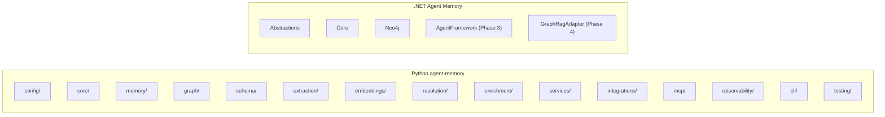
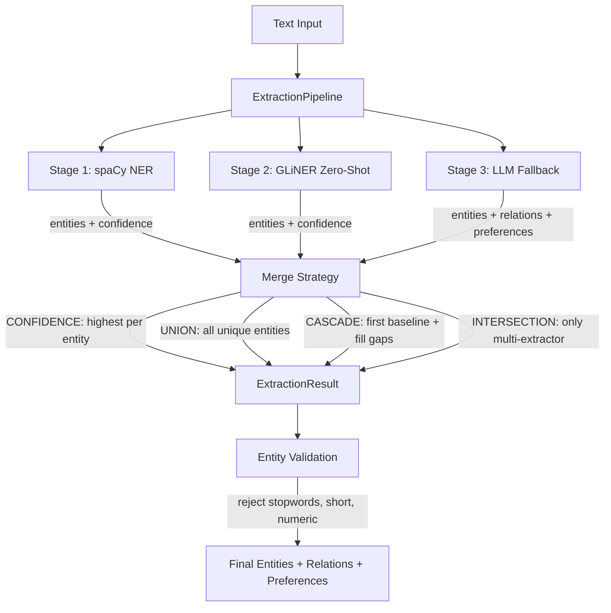
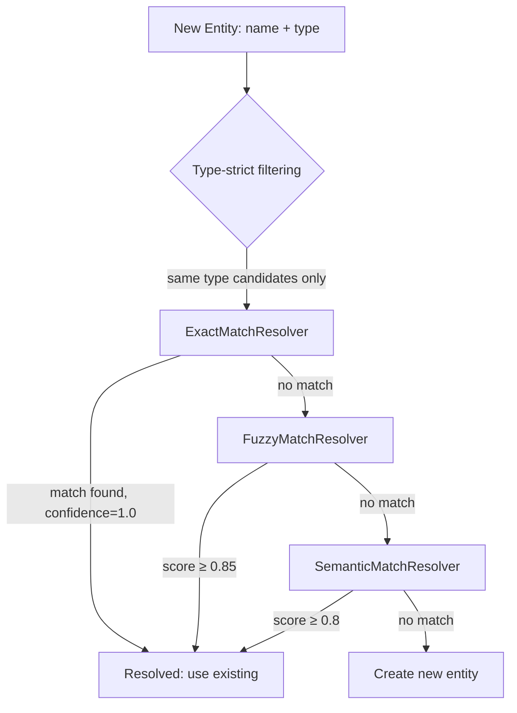

# Python agent-memory Reference Analysis

**Author:** Deckard (Lead Architect)  
**Last Updated:** 2025-07-12  
**Status:** Phase 1 Reference  
**Requested by:** Jose Luis Latorre Millas

---

## Table of Contents

1. [Executive Summary](#1-executive-summary)
2. [Architecture Comparison](#2-architecture-comparison)
3. [Module-by-Module Analysis](#3-module-by-module-analysis)
4. [Neo4j Graph Model Comparison](#4-neo4j-graph-model-comparison)
5. [Cypher Pattern Catalog](#5-cypher-pattern-catalog)
6. [Extraction Pipeline Deep Dive](#6-extraction-pipeline-deep-dive)
7. [Entity Resolution Deep Dive](#7-entity-resolution-deep-dive)
8. [Configuration Model Comparison](#8-configuration-model-comparison)
9. [Test Strategy Comparison](#9-test-strategy-comparison)
10. [Dependency Analysis](#10-dependency-analysis)
11. [What We Gain / What We Skip / What We Do Differently](#11-what-we-gain--what-we-skip--what-we-do-differently)
12. [Phase Mapping](#12-phase-mapping)
13. [Risks and Recommendations](#13-risks-and-recommendations)

---

## 1. Executive Summary

### What is the Python agent-memory project?

The Python `neo4j-labs/agent-memory` (v0.1.0, Apache 2.0) is a comprehensive library that provides a **three-tier memory system** for AI agents backed by Neo4j. It implements the **POLE+O** (Person, Object, Location, Event, Organization) data model for knowledge graphs, with support for multi-stage entity extraction (spaCy NER, GLiNER zero-shot, LLM fallback), embedding generation (OpenAI, Anthropic, Vertex AI, Bedrock, sentence-transformers), composite entity resolution (exact, fuzzy, semantic), background enrichment (Wikipedia, Diffbot), and integration with eight AI frameworks (LangChain, CrewAI, OpenAI Agents, Microsoft Agent Framework, Pydantic AI, LlamaIndex, Google ADK, Strands). It also ships an MCP server for Claude Desktop integration. Python 3.10+, Neo4j 5.20+.

### Relationship to our .NET project

Our .NET project is **inspired by, not a port of**, the Python agent-memory. We take the conceptual architecture (three memory layers, graph-native persistence, extraction pipeline, entity resolution), the Neo4j graph model conventions, and the Cypher query patterns. We **do not** take the Python code, the framework integrations (we target Microsoft Agent Framework), or the Python-specific tooling (spaCy, GLiNER). Our .NET design adds ports-and-adapters layering, GraphRAG interoperability (a feature the Python project doesn't have), and idiomatic C# patterns (DI, Options, async/await with CancellationToken, immutable records).

### Key takeaways for our implementation

1. **The three-tier model is proven.** Short-term, long-term, and reasoning memory are the right abstraction layers.
2. **Centralized Cypher queries work well.** Python's `graph/queries.py` pattern is clean — we should keep our Cypher in a similar centralized location.
3. **Entity resolution is more complex than it looks.** The Python code has four resolution strategies chained together with type-aware filtering. Our `IEntityResolver` stub needs a real implementation.
4. **Vector indexes are essential.** Five vector indexes across all memory types, all using cosine similarity at 1536 dimensions.
5. **The extraction pipeline is the most complex subsystem.** Multi-stage, configurable merge strategies, batch processing — this is Phase 2 work for us, but we should understand the target.
6. **Background enrichment is optional but valuable.** Wikipedia/Diffbot enrichment runs asynchronously — we can defer this indefinitely.
7. **The MCP server is a natural fit for Phase 6.** It exposes 16 tools across core and extended profiles.

---

## 2. Architecture Comparison

### Module Structure Comparison



| Python Module | .NET Equivalent | Notes |
|---|---|---|
| `config/` | `Abstractions/Options/` + `Neo4j/Infrastructure/Neo4jOptions` | Split: domain options in Abstractions, infra in Neo4j |
| `core/` | `Abstractions/Domain/` + `Abstractions/Services/` | Base types and protocols become interfaces + records |
| `memory/` | `Abstractions/Services/` + `Core/Stubs/` | Memory classes → service interfaces + stub impls |
| `graph/client.py` | `Neo4j/Infrastructure/` (DriverFactory, SessionFactory, TransactionRunner) | Python's single `Neo4jClient` → three focused .NET classes |
| `graph/queries.py` | Inline in repository methods (to be centralized) | Python centralizes; we should follow suit |
| `graph/schema.py` | `Neo4j/Infrastructure/SchemaBootstrapper` + `MigrationRunner` | Similar approach, split into bootstrap + migrations |
| `schema/` | `Abstractions/Repositories/ISchemaRepository` | Schema persistence deferred |
| `extraction/` | `Abstractions/Services/I*Extractor` + `Core/Stubs/Stub*Extractor` | Interfaces defined; real impl Phase 2 |
| `embeddings/` | `Abstractions/Services/IEmbeddingProvider` + `Core/Stubs/StubEmbeddingProvider` | Interface defined; real impl Phase 2 |
| `resolution/` | `Abstractions/Services/IEntityResolver` + `Core/Stubs/StubEntityResolver` | Interface defined; real impl Phase 2 |
| `enrichment/` | Not in scope | Background enrichment deferred indefinitely |
| `services/` | Not directly mapped | Python's geocoding/enrichment services not needed |
| `integrations/` | `AgentFramework/` (Phase 3) | We only target MAF, not 8 frameworks |
| `mcp/` | Phase 6 | MCP server deferred |
| `observability/` | Standard .NET `ILogger` + future OpenTelemetry | Python uses OTel + Opik; we use M.E.Logging |
| `cli/` | Not planned | No CLI tool planned |
| `testing/` | `tests/` projects (xUnit, FluentAssertions, Testcontainers) | Different framework, same patterns |

### Layering Comparison

**Python layering** — flat module structure with optional dependencies:

```
MemoryClient (top-level facade)
├── ShortTermMemory, LongTermMemory, ReasoningMemory (memory/)
├── Neo4jClient (graph/client.py)
├── Queries (graph/queries.py)
├── SchemaManager (graph/schema.py)
├── Embedder (embeddings/)
├── Extractor (extraction/)
├── Resolver (resolution/)
├── EnrichmentService (enrichment/)
└── Integrations (integrations/ — optional packages)
```

**Our .NET layering** — strict ports-and-adapters with enforced boundaries:

```
Host Application
├── Neo4j.AgentMemory.AgentFramework (Phase 3 adapter)
├── Neo4j.AgentMemory.GraphRagAdapter (Phase 4 adapter)
├── Neo4j.AgentMemory.Neo4j (infrastructure)
│   ├── Repositories (implement Abstractions.Repositories)
│   ├── Infrastructure (driver, schema, migrations)
│   └── Cypher queries
├── Neo4j.AgentMemory.Core (orchestration)
│   ├── Services (implement Abstractions.Services)
│   └── Stubs (Phase 1 placeholders)
└── Neo4j.AgentMemory.Abstractions (contracts)
    ├── Domain (records, enums)
    ├── Services (interfaces)
    ├── Repositories (interfaces)
    └── Options (configuration)
```

### Where They Align

1. **Three memory layers** — both have short-term, long-term, reasoning with identical conceptual boundaries
2. **Neo4j graph model** — same node types (Conversation, Message, Entity, Fact, Preference, ReasoningTrace, ReasoningStep, ToolCall) and similar relationship types
3. **Vector search** — both use `db.index.vector.queryNodes` with cosine similarity
4. **POLE+O entity model** — both support the same five entity types with subtypes
5. **Extraction → Resolution → Persistence pipeline** — same conceptual flow
6. **Schema-first approach** — both create constraints and indexes on startup

### Where They Diverge (and Why)

| Aspect | Python | .NET | Why |
|---|---|---|---|
| **Dependency direction** | Flat — any module can import any other | Strict layered — Abstractions ← Core ← Neo4j ← Adapters | .NET DI conventions; testability; adapter isolation |
| **Framework integrations** | 8 frameworks in one package | MAF only, as separate adapter | We target .NET ecosystem; adapters are additive |
| **GraphRAG** | Not present | First-class adapter (Phase 4) | Our spec requires GraphRAG interoperability |
| **Extraction strategy** | spaCy + GLiNER + LLM pipeline | LLM-first (Phase 2) | No Python NLP runtime; LLM is more accessible for .NET |
| **Configuration** | Pydantic BaseSettings with env vars | Options pattern (IOptions\<T\>) | Standard .NET configuration |
| **Observability** | OpenTelemetry + Opik | Microsoft.Extensions.Logging | .NET ecosystem standard |
| **MCP** | Ships with FastMCP server | Phase 6, separate package | Incremental delivery |
| **Geospatial** | Point indexes + geocoding services | Not in Phase 1 scope | Can add later if needed |
| **Enrichment** | Wikipedia + Diffbot background service | Not planned | Enrichment is optional/external |
| **Repository layer** | Queries embedded in memory classes | Separate repository interfaces | Clean separation of concerns |

---

## 3. Module-by-Module Analysis

### a. `core/` — Core Abstractions and Base Types

**What it does:**
- `MemoryEntry` — Pydantic base model with `id` (UUID), `created_at`, `updated_at`, `embedding`, `metadata`
- `MemoryStore` — Protocol defining `store`, `retrieve`, `search`, `delete`, `list`
- `BaseMemory` — ABC with `client`, `embedder`, `extractor`; methods for `add`, `search`, `get_context`, `_generate_embedding`
- `exceptions.py` — Exception hierarchy: `MemoryError`, `ConnectionError`, `SchemaError`, `ExtractionError`, `ResolutionError`, `EmbeddingError`, `ConfigurationError`, `NotConnectedError`

**Our .NET equivalent:**
- `Abstractions/Domain/` — Record types for all domain entities
- `Abstractions/Services/` — Interface definitions (`IMemoryService`, `IShortTermMemoryService`, etc.)
- No direct exception hierarchy — we use standard .NET exceptions with specific service-level handling

**Adaptation strategy:** ADAPT
- Python's `MemoryEntry` → our sealed records (`Message`, `Entity`, `Fact`, etc.)
- Python's `MemoryStore` Protocol → our repository interfaces (`IMessageRepository`, `IEntityRepository`, etc.)
- Python's `BaseMemory` ABC → our service interfaces + implementations
- Python's exceptions → standard `InvalidOperationException`, `ArgumentException` plus custom types where needed

**Key implementation details:**
```python
class MemoryEntry(BaseModel):
    id: UUID = Field(default_factory=uuid4)
    created_at: datetime = Field(default_factory=datetime.utcnow)
    embedding: list[float] | None = None
    metadata: dict[str, Any] = Field(default_factory=dict)
```

**Gaps:**
- Python has a formal exception hierarchy with 8 specific types; we don't have a custom exception hierarchy yet. Worth adding in a future phase.
- Python's `MemoryStore` Protocol includes `list` with `AsyncIterator` return — our repositories return `IReadOnlyList`, not async streams.

---

### b. `memory/` — Memory Model (Short-term, Long-term, Reasoning)

**What it does:**

This is the heart of the system. Three classes, each inheriting `BaseMemory`:

**ShortTermMemory** — manages conversations and messages:
- `add_message(session_id, role, content)` with auto-embedding and entity extraction
- `get_conversation(session_id, limit)` returning ordered messages
- `search_messages(query, session_id, limit, threshold)` via vector search
- `list_sessions(limit, offset)` with message count and previews
- Message linking pattern: `Conversation -[:FIRST_MESSAGE]→ Message1 -[:NEXT_MESSAGE]→ Message2`

**LongTermMemory** — manages the knowledge graph:
- `add_entity(name, type, subtype)` with deduplication, geocoding, enrichment triggers
- `add_preference(category, preference, context, confidence)`
- `add_fact(subject, predicate, object, confidence)`
- `create_relationship(source, target, relation_type)`
- Deduplication: auto-merge at ≥0.95 similarity, flag at 0.85–0.95, new entity below 0.85
- Entity search by embedding, type, name (including aliases and canonical names)

**ReasoningMemory** — manages reasoning traces:
- `start_trace(session_id, task)` → `add_step(trace_id, step_number, thought, action, observation)` → `record_tool_call(step_id, tool_name, args, result, status)` → `complete_trace(trace_id, outcome, success)`
- Tool statistics tracked on aggregate `Tool` nodes
- Vector search for similar past tasks

**Our .NET equivalent:**
- `Abstractions/Services/IShortTermMemoryService`, `ILongTermMemoryService`, `IReasoningMemoryService`
- `Abstractions/Repositories/` — `IMessageRepository`, `IConversationRepository`, `IEntityRepository`, `IFactRepository`, `IPreferenceRepository`, `IRelationshipRepository`, `IReasoningTraceRepository`, `IReasoningStepRepository`, `IToolCallRepository`
- `Core/Stubs/` — Stub implementations for Phase 1

**Adaptation strategy:** ADAPT

**Key implementation details worth knowing:**

1. **Message linking** — Python uses `FIRST_MESSAGE` + `NEXT_MESSAGE` linked list for conversation ordering. We should implement the same pattern for O(1) latest-message access.

2. **Entity deduplication thresholds:**
```python
# In long_term.py
if similarity >= 0.95:  # Auto-merge
    # Add name as alias to existing entity
elif similarity >= 0.85:  # Flag for review
    # Create SAME_AS relationship with status='pending'
else:  # New entity
    # Create new Entity node
```

3. **Metadata serialization** — Neo4j doesn't support Map properties on nodes. Python serializes metadata as JSON strings:
```python
def _serialize_metadata(metadata: dict) -> str | None:
    return json.dumps(metadata) if metadata else None
```

4. **DateTime conversion** — Python converts `neo4j.time.DateTime` → Python `datetime` via `.to_native()`. Our .NET code uses `DateTimeOffset` and the Neo4j driver handles conversion.

**Gaps:**
- Python's `list_sessions` returns `SessionInfo` with `first_message_preview` and `last_message_preview` — our `SessionInfo` record doesn't include previews yet.
- Python's entity addition returns `(Entity, DeduplicationResult)` tuple — our `ILongTermMemoryService.AddEntityAsync` returns just `Entity`. We lose deduplication metadata.
- Python's `LongTermMemory` supports geocoding on entity add — not in our scope.
- Python tracks entity aliases as a list property on the Entity node — our `Entity` record has `IReadOnlyList<string>? Aliases` but the repository needs to handle alias merging.

---

### c. `graph/` — Neo4j Graph Operations

**What it does:**
- `client.py` — Async Neo4j driver wrapper (`Neo4jClient`) with connection management, session/transaction handling, `execute_read`/`execute_write`, and User-Agent tracking
- `queries.py` — **All Cypher queries as centralized constants** (60+ queries organized by memory type). This is the single source of truth for all database operations.
- `schema.py` — Schema manager that creates constraints (9), regular indexes (9), vector indexes (5), and point indexes (1)

**Our .NET equivalent:**
- `Neo4j/Infrastructure/Neo4jDriverFactory`, `Neo4jSessionFactory`, `Neo4jTransactionRunner` — driver management split into three classes
- `Neo4j/Infrastructure/SchemaBootstrapper` — creates 9 constraints + 3 fulltext indexes
- Cypher queries are currently inline in repository methods (not yet centralized)

**Adaptation strategy:** ADAPT

**Key implementation details:**

1. **Centralized queries pattern** — Python keeps ALL Cypher in `queries.py` as module-level constants. This is a superior pattern for maintainability:
```python
# queries.py — organized by memory type
CREATE_CONVERSATION = """CREATE (c:Conversation {id: $id, session_id: $session_id, ...})"""
CREATE_MESSAGE = """CREATE (m:Message {id: $id, content: $content, ...})"""
SEARCH_MESSAGES_BY_EMBEDDING = """CALL db.index.vector.queryNodes(...)"""
```

2. **User-Agent tracking** — Python sends `user_agent: "neo4j-agent-memory/0.1.0"` for observability. We don't do this yet.

**Gaps:**
- **CRITICAL:** Python defines 5 vector indexes; our `SchemaBootstrapper` only creates 3 fulltext indexes. We're missing all 5 vector indexes (`message_embedding_idx`, `entity_embedding_idx`, `preference_embedding_idx`, `fact_embedding_idx`, `task_embedding_idx`). These are needed for `IEmbeddingProvider` to work.
- Python creates 9 regular property indexes (on `session_id`, `timestamp`, `role`, `type`, `name`, `canonical_name`, `category`, `success`, `status`). Our bootstrapper only creates fulltext indexes. We need property indexes for performance.
- Python has a `Tool` node (unique on `name`) with pre-aggregated statistics. Our schema has `ToolCall` but no aggregate `Tool` node.
- Python supports a point/geospatial index — not in our scope.
- Cypher queries are not centralized in our codebase — they're inline in repository methods. Recommend centralizing.

---

### d. `schema/` — Neo4j Schema Management

**What it does:**
- `models.py` — POLE+O entity type schema definitions with subtypes, relationship types, and schema versioning. `EntitySchemaConfig` supports multiple versions with active/inactive states.
- `persistence.py` — `SchemaManager` for saving/loading/listing schemas in Neo4j as `(:Schema)` nodes with version tracking.

**Our .NET equivalent:**
- `Abstractions/Repositories/ISchemaRepository` — interface with `InitializeSchemaAsync`, `IsSchemaInitializedAsync`, `GetSchemaVersionAsync`, `ApplyMigrationAsync`
- `Neo4j/Infrastructure/SchemaBootstrapper` + `MigrationRunner`

**Adaptation strategy:** ADAPT (simplified)

**Key implementation details:**
```python
# Schema versioning — multiple versions per schema, only one active
class StoredSchema(BaseModel):
    id: UUID
    name: str
    version: str
    config: EntitySchemaConfig
    is_active: bool
```

Python's POLE+O schema includes 16 relationship type definitions:
- Person relationships: `KNOWS`, `ALIAS_OF`, `MEMBER_OF`, `EMPLOYED_BY`
- Object relationships: `OWNS`, `USES`
- Location relationships: `LOCATED_AT`, `RESIDES_AT`, `HEADQUARTERS_AT`
- Event relationships: `PARTICIPATED_IN`, `OCCURRED_AT`, `INVOLVED`
- Organization relationships: `SUBSIDIARY_OF`, `PARTNER_WITH`
- Generic: `RELATED_TO`, `MENTIONS`

**Gaps:**
- Python has a rich schema versioning system with active/inactive states and rollback. Our `MigrationRunner` runs `.cypher` files sequentially — simpler but less flexible.
- Python stores entity type schemas (POLE+O subtypes, relationship types) as nodes in Neo4j. We hardcode these in code. Both approaches work; theirs is more dynamic.
- Python defines 16 specific relationship types; we use a generic `RELATED_TO` with a `type` property. Their approach gives better Neo4j label semantics.

---

### e. `extraction/` — Extraction Pipeline

**What it does:**

This is the most complex module. A multi-stage pipeline that extracts entities, relations, and preferences from text.

**Key classes:**
- `ExtractedEntity(name, type, subtype, confidence, context, attributes, extractor)`
- `ExtractedRelation(source, target, relation_type, confidence)`
- `ExtractedPreference(category, preference, context, confidence)`
- `ExtractionResult(entities, relations, preferences, source_text)`
- `ExtractionPipeline` — orchestrates multiple stages with configurable merge strategies
- `ConditionalPipeline` — skips stages based on conditions
- Stage implementations: `SpacyEntityExtractor`, `GLiNERExtractor`, `LLMEntityExtractor`

**Merge strategies:** UNION, INTERSECTION, CONFIDENCE, CASCADE, FIRST_SUCCESS

**Our .NET equivalent:**
- `Abstractions/Services/IEntityExtractor`, `IFactExtractor`, `IRelationshipExtractor`, `IPreferenceExtractor`
- `Abstractions/Services/IMemoryExtractionPipeline`
- `Core/Stubs/StubExtractionPipeline` + individual stub extractors

**Adaptation strategy:** ADAPT (Phase 2) — see [Section 6](#6-extraction-pipeline-deep-dive) for deep dive.

**Key implementation details:**
- Entity deduplication key: `f"{normalized_name}::{type}"` — keeps highest confidence per key
- Entity validation: 221 stopwords, minimum 2 characters, rejects numeric-only and punctuation-only
- Batch processing with `asyncio.Semaphore(max_concurrency)` for controlled parallelism
- Streaming extraction for documents >100K tokens: chunk with overlap, extract per chunk, deduplicate across chunks

**Gaps:**
- Our extraction interfaces separate into four extractors (`IEntityExtractor`, `IFactExtractor`, `IRelationshipExtractor`, `IPreferenceExtractor`). Python has a single `EntityExtractor` Protocol that returns all four types in one `ExtractionResult`. Our approach is more granular but means the pipeline must orchestrate four calls instead of one.
- Python's merge strategies (CONFIDENCE, CASCADE, etc.) don't have equivalents in our code — our `IMemoryExtractionPipeline` doesn't define merge behavior.
- Python supports batch extraction with progress callbacks — our interface is single-request only.

---

### f. `embeddings/` — Embedding Generation

**What it does:**

Provider-agnostic embedding generation with six backends:

| Provider | Model | Dimensions | Cost |
|---|---|---|---|
| OpenAI | text-embedding-3-small | 1536 | $$$ |
| Anthropic | (via OpenAI-compatible) | varies | $$$ |
| Sentence Transformers | all-MiniLM-L6-v2 | 384 | Free (local) |
| Vertex AI | text-embedding-004 | 768 | $$ |
| Bedrock | amazon.titan-embed-text-v2 | 1024 | $$ |
| Custom | user-provided | configurable | varies |

All implement `Embedder` Protocol: `async embed(text) → list[float]` + `async embed_batch(texts) → list[list[float]]`

**Our .NET equivalent:**
- `Abstractions/Services/IEmbeddingProvider` — `GenerateEmbeddingAsync`, `GenerateEmbeddingsAsync`, `EmbeddingDimensions`
- `Core/Stubs/StubEmbeddingProvider` — returns deterministic random vectors from text hash

**Adaptation strategy:** ADAPT (Phase 2)

**Key implementation details:**
- OpenAI embedder uses `openai.AsyncOpenAI` with batch support (batch_size=100)
- Sentence Transformers embedder is local/free, model loaded on first use
- Vertex AI supports task-specific embeddings (`RETRIEVAL_DOCUMENT`, `RETRIEVAL_QUERY`)
- All providers support batch processing with provider-specific batch limits

**Gaps:**
- Our `IEmbeddingProvider` interface closely matches Python's `Embedder` protocol — good alignment.
- The `StubEmbeddingProvider` uses SHA-based deterministic vectors — same approach as Python's `MockEmbedder` in tests.
- We don't specify which providers to support. Recommendation: start with OpenAI (via `Microsoft.Extensions.AI` or direct), add Semantic Kernel adapters for others.

---

### g. `resolution/` — Entity Resolution

**What it does:**

Four resolution strategies chained in a composite resolver:

1. **ExactMatchResolver** — case-insensitive string equality (confidence: 1.0)
2. **FuzzyMatchResolver** — RapidFuzz `token_sort_ratio` at threshold 0.85 (confidence: score/100)
3. **SemanticMatchResolver** — embedding cosine similarity at threshold 0.8 (confidence: cosine score)
4. **CompositeResolver** — chains Exact → Fuzzy → Semantic, with **type-strict** filtering (PERSON "John" ≠ LOCATION "John")

**Our .NET equivalent:**
- `Abstractions/Services/IEntityResolver` — `ResolveEntityAsync(ExtractedEntity, sourceMessageIds)`, `FindPotentialDuplicatesAsync(name, type)`
- `Core/Stubs/StubEntityResolver` — creates new entities without deduplication

**Adaptation strategy:** ADAPT (Phase 2) — see [Section 7](#7-entity-resolution-deep-dive) for deep dive.

**Gaps:**
- Our `IEntityResolver` interface returns a single `Entity` from `ResolveEntityAsync`. Python's resolver returns a `ResolvedEntity` with `match_type`, `confidence`, `merged_from`. We lose resolution metadata.
- Python's `FindPotentialDuplicatesAsync` equivalent uses SAME_AS relationships with `status='pending'` — a graph-native review queue. Our interface returns `IReadOnlyList<Entity>` without relationship context.

---

### h. `enrichment/` — Memory Enrichment

**What it does:**

Background enrichment service that augments entities with external data:

- **WikimediaProvider** — Wikipedia REST API (`/api/rest_v1/page/summary/`) with rate limiting, language support, fuzzy search fallback
- **DiffbotProvider** — Diffbot Knowledge Graph API (commercial, structured entity data)
- **BackgroundEnrichmentService** — async queue with priority, retry with exponential backoff, confidence thresholds, entity type filtering

Enrichment adds: `enriched_description`, `enriched_summary`, `wikipedia_url`, `wikidata_id`, `image_url`, `related_entities`

**Our .NET equivalent:** None planned.

**Adaptation strategy:** SKIP

**Rationale:** Enrichment is a nice-to-have feature that adds complexity without being core to the memory provider. It requires external API dependencies and background processing infrastructure. Can be added as a standalone package later if needed.

**Key implementation details worth noting for future reference:**
- Queue pattern with priority and retry is well-designed and could be adapted
- Rate limiting per provider prevents API abuse
- Entity type filtering (only enrich PERSON, ORGANIZATION, LOCATION, EVENT)

---

### i. `config/` — Configuration Model

**What it does:**

Pydantic `BaseSettings` with environment variable support (`NAM_` prefix, `__` nested delimiter):

```python
class MemorySettings(BaseSettings):
    neo4j: Neo4jConfig
    embedding: EmbeddingConfig
    llm: LLMConfig
    schema_config: SchemaConfig
    extraction: ExtractionConfig
    resolution: ResolutionConfig
    memory: MemoryConfig
    search: SearchConfig
    geocoding: GeocodingConfig
    enrichment: EnrichmentConfig
```

**Our .NET equivalent:**
- `Abstractions/Options/MemoryOptions` — top-level with `ShortTerm`, `LongTerm`, `Reasoning`, `Recall`, `ContextBudget`
- `Neo4j/Infrastructure/Neo4jOptions` — connection settings
- No extraction/resolution/enrichment options yet (stubbed)

**Adaptation strategy:** ADAPT — see [Section 8](#8-configuration-model-comparison) for detailed comparison.

---

### j. `services/` — Service Orchestration

**What it does:**

Contains geocoding services:
- `NominatimGeocoder` — free OpenStreetMap geocoding
- `GoogleGeocoder` — Google Maps API
- `CachedGeocoder` — LRU cache wrapper around any geocoder

Also the `MemoryIntegration` class (in `__init__.py`/`integration.py`) which provides:
- Simplified convenience layer over `MemoryClient`
- Session strategy resolution (per_conversation, per_day, persistent)
- Auto-extraction on message storage
- Context assembly from all three memory tiers

**Our .NET equivalent:**
- `Abstractions/Services/IMemoryService` — our facade (maps to MemoryClient)
- `Abstractions/Services/IMemoryContextAssembler` — context assembly
- `Abstractions/Options/SessionStrategy` enum — same three strategies
- No geocoding services

**Adaptation strategy:** ADAPT (selective)

**Gaps:**
- Python's `MemoryIntegration` is a higher-level convenience wrapper that our architecture pushes into adapter layers. We don't have this layer yet — it would be part of Phase 3 (MAF adapter).

---

### k. `integrations/` — Framework Integrations

**What it does:**

Eight framework adapters, each implementing the framework's memory interface:

| Framework | Python Class | Key Pattern |
|---|---|---|
| LangChain | `Neo4jAgentMemory(BaseModel)` | `load_memory_variables` / `save_context` |
| CrewAI | `Neo4jCrewMemory(Memory)` | `remember` / `recall` / `get_agent_context` |
| OpenAI Agents | `Neo4jMemory` | Direct memory provider |
| Microsoft AF | `Neo4jMicrosoftMemory` + `Neo4jContextProvider` + `Neo4jChatMessageStore` | Context provider + chat store |
| Pydantic AI | `Neo4jMemory(BaseModel)` | Pydantic integration |
| LlamaIndex | `Neo4jMemory` | Memory management |
| Google ADK | `Neo4jMemoryService` | Async memory service |
| Strands | `Neo4jTools` | Memory tools |

**Our .NET equivalent:** Phase 3 — `Neo4j.AgentMemory.AgentFramework` package (MAF only)

**Adaptation strategy:** REFERENCE (Python's Microsoft AF integration is useful reference)

**Key implementation details from Python's Microsoft AF integration:**
```python
class Neo4jMicrosoftMemory:
    context_provider: Neo4jContextProvider  # Supplies context to agents
    chat_store: Neo4jChatMessageStore       # Persists chat history
    gds: GDSIntegration | None              # Optional GDS algorithms
    graph_tracing: GraphTracing             # Tool invocation tracing
```
- `Neo4jContextProvider(BaseContextProvider)` — implements MAF's context provider pattern
- `GDSIntegration` — exposes Neo4j GDS algorithms (shortest path, PageRank, community detection)
- `GraphTracing` — tool invocation tracing linked to messages

**Gaps:**
- Python targets MAF 0.3-era APIs; MAF is now 1.1.0 — their implementation is already outdated
- GDS integration is interesting for Phase 5+ but not core
- Graph tracing pattern is useful for our reasoning memory integration with MAF

---

### l. `mcp/` — MCP Server

**What it does:**

FastMCP-based Model Context Protocol server with two tool profiles:

**Core profile (6 tools):** `memory_search`, `memory_get_context`, `memory_store_message`, `memory_add_entity`, `memory_add_preference`, `memory_add_fact`

**Extended profile (16 tools):** Core + `memory_get_conversation`, `memory_list_sessions`, `memory_get_entity`, `memory_export_graph`, `memory_create_relationship`, `memory_start_trace`, `memory_record_step`, `memory_complete_trace`, `memory_get_observations`, `graph_query`

Notable features:
- `MemoryObserver` — monitors accumulated context, extracts observations (facts, decisions, preferences, topics, entities) when token threshold exceeded (default: 30,000)
- `PreferenceDetector` — rule-based, zero-cost preference detection from natural language patterns (7 categories, 11 patterns)
- Read-only safety for `graph_query` tool (blocks CREATE, MERGE, DELETE, SET, REMOVE)
- Transport options: stdio, SSE, HTTP

**Our .NET equivalent:** Phase 6

**Adaptation strategy:** REFERENCE

**Key details worth capturing for Phase 6:**
- Tool annotations with `readOnlyHint`, `destructiveHint`, `idempotentHint`
- The core/extended profile split is a good pattern for progressive capability exposure
- `MemoryObserver`'s token-threshold compression is elegant for long conversations
- `PreferenceDetector`'s rule-based approach is zero-cost and high-precision

---

### m. `observability/` — Telemetry and Tracing

**What it does:**
- `Tracer` protocol with `start_span(name, attributes)`, `set_attribute`, `set_status`, `end`
- `OpenTelemetryTracer` — full OTel integration with HTTP exporter
- `OpikTracer` — Opik integration for ML observability
- `NoopTracer` — no-op for testing
- Auto-detection: `get_tracer(provider="auto")` tries OTel → Opik → Noop

**Our .NET equivalent:** `Microsoft.Extensions.Logging.ILogger` throughout all classes

**Adaptation strategy:** DEFER

**Rationale:** .NET has first-class logging via `ILogger`. OpenTelemetry for .NET is mature (`System.Diagnostics.Activity`). We use `ILogger` for Phase 1; add OTel tracing in a future phase if needed.

---

### n. `testing/` — Test Utilities

**What it does:**
- `MockMemoryClient` — in-memory mock of `MemoryClient` with `MockShortTermMemory`, `MockLongTermMemory`, `MockReasoningMemory`
- `MemoryFixtures` — factory methods for test data: `message()`, `conversation()`, `entity()`, `preference()`, `reasoning_trace()`
- Deterministic mock implementations for embedder, extractor, resolver

**Our .NET equivalent:**
- `Core/Stubs/` — stub implementations (`StubEmbeddingProvider`, `StubEntityExtractor`, etc.)
- Test projects with xUnit, FluentAssertions, Testcontainers

**Adaptation strategy:** ADAPT

**Gaps:**
- Python ships test utilities as a published subpackage (`neo4j_agent_memory.testing`) — users can import fixtures for their own tests. We don't publish test utilities yet. Consider a `Neo4j.AgentMemory.Testing` package in a future phase.
- Python's `MemoryFixtures` factory pattern is cleaner than manually constructing records. Recommendation: add a `TestDataBuilder` or similar to our test projects.

---

### o. `cli/` — CLI Tools

**What it does:**
- `extract` — extract entities from text (stdin, file, or argument) with format options (table, JSON, JSONL)
- `schemas` — list, show, validate POLE+O schemas
- `stats` — show database statistics (entity counts, extractor provenance)
- `mcp serve` — start MCP server with transport/profile/session options

Built with `click` + `rich` (Python CLI frameworks).

**Our .NET equivalent:** Not planned.

**Adaptation strategy:** SKIP

**Rationale:** CLI tools are developer conveniences, not core library functionality. Our users interact through the NuGet packages and C# APIs, not command-line tools.

---

## 4. Neo4j Graph Model Comparison

### Node Types

| Node Label | Python | .NET | Notes |
|---|---|---|---|
| `:Conversation` | ✅ | ✅ | Both: `id`, `session_id`, `title`, `created_at` |
| `:Message` | ✅ | ✅ | Both: `id`, `content`, `role`, `embedding`, `timestamp` |
| `:Entity` | ✅ (+ dynamic type labels) | ✅ | Python adds `:Person`, `:Object`, etc. as additional labels |
| `:Fact` | ✅ | ✅ | Both: `subject`, `predicate`, `object`, `confidence` |
| `:Preference` | ✅ | ✅ | Both: `category`, `preference`, `context`, `confidence` |
| `:ReasoningTrace` | ✅ | ✅ | Both: `task`, `outcome`, `success`, `session_id` |
| `:ReasoningStep` | ✅ | ✅ | Both: `step_number`, `thought`, `action`, `observation` |
| `:ToolCall` | ✅ | ✅ | Both: `tool_name`, `arguments`, `result`, `status`, `duration_ms` |
| `:Tool` | ✅ (aggregate stats) | ❌ | Python maintains pre-aggregated tool statistics |
| `:Extractor` | ✅ (provenance) | ❌ | Python tracks which extractor found each entity |
| `:Schema` | ✅ (versioned) | ❌ | Python stores entity schemas as nodes |
| `:Migration` | ❌ | ✅ | We track applied migrations; Python doesn't |
| `:MemoryRelationship` | ❌ | ✅ | We reify relationships as nodes for properties |

### Relationship Types

| Relationship | Python | .NET | Notes |
|---|---|---|---|
| `(Conversation)-[:FIRST_MESSAGE]->(Message)` | ✅ | ❌ (to implement) | O(1) access to first message |
| `(Message)-[:NEXT_MESSAGE]->(Message)` | ✅ | ❌ (to implement) | Sequential message chain |
| `(Conversation)-[:HAS_MESSAGE]->(Message)` | ✅ | ✅ (implied) | Standard parent-child |
| `(Message)-[:MENTIONS]->(Entity)` | ✅ | ✅ (implied) | With confidence, position |
| `(Entity)-[:RELATED_TO]->(Entity)` | ✅ | ✅ | With relation_type, confidence |
| `(Entity)-[:SAME_AS]->(Entity)` | ✅ | ❌ | Deduplication/review queue |
| `(Entity)-[:EXTRACTED_FROM]->(Message)` | ✅ | ❌ | Provenance tracking |
| `(Entity)-[:EXTRACTED_BY]->(Extractor)` | ✅ | ❌ | Extractor provenance |
| `(Preference)-[:ABOUT]->(Entity)` | ✅ | ❌ | Preference → entity link |
| `(ReasoningTrace)-[:HAS_STEP]->(ReasoningStep)` | ✅ | ✅ (implied) | Step ordering |
| `(ReasoningStep)-[:USES_TOOL]->(ToolCall)` | ✅ | ✅ (implied) | Tool usage |
| `(ToolCall)-[:INSTANCE_OF]->(Tool)` | ✅ | ❌ | Aggregate tool stats |
| `(ReasoningTrace)-[:INITIATED_BY]->(Message)` | ✅ | ❌ | Cross-memory link |
| `(ToolCall)-[:TRIGGERED_BY]->(Message)` | ✅ | ❌ | Cross-memory link |
| `(Conversation)-[:HAS_TRACE]->(ReasoningTrace)` | ✅ | ❌ | Cross-memory link |

### Constraint Comparison

| Constraint | Python | .NET |
|---|---|---|
| `Conversation.id IS UNIQUE` | ✅ | ✅ |
| `Message.id IS UNIQUE` | ✅ | ✅ |
| `Entity.id IS UNIQUE` | ✅ | ✅ |
| `Fact.id IS UNIQUE` | ✅ | ✅ |
| `Preference.id IS UNIQUE` | ✅ | ✅ |
| `ReasoningTrace.id IS UNIQUE` | ✅ | ✅ |
| `ReasoningStep.id IS UNIQUE` | ✅ | ✅ |
| `ToolCall.id IS UNIQUE` | ✅ | ✅ |
| `Tool.name IS UNIQUE` | ✅ | ❌ |
| `MemoryRelationship.id IS UNIQUE` | ❌ | ✅ |
| `Migration.version IS UNIQUE` | ❌ | ✅ |

### Index Comparison

| Index Type | Python Count | .NET Count | Gap |
|---|---|---|---|
| Unique constraints | 9 | 9 | Different set (Tool vs MemoryRelationship/Migration) |
| Regular property indexes | 9 | 0 | **MISSING** — we need these for performance |
| Vector indexes | 5 | 0 | **MISSING** — needed for embedding search |
| Fulltext indexes | 0 (uses vector) | 3 | We have these; Python doesn't |
| Point indexes | 1 | 0 | Geospatial — out of scope |

**CRITICAL GAP: Vector indexes.** Python creates 5 vector indexes:

```cypher
CREATE VECTOR INDEX message_embedding_idx IF NOT EXISTS
  FOR (n:Message) ON (n.embedding)
  OPTIONS {indexConfig: {`vector.dimensions`: 1536, `vector.similarity_function`: 'cosine'}}

CREATE VECTOR INDEX entity_embedding_idx IF NOT EXISTS
  FOR (n:Entity) ON (n.embedding)
  OPTIONS {indexConfig: {`vector.dimensions`: 1536, `vector.similarity_function`: 'cosine'}}

CREATE VECTOR INDEX preference_embedding_idx IF NOT EXISTS
  FOR (n:Preference) ON (n.embedding)
  OPTIONS {indexConfig: {`vector.dimensions`: 1536, `vector.similarity_function`: 'cosine'}}

CREATE VECTOR INDEX fact_embedding_idx IF NOT EXISTS
  FOR (n:Fact) ON (n.embedding)
  OPTIONS {indexConfig: {`vector.dimensions`: 1536, `vector.similarity_function`: 'cosine'}}

CREATE VECTOR INDEX task_embedding_idx IF NOT EXISTS
  FOR (n:ReasoningTrace) ON (n.task_embedding)
  OPTIONS {indexConfig: {`vector.dimensions`: 1536, `vector.similarity_function`: 'cosine'}}
```

**Recommendation:** Add vector indexes to `SchemaBootstrapper` immediately. The dimensions should be configurable (default 1536) to support different embedding providers.

---

## 5. Cypher Pattern Catalog

### Memory CRUD Operations

| Operation | Python Cypher Pattern | .NET Repository Method |
|---|---|---|
| Create conversation | `CREATE (c:Conversation {id: $id, session_id: $session_id, ...})` | `IConversationRepository.UpsertAsync` |
| Create message | `CREATE (m:Message {id: $id, content: $content, ...})` with `FIRST_MESSAGE`/`NEXT_MESSAGE` linking | `IMessageRepository.AddAsync` |
| Create entity | `MERGE (e:Entity {name: $name, type: $type}) ON CREATE SET ... ON MATCH SET ...` | `IEntityRepository.UpsertAsync` |
| Create fact | `CREATE (f:Fact {id: $id, subject: $subject, ...})` | `IFactRepository.UpsertAsync` |
| Create preference | `CREATE (p:Preference {id: $id, category: $category, ...})` | `IPreferenceRepository.UpsertAsync` |
| Create relationship | `MERGE (e1)-[r:RELATED_TO {type: $relation_type}]->(e2) ON CREATE SET ... ON MATCH SET ...` | `IRelationshipRepository.UpsertAsync` |
| Start trace | `CREATE (rt:ReasoningTrace {id: $id, task: $task, ...})` | `IReasoningTraceRepository.AddAsync` |
| Add step | `CREATE (rs:ReasoningStep {...})` + `MATCH (rt:ReasoningTrace {id: $trace_id}) MERGE (rt)-[:HAS_STEP]->(rs)` | `IReasoningStepRepository.AddAsync` |
| Record tool call | `CREATE (tc:ToolCall {...})` + `MERGE (rs)-[:USES_TOOL]->(tc)` + Tool stats update | `IToolCallRepository.AddAsync` |

### Vector Search Queries

```cypher
-- Pattern used across all memory types (5 variations)
CALL db.index.vector.queryNodes($index_name, $limit, $embedding)
YIELD node, score
WHERE score >= $threshold
RETURN node, score
ORDER BY score DESC
```

| Index | Used For | .NET Repository Method |
|---|---|---|
| `message_embedding_idx` | Message semantic search | `IMessageRepository.SearchByVectorAsync` |
| `entity_embedding_idx` | Entity similarity search | `IEntityRepository.SearchByVectorAsync` |
| `preference_embedding_idx` | Preference search | `IPreferenceRepository.SearchByVectorAsync` |
| `fact_embedding_idx` | Fact search | `IFactRepository.SearchByVectorAsync` |
| `task_embedding_idx` | Similar reasoning tasks | `IReasoningTraceRepository.SearchByTaskVectorAsync` |

### Graph Traversal Patterns

```cypher
-- Entity relationships (bidirectional)
MATCH (e:Entity {id: $entity_id})-[r:RELATED_TO]-(other:Entity)
RETURN e, r, other

-- Entity by name (including aliases)
MATCH (e:Entity)
WHERE e.name = $name OR e.canonical_name = $name OR $name IN COALESCE(e.aliases, [])
RETURN e LIMIT 1

-- Session context assembly (cross-memory)
MATCH (c:Conversation {session_id: $session_id})-[:HAS_MESSAGE]->(m:Message)
WITH m ORDER BY m.timestamp DESC LIMIT $message_limit
OPTIONAL MATCH (m)-[:MENTIONS]->(e:Entity)
WITH collect(DISTINCT m) AS messages, collect(DISTINCT e) AS entities
OPTIONAL MATCH (p:Preference)
WHERE p.created_at > datetime() - duration({days: $preference_days})
RETURN messages, entities, collect(DISTINCT p) AS preferences

-- Duplicate entity cluster (SAME_AS traversal, up to 3 hops)
MATCH (e:Entity {id: $entity_id})
MATCH path = (e)-[:SAME_AS*1..3]-(other:Entity)
RETURN DISTINCT other AS entity, length(path) AS distance
ORDER BY distance
```

### Entity Merge (Deduplication)

```cypher
-- The most complex single query in the codebase
MATCH (source:Entity {id: $source_id})
MATCH (target:Entity {id: $target_id})
-- Transfer MENTIONS relationships
CALL (source, target) {
    MATCH (source)<-[:MENTIONS]-(m:Message)
    WHERE NOT (m)-[:MENTIONS]->(target)
    MERGE (m)-[:MENTIONS]->(target)
    RETURN count(*) AS mentionsTransferred
}
-- Transfer SAME_AS relationships
CALL (source, target) {
    MATCH (source)-[r:SAME_AS]-(other:Entity)
    WHERE other <> target AND NOT (target)-[:SAME_AS]-(other)
    MERGE (target)-[:SAME_AS {confidence: r.confidence, match_type: 'merged', created_at: datetime()}]-(other)
    RETURN count(*) AS sameAsTransferred
}
SET source.merged_into = target.id, source.merged_at = datetime()
SET target.aliases = CASE
    WHEN target.aliases IS NULL THEN [source.name]
    WHEN NOT source.name IN target.aliases THEN target.aliases + source.name
    ELSE target.aliases
END
RETURN source, target
```

### Schema Management

```cypher
-- Vector index creation (repeated for 5 indexes)
CREATE VECTOR INDEX {name} IF NOT EXISTS
FOR (n:{label}) ON (n.{property})
OPTIONS {indexConfig: {`vector.dimensions`: $dimensions, `vector.similarity_function`: 'cosine'}}

-- Constraint creation
CREATE CONSTRAINT {name} IF NOT EXISTS FOR (n:{label}) REQUIRE n.{property} IS UNIQUE

-- Property index creation
CREATE INDEX {name} IF NOT EXISTS FOR (n:{label}) ON (n.{property})
```

---

## 6. Extraction Pipeline Deep Dive

### Pipeline Architecture



### Pipeline Stages (in order)

1. **spaCy NER** (`SpacyEntityExtractor`)
   - Fast statistical model (`en_core_web_sm` or `en_core_web_lg`)
   - Maps spaCy labels to POLE+O: `PERSON→PERSON`, `ORG→ORGANIZATION`, `GPE/LOC→LOCATION`, `DATE/TIME→EVENT`
   - Default confidence: 0.85 (spaCy doesn't provide per-entity scores)
   - Context window: 50 characters around each entity
   - **Not available in .NET** — no equivalent NER library

2. **GLiNER Zero-Shot** (`GLiNERExtractor`)
   - Zero-shot NER with domain-specific schemas (podcast, news, medical, etc.)
   - Configurable threshold (default: 0.5)
   - Supports custom entity type labels mapped to POLE+O
   - Can run on CPU or GPU
   - **Not available in .NET** — Python-specific ML model

3. **LLM Fallback** (`LLMEntityExtractor`)
   - GPT-4o-mini with temperature=0.0
   - Structured JSON output for entities, relations, and preferences
   - POLE+O-aware prompt with subtype guidance
   - Type mapping for non-standard LLM outputs (CONCEPT→OBJECT, PLACE→LOCATION, etc.)
   - **Available in .NET** — this is our Phase 2 strategy

### LLM Extraction Prompt (key excerpt)

```
Extract entities, relationships, and preferences from the following text.

## Entity Types (POLE+O Model)
Extract entities of these types: PERSON, ORGANIZATION, LOCATION, EVENT, OBJECT

## Output Format
Return a JSON object with:
{
    "entities": [{"name": "...", "type": "ENTITY_TYPE", "subtype": "...", "confidence": 0.9}],
    "relations": [{"source": "entity1", "target": "entity2", "relation_type": "...", "confidence": 0.8}],
    "preferences": [{"category": "...", "preference": "...", "context": "...", "confidence": 0.85}]
}

## Guidelines
- PERSON: Individuals mentioned by name or role
- OBJECT: Physical or digital items
- LOCATION: Places, addresses, geographic areas
- EVENT: Incidents, meetings, things that happened
- ORGANIZATION: Companies, groups, institutions
```

### Entity Validation

Python validates extracted entities with 221 stopwords:
```python
ENTITY_STOPWORDS = {"i", "me", "my", "myself", "we", "our", "you", "your", "he", "she",
    "it", "they", "this", "that", "these", "is", "are", "was", "were", "be",
    "have", "has", "do", "does", "did", "will", "would", "could", "should",
    "the", "a", "an", "and", "but", "or", "for", "with", ...}
```

Validation rules:
- Name length ≥ 2 characters
- Not purely numeric
- Not punctuation-only
- Not in stopword list (case-insensitive)

### Merge Strategies (detailed)

**CONFIDENCE** (recommended):
```python
# For each unique entity (keyed by normalized_name::type):
# Keep the version with the highest confidence score
entity_key = f"{entity.name.lower().strip()}::{entity.type}"
if entity_key in seen:
    if entity.confidence > seen[entity_key].confidence:
        seen[entity_key] = entity
else:
    seen[entity_key] = entity
```

**CASCADE**:
```python
# First extractor's results are the baseline
# Subsequent extractors only add NEW entities not in baseline
baseline = stage_results[0].entities
for stage in stage_results[1:]:
    for entity in stage.entities:
        if entity_key(entity) not in baseline_keys:
            baseline.append(entity)
```

### How this maps to our .NET implementation

Our current Phase 1 has stub extractors returning empty lists. For Phase 2:

1. Implement `LlmEntityExtractor : IEntityExtractor` using the Python prompt template as reference
2. Implement `LlmFactExtractor : IFactExtractor` (Python extracts facts inline; we separate)
3. Implement `LlmPreferenceExtractor : IPreferenceExtractor`
4. Implement `LlmRelationshipExtractor : IRelationshipExtractor`
5. Our `IMemoryExtractionPipeline` orchestrates all four extractors (simpler than Python's multi-stage approach since we start with LLM-only)

**Key difference:** Python's pipeline runs multiple extractors and merges results. Our Phase 2 will likely run a single LLM extractor that returns all types. This is simpler but less flexible. We can add pipeline stages later if needed.

---

## 7. Entity Resolution Deep Dive

### Resolution Chain



### Exact Match

```python
# Case-insensitive string equality
normalized = entity_name.lower().strip()
for existing in candidates:
    if existing.lower().strip() == normalized:
        return ResolvedEntity(canonical_name=existing, confidence=1.0, match_type="exact")
```

### Fuzzy Match (RapidFuzz)

```python
# token_sort_ratio: splits into tokens, sorts alphabetically, then Levenshtein
from rapidfuzz import fuzz
score = fuzz.token_sort_ratio(normalized_name, existing_normalized) / 100.0
if score >= 0.85:  # threshold
    return ResolvedEntity(canonical_name=existing, confidence=score, match_type="fuzzy")
```

The `token_sort_ratio` scorer handles:
- "John Smith" vs "Smith, John" → high score (tokens sorted before comparison)
- "Microsoft Corp" vs "Microsoft Corporation" → moderate score
- "NYC" vs "New York City" → low score (semantic resolution needed)

### Semantic Match

```python
entity_embedding = await embedder.embed(entity_name)
for existing in candidates:
    existing_embedding = await embedder.embed(existing)  # cached
    score = cosine_similarity(entity_embedding, existing_embedding)
    if score >= 0.8:  # threshold
        return ResolvedEntity(canonical_name=existing, confidence=score, match_type="semantic")
```

Embedding cache avoids recomputation:
```python
async def _get_embedding(text: str) -> list[float]:
    normalized = text.lower().strip()
    if normalized not in self._cache:
        self._cache[normalized] = await self.embedder.embed(text)
    return self._cache[normalized]
```

### Type-Strict Resolution

Critical feature: PERSON "John" should never merge with LOCATION "John (city)":

```python
if type_strict and existing_entity_types:
    candidates = [name for name in existing_entities
                  if existing_entity_types[name] == entity_type]
```

### Post-Resolution Actions

Based on confidence:
| Confidence | Action | Python | Our Phase 2 |
|---|---|---|---|
| ≥ 0.95 | Auto-merge (add alias) | ✅ | To implement |
| 0.85 – 0.95 | Flag with `SAME_AS` relationship | ✅ | To implement |
| < 0.85 | Create new entity | ✅ | StubEntityResolver does this |

### Mapping to our `IEntityResolver`

```csharp
// Our current interface
public interface IEntityResolver
{
    Task<Entity> ResolveEntityAsync(ExtractedEntity extractedEntity,
        IReadOnlyList<string> sourceMessageIds, CancellationToken ct);
    Task<IReadOnlyList<Entity>> FindPotentialDuplicatesAsync(
        string name, string type, CancellationToken ct);
}
```

For Phase 2 implementation:
1. **ExactMatchEntityResolver** — case-insensitive string match against existing entities from `IEntityRepository.GetByNameAsync`
2. **FuzzyMatchEntityResolver** — use `FuzzySharp` NuGet package (C# port of fuzzywuzzy, which is what RapidFuzz improves upon)
3. **SemanticMatchEntityResolver** — use `IEmbeddingProvider` + cosine similarity
4. **CompositeEntityResolver** — chains all three with type-strict filtering

**Recommendation:** The `ResolveEntityAsync` return type should be enriched in Phase 2 to include match metadata (confidence, match_type, merged_from). Consider a wrapper type or extension to `Entity`.

---

## 8. Configuration Model Comparison

| Config Area | Python (`MemorySettings`) | .NET (Options) | Match |
|---|---|---|---|
| **Neo4j connection** | `Neo4jConfig(uri, username, password, database, pool_size, timeouts)` | `Neo4jOptions(Uri, Username, Password, Database, MaxPoolSize, AcqTimeout)` | ✅ Close match |
| **Embedding** | `EmbeddingConfig(provider, model, dimensions, api_key, batch_size, device)` | Not yet configured (stub) | ⏳ Phase 2 |
| **Extraction** | `ExtractionConfig(extractor_type, spacy/gliner/llm settings, merge_strategy, entity_types)` | Not yet configured (stub) | ⏳ Phase 2 |
| **Resolution** | `ResolutionConfig(strategy, exact/fuzzy/semantic thresholds)` | Not yet configured (stub) | ⏳ Phase 2 |
| **Memory** | `MemoryConfig(context limits, session strategy)` | `MemoryOptions(ShortTerm, LongTerm, Reasoning, Recall, ContextBudget)` | ✅ Richer |
| **Search** | `SearchConfig(vector limits, metadata filters)` | Inside `RecallOptions(MaxEntities, MaxFacts, MinSimilarityScore)` | ✅ Different structure |
| **Geocoding** | `GeocodingConfig(enabled, provider, api_key, rate_limit)` | Not planned | ❌ Skip |
| **Enrichment** | `EnrichmentConfig(enabled, providers, api_keys, cache, retry)` | Not planned | ❌ Skip |
| **Observability** | `ObservabilityConfig(provider, endpoint, api_key)` | Not yet configured | ⏳ Future |

### Default Values Comparison

| Setting | Python Default | .NET Default | Notes |
|---|---|---|---|
| Neo4j URI | `bolt://localhost:7687` | `bolt://localhost:7687` | Same |
| Neo4j database | `neo4j` | `neo4j` | Same |
| Neo4j pool size | 50 | 100 | .NET is more generous |
| Embedding model | `text-embedding-3-small` | N/A (stubbed) | |
| Embedding dimensions | 1536 | 1536 (stub) | Same |
| Recent message limit | N/A (varies by call) | 10 | |
| Max messages per query | N/A | 100 | |
| Session strategy | `per_conversation` | `PerConversation` | Same |
| Min confidence | 0.5 | 0.5 | Same |
| Min similarity score | 0.7 | 0.7 | Same |
| Context budget max tokens | N/A | `null` (unlimited) | |
| Enable auto-extraction | True | True | Same |

### What we configure that Python doesn't

- **ContextBudget** — max tokens, max characters, truncation strategy (OldestFirst, LowestScoreFirst, Proportional, Fail)
- **RetrievalBlendMode** — MemoryOnly, GraphRagOnly, MemoryThenGraphRag, GraphRagThenMemory, Blended
- **Per-memory-type options** — separate options for ShortTerm, LongTerm, Reasoning
- **GraphRAG enablement** — `EnableGraphRag` flag

---

## 9. Test Strategy Comparison

### Framework Comparison

| Aspect | Python | .NET |
|---|---|---|
| **Test framework** | pytest 8.0+ | xUnit (planned) |
| **Async support** | pytest-asyncio (`asyncio_mode = "auto"`) | xUnit async Task tests |
| **Mocking** | unittest.mock + custom mock classes | Moq / NSubstitute + stub classes |
| **Assertions** | pytest `assert` | FluentAssertions |
| **Coverage** | pytest-cov (55% target, 65% patch) | coverlet (to configure) |
| **Containers** | testcontainers[neo4j] (Python) | Testcontainers for .NET |
| **Neo4j image** | `neo4j:5.26-community` with APOC | `neo4j:5-community` (planned) |
| **Type checking** | mypy + ruff | C# compiler + nullable reference types |

### Test Organization

| Python | .NET (Planned) |
|---|---|
| `tests/unit/` (23 files) | `tests/AgentMemory.UnitTests/` |
| `tests/integration/` (25+ files) | `tests/AgentMemory.IntegrationTests/` |
| `tests/examples/` | Not planned |
| `tests/docs/` | Not planned |
| `tests/benchmark/` | Not planned (Phase 5+) |
| Total: 79 test files | Target: comparable coverage |

### Mock Strategy Comparison

**Python mocks (in conftest.py):**
```python
class MockEmbedder:     # SHA256-based deterministic embeddings
class MockExtractor:    # Simple rule-based extraction (capitalized words → PERSON)
class MockResolver:     # Case-insensitive exact match only
```

**Our .NET stubs (in Core/Stubs/):**
```csharp
StubEmbeddingProvider   // Hash-based deterministic vectors (same approach)
StubEntityExtractor     // Returns empty list
StubFactExtractor       // Returns empty list
StubPreferenceExtractor // Returns empty list
StubEntityResolver      // Creates new entity without deduplication
```

**Key difference:** Python's `MockExtractor` actually extracts basic entities (useful for integration tests that exercise the full pipeline). Our `StubEntityExtractor` returns empty — integration tests don't exercise extraction. Consider adding a `SimpleRuleBasedExtractor` for integration testing.

### Integration Test Pattern

**Python approach:**
1. Session-scoped Testcontainer (started once per test session)
2. Schema setup on container start
3. `MATCH (n) DETACH DELETE n` before/after each test for isolation
4. Mock embedder/extractor/resolver (avoid API calls) but real Neo4j
5. Auto-skip if Docker not available

**Our planned approach:**
1. Same Testcontainers pattern (documented in spec)
2. SchemaBootstrapper runs on setup
3. Same cleanup strategy
4. Stub implementations for embedder/extractor (same concept)
5. Skip integration tests without Docker

### Lessons for our testing approach

1. **Python's conftest.py pattern is excellent.** A shared test fixture file with mock implementations and container management keeps tests clean. We should have a similar shared fixture project or base class.
2. **Test prefixing (`test-` on IDs) enables targeted cleanup.** Smarter than deleting everything — preserves schema nodes.
3. **Multiple Neo4j connection strategies** (environment variables → Testcontainers → skip) is robust for CI/CD.
4. **79 test files for a beta library is comprehensive.** We should target similar coverage density.
5. **Separate unit and integration test directories** is the right pattern.

---

## 10. Dependency Analysis

### Python Dependencies → .NET Equivalents

| Python Package | Purpose | .NET Equivalent | Status |
|---|---|---|---|
| `neo4j>=5.20.0` | Neo4j driver | `Neo4j.Driver 6.0.0` | ✅ In use |
| `pydantic>=2.0.0` | Data validation, settings | Records + `IOptions<T>` | ✅ In use |
| `openai>=1.0.0` (optional) | Embeddings, LLM extraction | `Microsoft.Extensions.AI` or `Azure.AI.OpenAI` | ⏳ Phase 2 |
| `anthropic` (optional) | Embeddings | (via M.E.AI abstraction) | ⏳ Phase 2 |
| `sentence-transformers` (optional) | Local embeddings | (possible via ONNX Runtime) | ❓ Evaluate |
| `google-cloud-aiplatform` (optional) | Vertex AI embeddings | (Google Cloud SDK for .NET) | ⏳ Phase 2 |
| `boto3` (optional) | Bedrock embeddings | `Amazon.BedrockRuntime` | ⏳ Phase 2 |
| `spacy` (optional) | NER extraction | No direct equivalent | ❌ Skip |
| `gliner` (optional) | Zero-shot NER | No direct equivalent | ❌ Skip |
| `rapidfuzz` (optional) | Fuzzy string matching | `FuzzySharp` | ⏳ Phase 2 |
| `httpx` | HTTP client | `System.Net.Http.HttpClient` | ✅ Built-in |
| `fastmcp` | MCP server | (C# MCP SDK — future) | ⏳ Phase 6 |
| `click`, `rich` | CLI | N/A | ❌ Skip |
| `testcontainers[neo4j]` | Test infrastructure | `Testcontainers` NuGet | ✅ Planned |

### What we need that Python doesn't

| .NET Package | Purpose | Why Python doesn't need it |
|---|---|---|
| `Microsoft.Extensions.DependencyInjection` | DI container | Python uses constructor injection / manual wiring |
| `Microsoft.Extensions.Logging` | Structured logging | Python uses `logging` stdlib |
| `Microsoft.Extensions.Options` | Configuration binding | Python uses Pydantic BaseSettings |
| `Microsoft.Agents.*` (Phase 3) | MAF integration | Python has its own AF adapter |
| `xUnit`, `FluentAssertions` | Testing | Python uses pytest |
| `coverlet` | Code coverage | Python uses pytest-cov |

---

## 11. What We Gain / What We Skip / What We Do Differently

| Category | Item | Details |
|---|---|---|
| **GAIN** | Three-tier memory model | Short-term, long-term, reasoning — proven architecture |
| **GAIN** | POLE+O entity model | Person, Object, Location, Event, Organization with subtypes |
| **GAIN** | Neo4j graph model | Node types, relationship patterns, constraint/index strategy |
| **GAIN** | Vector search patterns | `db.index.vector.queryNodes` with cosine similarity |
| **GAIN** | Entity resolution chain | Exact → Fuzzy → Semantic with type-strict filtering |
| **GAIN** | Extraction prompt templates | LLM extraction prompts and output parsing strategy |
| **GAIN** | Merge/deduplication Cypher | Entity merge query pattern (SAME_AS, alias transfer) |
| **GAIN** | Session strategy patterns | per_conversation, per_day, persistent_per_user |
| **GAIN** | Test patterns | Mock embedder/extractor, Testcontainers, cleanup strategy |
| **GAIN** | Message linking pattern | FIRST_MESSAGE + NEXT_MESSAGE for O(1) access |
| | | |
| **SKIP** | spaCy NER | Python-specific NLP library, no .NET equivalent |
| **SKIP** | GLiNER zero-shot | Python-specific ML model |
| **SKIP** | Geocoding services | Not core to memory provider |
| **SKIP** | Background enrichment | Wikipedia/Diffbot integration is optional |
| **SKIP** | CLI tools | Developer convenience, not library feature |
| **SKIP** | 7 of 8 framework integrations | We only target MAF |
| **SKIP** | Opik observability | Niche ML observability platform |
| **SKIP** | Schema persistence as nodes | Over-engineered for our needs |
| | | |
| **DIFFER** | Architecture | Flat modules → layered ports-and-adapters with DI |
| **DIFFER** | GraphRAG | Not present in Python → first-class adapter in .NET |
| **DIFFER** | Configuration | Pydantic BaseSettings → IOptions\<T\> pattern |
| **DIFFER** | Observability | OTel + Opik → Microsoft.Extensions.Logging |
| **DIFFER** | Repository layer | Queries in memory classes → separate repository interfaces |
| **DIFFER** | Extraction approach | Multi-stage pipeline (spaCy+GLiNER+LLM) → LLM-first |
| **DIFFER** | Dependency management | pip optional extras → separate NuGet packages |
| **DIFFER** | Async model | Python asyncio → C# async/await with CancellationToken |
| **DIFFER** | Data types | Pydantic models → sealed records (immutable by design) |
| **DIFFER** | Relationship reification | Properties on Neo4j relationships → `:MemoryRelationship` nodes |

---

## 12. Phase Mapping

### Phase 1 (Current) — Foundation

Python features being implemented now:

| Python Feature | .NET Implementation | Status |
|---|---|---|
| Memory domain model (Message, Entity, Fact, Preference, Trace, Step, ToolCall) | `Abstractions/Domain/` sealed records | ✅ Done |
| Service interfaces | `Abstractions/Services/` interfaces | ✅ Done |
| Repository interfaces | `Abstractions/Repositories/` interfaces | ✅ Done |
| Configuration model | `Abstractions/Options/` + `Neo4j/Infrastructure/Neo4jOptions` | ✅ Done |
| Neo4j driver management | `Neo4j/Infrastructure/` (DriverFactory, SessionFactory, TransactionRunner) | ✅ Done |
| Schema bootstrap (constraints) | `SchemaBootstrapper` | ✅ Done |
| Migration runner | `MigrationRunner` | ✅ Done |
| Stub extraction pipeline | `Core/Stubs/` | ✅ Done |
| Stub embedding provider | `StubEmbeddingProvider` | ✅ Done |
| Stub entity resolver | `StubEntityResolver` | ✅ Done |

### Phase 2 — Real Extraction & Embedding

| Python Feature | .NET Target |
|---|---|
| LLM entity extraction (`LLMEntityExtractor`) | `LlmEntityExtractor : IEntityExtractor` |
| LLM fact/preference/relationship extraction | Separate extractor implementations |
| OpenAI embedding provider | `OpenAiEmbeddingProvider : IEmbeddingProvider` |
| Composite entity resolver | `CompositeEntityResolver : IEntityResolver` |
| Fuzzy string matching (RapidFuzz) | FuzzySharp NuGet package |
| Semantic matching | Cosine similarity on embeddings |
| Entity validation (stopwords) | Port stopword list and validation rules |
| Vector indexes | Add to `SchemaBootstrapper` |
| Property indexes | Add to `SchemaBootstrapper` |

### Phase 3 — MAF Integration

| Python Feature | .NET Target |
|---|---|
| Microsoft AF integration (`Neo4jMicrosoftMemory`) | `Neo4j.AgentMemory.AgentFramework` package |
| Context provider | MAF `IContextProvider` implementation |
| Chat message store | MAF chat history implementation |
| Tool definitions for agents | Memory operations as MAF tools |

### Phase 4 — GraphRAG

| Python Feature | .NET Target |
|---|---|
| Not in Python | `Neo4j.AgentMemory.GraphRagAdapter` package |
| Not in Python | Blended retrieval (memory + GraphRAG) |

### Phase 5+ — Advanced Features

| Python Feature | .NET Target | Priority |
|---|---|---|
| GDS integration (community detection, PageRank) | Optional GDS package | Medium |
| Background enrichment | Optional enrichment package | Low |
| Geospatial queries | Add point indexes + queries | Low |
| Batch extraction with progress | Pipeline enhancement | Medium |
| Streaming extraction | Pipeline enhancement | Low |
| Preference detection (rule-based) | Port `PreferenceDetector` patterns | Medium |
| Tool statistics aggregation | `Tool` node + stats queries | Low |

### Phase 6 — MCP

| Python Feature | .NET Target |
|---|---|
| FastMCP server (16 tools) | C# MCP SDK integration |
| Core/extended profiles | Same tool split |
| MemoryObserver (token compression) | Port observer pattern |
| PreferenceDetector (rule-based) | Port detection patterns |

---

## 13. Risks and Recommendations

### Things the Python code reveals that we haven't accounted for

1. **Vector indexes are missing from our schema.** The Python code creates 5 vector indexes that are essential for embedding-based search. Without these, our `SearchByVectorAsync` repository methods will perform full-table scans. **Severity: HIGH. Action: Add vector indexes to SchemaBootstrapper.**

2. **Property indexes are missing.** Python creates 9 regular property indexes for performance. Without these, queries filtering by `session_id`, `timestamp`, `type`, `name`, `category` will be slow. **Severity: MEDIUM. Action: Add property indexes.**

3. **Entity merge/deduplication is complex.** The Python MERGE_ENTITIES Cypher query uses CALL subqueries to transfer relationships. This is non-trivial and needs careful testing. **Severity: MEDIUM. Action: Plan thorough integration tests for Phase 2 entity resolution.**

4. **Metadata serialization.** Python serializes metadata as JSON strings because Neo4j doesn't support Map properties on nodes. We need the same approach — our `IReadOnlyDictionary<string, object> Metadata` needs JSON serialization/deserialization in the Neo4j repository layer. **Severity: MEDIUM. Action: Ensure repositories serialize metadata.**

5. **Message linking pattern.** Python uses `FIRST_MESSAGE` + `NEXT_MESSAGE` for conversation ordering. This is more efficient than ORDER BY timestamp for large conversations. We should implement this. **Severity: LOW. Action: Consider for repository implementation.**

6. **Cross-memory relationships.** Python links reasoning traces to messages (`INITIATED_BY`), tool calls to messages (`TRIGGERED_BY`), and conversations to traces (`HAS_TRACE`). These cross-memory links enable powerful context assembly queries. We haven't defined these relationship types yet. **Severity: MEDIUM. Action: Plan cross-memory relationships.**

### Complexity areas that need attention

1. **Extraction pipeline orchestration** — Python's pipeline with merge strategies is the most complex subsystem. Our LLM-first approach is simpler but still needs structured output parsing, entity validation, and error handling.

2. **Entity resolution with embedding similarity** — requires real embeddings, cosine similarity calculation, caching, and careful threshold tuning. Start simple (exact match), add fuzzy, then semantic.

3. **Context assembly** — Python's `GET_SESSION_CONTEXT` query pulls from all three memory tiers in a single Cypher query. Our `IMemoryContextAssembler` needs a similarly efficient approach, plus token budget enforcement.

### Patterns that worked well in Python — adopt

1. **Centralized Cypher queries** — `graph/queries.py` is clean and maintainable. We should centralize our queries similarly.
2. **Mock implementations for testing** — the `MockEmbedder`/`MockExtractor` pattern with deterministic output is exactly right for unit/integration test isolation.
3. **Entity deduplication key** — `f"{normalized_name}::{type}"` is simple and effective.
4. **MERGE with ON CREATE SET / ON MATCH SET** — idempotent upserts are the right pattern for entity creation.
5. **Session strategy enum** — per_conversation / per_day / persistent maps cleanly to our `SessionStrategy`.
6. **Confidence thresholds for auto-merge vs flag** — 0.95 / 0.85 thresholds are well-chosen.

### Patterns that are Python-specific — don't translate

1. **spaCy/GLiNER NER** — Python-only ML libraries. Not available in .NET.
2. **asyncio.Semaphore for batch concurrency** — C# uses `SemaphoreSlim` (similar concept, different API).
3. **Pydantic BaseSettings with env vars** — .NET uses `IConfiguration` + `IOptions<T>` (more flexible).
4. **FastMCP** — Python's MCP server framework. C# has its own MCP SDK.
5. **Protocol (runtime_checkable)** — Python's structural typing. C# uses interfaces (nominal typing) — actually better for tooling and DI.
6. **Optional imports with graceful degradation** — Python `try/except ImportError` pattern. .NET uses separate NuGet packages (cleaner dependency management).

---

*This analysis was produced by Deckard (Lead Architect) as part of Phase 1 of the Agent Memory for .NET project. It should be updated as the implementation progresses and as the Python reference evolves.*
