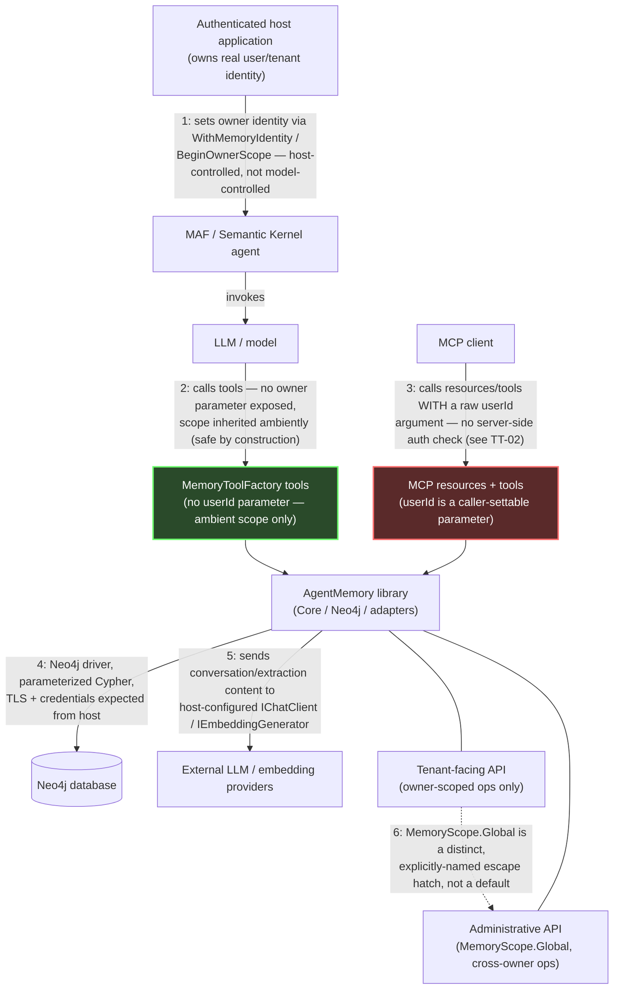

# Threat Model — Agent Memory for .NET

**Status:** Living document. Every claim below was checked against the current source at the time of
writing (not assumed from a template) — file/test references are load-bearing, not decorative. If a
row's cited file or test is renamed or removed, this document needs a matching update.

**Reporting a vulnerability?** Do not open a public issue. See [SECURITY.md](../../SECURITY.md).

---

## 1. Scope

This threat model covers AgentMemory's memory storage, retrieval, extraction, agent-framework
adapters, MCP resources and tools, Neo4j persistence, maintenance operations, audit data, and external
AI/provider integrations.

It does **not** cover the security of Neo4j itself, the hosting infrastructure, the operating system,
or third-party LLM/embedding providers — those are host responsibilities (§6).

## 2. Security properties

These are the properties the design intends to hold. Section 5 states, per threat, whether each
currently holds, holds only in part, or does not hold yet — a threat model's job is to be honest about
the gap between intent and reality, not to assert everything already works.

| ID | Property |
|---|---|
| T1 | One tenant cannot read another tenant's private memory. |
| T2 | One tenant cannot modify, invalidate, supersede, or delete another tenant's memory. |
| T3 | Shared memory can only be created intentionally. |
| T4 | LLM-provided tool parameters cannot determine authorization. |
| T5 | Partial ingestion failure is visible to callers and operators. |
| T6 | Provenance is not silently lost. |
| T7 | Administrative cross-owner access is explicit and auditable. |

## 3. Assets

- Messages (short-term conversation history)
- Entities, facts, preferences, relationships (long-term memory)
- Reasoning traces, steps, tool calls (reasoning memory)
- Embeddings (vector representations of the above)
- Owner identifiers (`owner_id` / `MemoryScope`) — the tenancy boundary itself
- Audit records (`:MemoryReadAudit` — who read what, when, how often)
- Neo4j credentials (connection string, username/password or equivalent)
- LLM/embedding provider credentials (API keys for chat/embedding services the host configures)

## 4. Trust boundaries

Boundary 3 (MCP client → resources/tools) is the one boundary that does **not** currently enforce
authorization the way boundary 2 (agent/LLM → MAF tools) does — see TT-02.

## 5. Threat table

| ID | Threat | Entry point | Impact | Current mitigation | Gap | Planned mitigation | Verification |
|---|---|---|---|---|---|---|---|
| TT-01 | Cross-owner unscoped recall (T1) | Any caller that omits `MemoryScope`/`UserId` on recall | Reads another owner's (or all owners') memory | `MemoryScope.OwnerId == null` is a documented, explicit "no filter" semantic (not silent); recall/read repositories parameterize the owner filter; **`MemoryOptions.Isolation.Mode = StrictMultiTenant` (#100) now makes an omitted scope throw `MemoryOwnerScopeRequiredException` before any Neo4j call, instead of silently resolving to global — this now includes `Neo4jGraphRagContextSource` (#100 Stage 2), which independently enforces the same gate rather than relying on the caller's recall path having already checked it** | The **default** (`SingleTenant`) is still global-on-omission, unchanged for backward compatibility — a host must explicitly opt in to `StrictMultiTenant` (or at least `WarnOnUnscoped`) to close this gap; nothing forces that opt-in | Host must construct `RecallRequest`/`MemoryScope` from authenticated identity (see [Owner isolation](../getting-started.md#owner-isolation)) **and** set `Isolation.Mode = StrictMultiTenant` for any multi-tenant deployment (see production checklist) | `OwnerScopeIsolationIntegrationTests`, `EntityVectorReadScopeIntegrationTests`, `NonVectorReadScopeIntegrationTests`, `DefaultMemoryIsolationPolicyTests`, `StrictMultiTenantIntegrationTests` |
| TT-02 | Arbitrary owner ID supplied through MCP (T4) | `ContextResource`, `EntityListResource`, `PreferenceListResource`, `ConversationListResource`, `MaintenanceTools` (`memory_invalidate`, `memory_supersede`), `CoreMemoryTools` (`memory_add_entity`, `memory_add_preference`, `memory_add_fact`), `EntityTools` (`memory_get_entity`, `memory_get_entity_provenance`, `memory_record_entity_feedback`, `memory_create_relationship`), and `ConversationTools` (`memory_get_conversation`, `memory_list_sessions`) all accept a bare, optional `userId` parameter | An untrusted MCP client or the model itself can read, write, invalidate, or supersede **any** owner's memory by supplying that owner's ID as a plain argument — no binding to the actual authenticated caller | Documented in each resource/tool's `[Description]` (`null = all owners (unscoped/admin)`); MAF's own tool surface (`MemoryToolFactory`) has **no such parameter** — ambient-scope-only by design, so this gap is MCP-specific, not systemic; **all 15 entry points listed now route through the shared `IMemoryIsolationPolicy` (#100 Stage 1 + Stage 2, via `LongTermMemoryService` for entity/fact/preference/relationship tools, directly in `ConversationTools`, and directly in `EntityTools.MemoryGetEntityProvenance` — the one entry point that bypasses `LongTermMemoryService` entirely, reading `IExtractorRepository` directly, and so needed its own explicit wiring), so `StrictMultiTenant` rejects an *omitted* `userId` before any repository/Neo4j call, for both reads and writes** | `ConversationTools`' actual owner check remains a post-hoc, in-memory filter (`IConversationRepository` has no `MemoryScope`-aware query method, unlike the entity/fact/preference repositories) — the *omitted-owner* half now fails closed like everywhere else, but there's no defense-in-depth at the Cypher layer for this one pair of tools specifically; a real fix would add `MemoryScope`-aware query methods to `IConversationRepository`. Separately, and for every entry point in this row, **no current mode solves impersonation**: a caller that supplies a well-formed but *wrong* `userId` is still not authenticated against anything — the library has no way to know that string didn't come from the real caller. That requires the host to never forward a client/model-supplied `userId` verbatim (or #90's guaranteed-propagation work for MAF-fronted MCP hosts) | Host must not expose `userId`/owner parameters on MCP resources/tools to untrusted clients — override or strip them server-side before the request reaches AgentMemory, or don't expose these MCP endpoints to untrusted callers at all | `McpResourceIsolationIntegrationTests`, `StrictMultiTenantIntegrationTests` (now cover all 15 entry points for the omitted-owner half; the impersonation half remains an acknowledged, untested-by-design gap on every one of them) |
| TT-03 | Accidental shared writes (T3) | Any write path where the owner argument is left null | Data intended as tenant-private lands in the shared/global bucket, readable by every owner | `BeginOwnerScope(null)` scopes to shared **deliberately and by explicit choice** — the null-write-is-shared semantic is documented on `MemoryScope` | Verified only at the owner-context mechanism level, not end-to-end at the repository/API layer (no test confirms a null-owner write actually lands as a shared node in Neo4j) | Add a repository-level integration test asserting a null-owner write produces `owner_id IS NULL` | `MemoryOwnerContextExtensionsTests.BeginOwnerScope_NullUserId_ScopesToShared` (mechanism-level only) |
| TT-04 | Cross-owner delete/prune/decay (T2) | `Neo4jMemoryDecayService` prune/decay operations, fact/entity/relationship deletion | Another owner's memory is invalidated or hard-deleted | Prune/decay accepts the same optional `MemoryScope? scope` pattern as reads, parameterized in Cypher | Same systemic pattern as TT-01: a null/omitted scope means unscoped, not "no destructive operations allowed" — no extra safeguard beyond standard scope-gating exists for destructive ops specifically | Same host responsibility as TT-01; consider a confirmation/audit requirement specifically for unscoped destructive calls | `ReasoningTraceOwnerScopeIntegrationTests`, `RelationshipOwnerScopeIntegrationTests`, `EntityResolutionOwnerScopeIntegrationTests` |
| TT-05 | Prompt-based memory poisoning | A conversation crafted to make the LLM extract false facts/preferences/entities | Long-term memory is polluted with attacker-controlled "facts" that later get recalled and re-injected into a later prompt with elevated (system-message) authority | Confidence-threshold filtering on extracted facts/preferences/relationships; `EntityValidator` rejects degenerate entity names (too short, numeric-only, punctuation-only, stopwords); **the *recall* half of this threat now has a mitigation built across four phases of #92: Phase 1 — `MafTypeMapper.ToContextMessages` delimits and angle-bracket-escapes every recalled entity/fact/preference/trace/GraphRAG block (`<recalled_memory category="...">...</recalled_memory>`, with `<`/`>` in the content escaped so it can't forge or prematurely close its own boundary), and the default context prefix explicitly tells the model recalled memory is untrusted reference data, not instructions; Phase 2 — `IMemoryContextAdmissionPolicy` detects instruction-like recalled content and can exclude it (`SecurityMode.Strict`); Phase 3 — `MemoryTrustLevel` lets a host mark specific sources as explicitly trusted; Phase 4 — `ContextFormatOptions.DefaultMemoryRole`/`MinimumTrustForSystemRole` let a host render low-trust recalled content as a lower-authority `ChatRole.User` message instead of `ChatRole.System`. Phases 2-4 are opt-in and default to Phase 1's original behavior unless a host explicitly configures them** | Nothing prevents poisoned content from being *extracted and stored* in the first place — entity validation is a data-quality heuristic (ported from the Python original), not a security sanitizer, and facts/preferences/relationships have **no** length cap or content sanitization at extraction/storage time. The delimiting/escaping mitigation is MAF-adapter-only (`MafTypeMapper`), covers only boundary-forgery (not instruction-like content that never uses `<`/`>` — e.g. plain-language "ignore previous instructions", role-header conventions, code fences, all pass through the block unescaped and rely solely on the prefix instruction, not the delimiter, to be disregarded), and does **not** apply to recalled conversation history (`RelevantMessages`) — a message resurfaced by semantic search keeps its originally-persisted role, so a historical `system`-role message would still replay with full authority. **Phases 2-4 (admission policy, trust metadata, configurable message role) are now available, but every one is opt-in and defaults to Phase 1's original behavior — a host that doesn't explicitly configure `SecurityMode=Strict`, a non-default `MinimumTrustForAdmissionBypass`/`MinimumTrustForSystemRole`, or a non-`UserProvided` `ExtractionOptions.DefaultTrustLevel` gets no additional protection beyond Phase 1's boundary-escaping.** Per-item (not per-request) trust attribution, monotonic trust protection for facts/preferences (entities only today), and `ReasoningTrace` trust stamping remain unbuilt | Treat all extracted content as untrusted input at recall/consumption time (host-side); consider adding length caps and stricter validation across all four extracted types, not just entities; a security-conscious host should raise `MinimumTrustForSystemRole`/`MinimumTrustForAdmissionBypass` and set `SecurityMode=Strict` rather than relying on defaults | `MafTypeMapperTests` (`ToContextMessages_FactContainingInjectionAttempt_IsDelimitedNotRaw`, `ToContextMessages_PreferenceContainingLiteralClosingDelimiter_IsEscaped`, `ToContextMessages_GraphRagContentWithEscapeAttempt_BoundaryStaysIntact`), `StoredPromptInjectionCrossSessionIntegrationTests` (live-Neo4j, proves a configured host never sees poisoned content resurface as an unattributed `System` message) — no dedicated poisoning/adversarial-*extraction* test exists today, and no test covers the recalled-conversation-history gap noted above |
| TT-06 | Malicious extraction output | LLM extraction returns malformed or adversarial structured output | Garbage or oversized data written to the graph; potential downstream issues wherever that data is later rendered/consumed | Same confidence filtering as TT-05; Cypher values are always parameterized (see TT-07), so this is a data-quality risk, not a Cypher-injection risk | No length/character sanitization on facts, preferences, or relationships before they're persisted | Same as TT-05 | None found |
| TT-07 | Cypher injection | Any caller-supplied string (owner ID, session ID, query text, entity name, metadata filter key) | Arbitrary Cypher execution, full data compromise | Every sampled query file (`EntityQueries`, `FactQueries`, `PreferenceQueries`, `ReasoningQueries`, `ToolCallQueries`, `DecayQueries`) binds caller-supplied **values** via Neo4j driver parameters (`$ownerId`, `$id`, etc.), never string-interpolated. The one place a caller-influenced **identifier** (a metadata filter property key, not a value) is used, `MetadataFilterBuilder.EscapeIdentifier()` explicitly escapes it (backtick-quoting, rejects null bytes/backticks) with a documented rationale | None found in this pass — this is a real, deliberate mitigation, not an open gap | Keep enforcing "values are always parameters" as a review rule for new queries | `CypherQueryExecutionSweepTests`, `MethodBuiltQueryStructureTests` |
| TT-08 | Huge graph traversal / resource exhaustion | Recall, GraphRAG retrieval, and the MCP `graph_query` tool | A single request consumes unbounded Neo4j resources (DoS) | `VectorRetriever`/`FulltextRetriever`/`GraphRetriever`/`HybridRetriever` all apply `LIMIT`/`Take(topK)` — no unbounded traversal found in the normal retrieval path | **`graph_query` (in `MaintenanceTools`/`GraphQueryTools`) executes arbitrary caller-supplied Cypher with no limit or depth guard at all.** It is gated by `AgentMemoryMcpOptions.EnableGraphQuery`, **disabled by default** — but if a host enables it, every other protection in this table (scoping, limits, injection-safety) is bypassed by design, because the caller is now writing the Cypher directly | Keep `EnableGraphQuery` off unless the caller is fully trusted (e.g. an internal admin tool, never exposed to an untrusted agent or MCP client) | N/A — no automated test enforces the default-off posture beyond the option's own default value |
| TT-09 | Oversized embeddings or malformed vectors | A custom/buggy `IEmbeddingGenerator` implementation supplied by the host | Corrupt vector data written to Neo4j; potential query failures or incorrect similarity results | `Neo4jOptions.EmbeddingDimensions` + `ValidateVectorIndexDimensions` check that existing vector **indexes** match the configured dimensionality, and throw `EmbeddingDimensionMismatchException` on mismatch | That check runs at **schema bootstrap** (comparing index metadata), not on every write — a NaN, `Infinity`, or wrong-length embedding array from a misbehaving generator is not caught before being sent to Neo4j | Add per-write validation of embedding array length and finite values | None found |
| TT-10 | External provider data leakage | Conversation content, extracted entities/facts sent to host-configured `IChatClient`/`IEmbeddingGenerator` | Sensitive data leaves the trust boundary to a third-party provider | The library only sends data through host-supplied provider interfaces — it does not bundle or default to any specific external provider | Selecting a compliant provider and reviewing its data-processing terms is entirely a host decision (§6) — the library has no visibility or control over what a given provider does with the data it receives | N/A — host responsibility | N/A |
| TT-11 | Audit-record tampering | Any caller with the library's Neo4j credentials | `:MemoryReadAudit` records are deleted or altered, hiding evidence of past access | None beyond standard Neo4j write access — audit writes use the same driver/credentials as every other write, with no separate role or append-only enforcement | This is real and by design at the library level — AgentMemory does not implement its own audit-tamper protection | Enforce via Neo4j RBAC / least-privilege credentials at the host/deployment level (§6), not in the library | N/A — host responsibility |
| TT-12 | Provenance loss (T6) | Any extraction write | A fact/entity/preference is persisted with no traceable `EXTRACTED_FROM`/`EXTRACTED_BY` link back to its source message | `source_message_ids` and extraction-edge creation are part of the normal extraction path | The record write (`UpsertAsync`) and the provenance-edge write (`CreateExtractedFromRelationshipAsync`) are **two separate calls, not one transaction** — the edge-creation call is wrapped in a try/catch that only logs a warning on failure. A transient failure leaves the record persisted with **no provenance link**, visible only in operator logs, not to the caller | Make record + provenance-edge creation atomic (single transaction), or surface partial-provenance failures to the caller | None found — no atomicity/failure-injection test exists today |
| TT-13 | Stale or poisoned memory supersession (T2) | `SupersedeFactAsync`/`SupersedePreferenceAsync`, also exposed as the MCP tool `memory_supersede` | A caller (or a model, via MCP, given valid fact IDs) overwrites a correct fact with a worse one | Supersession is owner-scope-gated the same way every other operation is | **No confidence, provenance, or correctness check exists** — any in-scope caller can supersede a high-confidence fact with a low-confidence or fabricated one; via MCP this is reachable by a model with no additional authorization beyond having valid IDs | Consider requiring the winner to meet a minimum confidence/provenance bar before allowing supersession of a higher-confidence existing fact | None found |
| TT-14 | Compromised NuGet/release pipeline | GitHub Actions supply chain, NuGet publishing | Malicious code published under the AgentMemory package names | OIDC trusted publishing (no long-lived NuGet API key), every third-party GitHub Action pinned to a commit SHA with Dependabot tracking updates, build-provenance attestations on published packages, a branch ruleset requiring review + a green required check before merge, release tags must point at current `main` HEAD (not an arbitrary ancestor) with a mandatory dated CHANGELOG entry, the full test suite plus a package-inventory check and a per-entry-point consumer-install smoke test gate every release, and `dotnet pack`/`dotnet build` never run in the publish job (it only pushes pre-verified artifacts) | The repository owner has standing bypass on the required review/status-check ruleset (needed for solo maintenance) — an intentional tradeoff, not an oversight, but worth naming explicitly | Keep bypass scoped to the current maintainer only; re-evaluate if the project ever gains additional maintainers | `release.yml`, `eng/validate-release-tag.sh`, `eng/validate-release.sh`, `eng/verify-packages-install.sh` |

## 6. Host responsibilities

AgentMemory cannot guarantee these alone — they belong to the application embedding it:

- Authenticating users.
- Mapping authenticated identity to an owner ID (never trusting a client- or model-supplied one — see TT-02).
- Authorizing administrative operations (deciding who may use `MemoryScope.Global` or cross-owner APIs).
- Protecting Neo4j credentials (secrets storage, rotation, least privilege — also closes TT-11).
- Selecting compliant LLM/embedding providers and reviewing their data-processing terms (TT-10).
- Defining retention and deletion policy.
- Database backups and encryption.
- Network restrictions (TLS to Neo4j, firewalling, etc.).
- Rate limiting — AgentMemory implements **no per-owner request throttling anywhere**; the only rate
  limiting in the codebase throttles *outbound* calls to third-party geocoding APIs, which is unrelated.

## 7. Verification map

| Property | Status | Test(s) |
|---|---|---|
| T1 | Holds for the Core/repository read path | `OwnerScopeIsolationIntegrationTests`, `EntityVectorReadScopeIntegrationTests`, `NonVectorReadScopeIntegrationTests` |
| T2 | Holds for the Core/repository mutation path | `ReasoningTraceOwnerScopeIntegrationTests`, `RelationshipOwnerScopeIntegrationTests`, `EntityResolutionOwnerScopeIntegrationTests` |
| T3 | Holds at the owner-context mechanism level; not verified end-to-end at the repository layer | `MemoryOwnerContextExtensionsTests.BeginOwnerScope_NullUserId_ScopesToShared` |
| T4 | Holds for MAF (no parameter exposed); **for MCP, holds only when the host enables `Isolation.Mode = StrictMultiTenant`** — an omitted `userId` then fails closed instead of going unscoped; a supplied-but-wrong `userId` is still the host's responsibility to prevent (TT-02) | `McpResourceIsolationIntegrationTests`, `StrictMultiTenantIntegrationTests`, `DefaultMemoryIsolationPolicyTests` |
| T5 | Does not hold — failures are logged, not surfaced to the caller | None — open gap |
| T6 | Does not hold — provenance-edge creation is not atomic with the record write | None — open gap |
| T7 | Does not hold as a distinct path — `MemoryOperationAccess.Administrative` exists in `IMemoryIsolationPolicy`'s API but has **zero call sites anywhere in the codebase** (confirmed by grep during #100 Stage 2); every real call site uses `.Tenant`. "Administrative access" today is only the absence of enforcement in `SingleTenant`/`WarnOnUnscoped` mode, not an intentional, separate, auditable operation. `MemoryScope.Global` is at least an explicit, deliberately-named API rather than an accidental default, and the read-audit trail exists, but neither constitutes the dedicated administrative path T7 describes. Explicitly descoped from #100's acceptance criteria rather than designed under release pressure — a real admin path needs a concrete consumer and its own design pass | None specific to a real administrative path — open gap, explicitly deferred |

Every unresolved gap in §5/§7 needs an owner and status before it's closed: library-side gaps
(TT-03's end-to-end test, TT-09's per-write validation, TT-12's atomicity, TT-13's confidence check,
T7's audit marking) are maintainer-owned; everything under §6 is host-owned.
